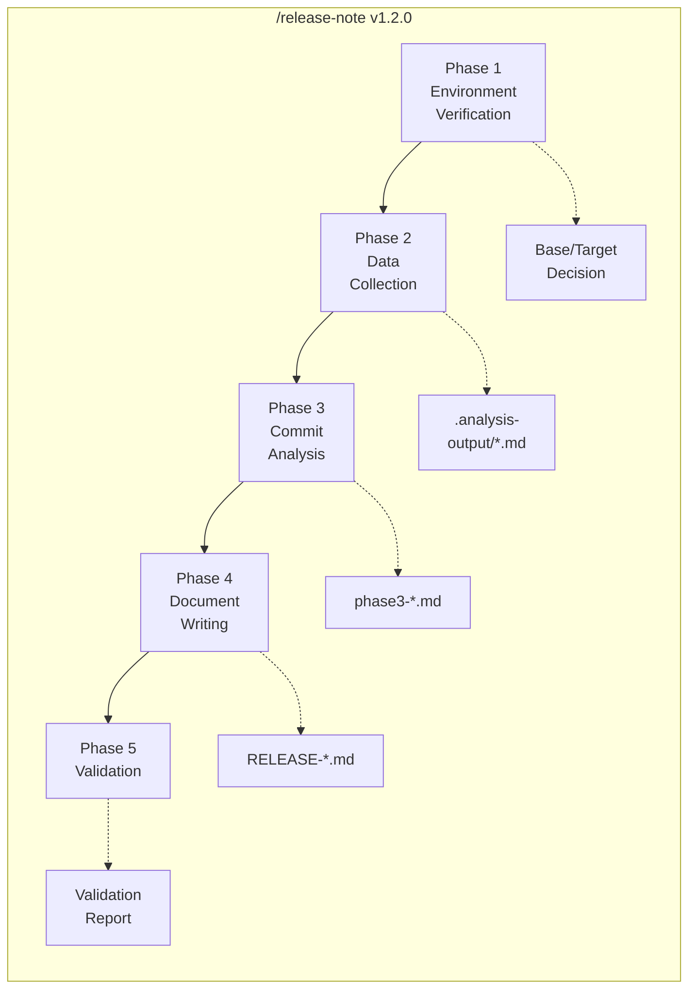
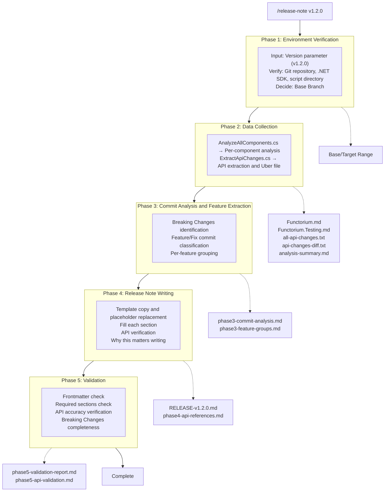

The moment you type `/release-note v1.2.0`, the automation workflow begins. With this single command, 5 Phases execute sequentially from environment verification to final quality check, generating a complete release note.

## 5-Phase Workflow



Let's briefly look at what each Phase does.

| Phase | Goal | Input | Output | Handler |
|-------|------|-------|--------|---------|
| **1** | Environment Verification | Version parameter | Base/Target decision | Claude |
| **2** | Data Collection | Base/Target | Analysis files (.md) | C# scripts |
| **3** | Commit Analysis | Analysis files | Feature grouping | Claude |
| **4** | Document Writing | Feature grouping | Release notes | Claude |
| **5** | Validation | Release notes | Validation report | Claude |

**In Phase 1,** prerequisite environments such as the Git repository, .NET SDK, and script directory are checked, and the comparison range (Base/Target) is determined based on the previous release branch. It is a quick step that finishes in about 10 seconds, but if it fails here, the entire process stops.

**In Phase 2,** two C# scripts are executed. `AnalyzeAllComponents.cs` collects per-component commit history, and `ExtractApiChanges.cs` builds projects to extract Public APIs. It takes 30 seconds to 2 minutes, and the source data for all subsequent analysis is created at this stage.

**In Phase 3,** the collected raw data is transformed into meaningful information. Breaking Changes are identified by analyzing commit messages and API Diffs, and related commits are grouped by feature. It takes 1-3 minutes.

**Phase 4** is the most time-consuming step (5-15 minutes), where the actual release note document is written based on the analysis results. Each section is filled based on the template, and all code examples are verified against the Uber file.

**In Phase 5,** the API accuracy, Breaking Changes completeness, and structural quality of the completed release notes are finally verified. It completes in 1-3 minutes, and a validation report is generated alongside.

The total time required is approximately 8-25 minutes. Compared to the 2-3 hours it used to take with manual writing, **approximately 85% is saved.**

## Detailed Data Flow

The diagram below shows what data is generated in each Phase and how it is passed to the next Phase. Since each Phase depends on the output of the previous Phase, if even one fails in the middle, subsequent steps cannot proceed.



## File Generation Flow

Let's look at how the directory structure changes before and after the workflow execution. Existing `TEMPLATE.md` and scripts remain intact, and new analysis results and the final release notes are added.

```txt
Before Execution                  After Execution
───────────────                   ───────────────

.release-notes/                  .release-notes/
├── TEMPLATE.md                  ├── TEMPLATE.md
└── scripts/                     ├── RELEASE-v1.2.0.md ← Newly generated
    ├── *.cs                     └── scripts/
    └── docs/                        ├── *.cs
        └── *.md                     ├── docs/
                                     │   └── *.md
                                     └── .analysis-output/ ← Newly generated
                                         ├── Functorium.md
                                         ├── Functorium.Testing.md
                                         ├── analysis-summary.md
                                         ├── api-changes-build-current/
                                         │   ├── all-api-changes.txt
                                         │   └── api-changes-diff.txt
                                         └── work/
                                             ├── phase3-commit-analysis.md
                                             ├── phase3-feature-groups.md
                                             ├── phase4-api-references.md
                                             ├── phase5-validation-report.md
                                             └── phase5-api-validation.md
```

## Behavior on Error

When errors occur in Phases 1-3, the entire process stops immediately. Phase 1 stops when the Git repository or .NET SDK is not found, Phase 2 when script execution or build fails, and Phase 3 when analysis files are missing.

Phases 4 and 5 behave somewhat differently. In Phase 4, if the template is missing or API verification fails, an incomplete release note is generated, and in Phase 5, if the validation criteria are not met, the issues are recorded in the validation report. In this case, the document can be corrected and validation re-run.

## Core Principles

Three principles run through this workflow.

**Accuracy first --** all APIs are verified against the Uber file (`all-api-changes.txt`). Cross-verification once in Phase 4 and once again in Phase 5 prevents non-existent APIs from being included in the document.

**For traceability,** all artifacts cite their sources. Through commit SHA annotations, intermediate result file storage, and validation report generation, all content in the release notes is traceable to actual code changes.

**Through modularization,** each Phase is defined as an independent document. The master document (`release-note.md`) manages the overall flow, and each Phase detail document contains the specific execution methods, making maintenance and extension easy.

## FAQ

### Q1: What is the total time for the 5-Phase workflow?
**A**: Approximately 8-25 minutes. Phase 1 (Environment Verification) takes about 10 seconds, Phase 2 (Data Collection) 30 seconds to 2 minutes, Phase 3 (Commit Analysis) 1-3 minutes, Phase 4 (Document Writing) 5-15 minutes, and Phase 5 (Validation) 1-3 minutes. Compared to manual writing, **approximately 85% is saved.**

### Q2: If an error occurs mid-Phase, do you have to re-run everything from the beginning?
**A**: If an error occurs in Phases 1-3, the process stops immediately, so you need to resolve the cause and run again. However, analysis files generated in Phase 2 remain in `.analysis-output/`, so only Phase 2 can be re-run. Phases 4-5 allow correction and re-validation after an incomplete result is generated.

### Q3: Why are the inputs and outputs of each Phase explicitly specified?
**A**: Because it is a **pipeline structure where each Phase depends on the output of the previous Phase.** Specifying inputs and outputs makes the data flow between Phases clear, and when problems occur, you can quickly diagnose which Phase's output is incorrect. Intermediate result files serve as debugging tools.

Now let's examine each Phase in detail. Starting with [Phase 1: Environment Verification](01-phase1-setup.md).
