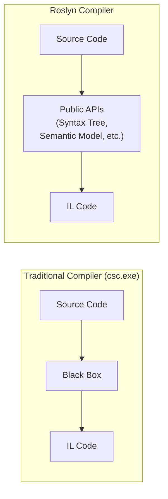
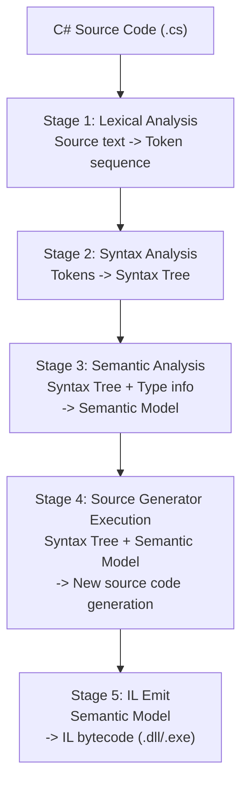

## Overview

In the previous chapters, we completed the development environment, project structure, and debugging setup. Now it is time to understand **what tooling the source generator operates on top of**.

Source generators use Roslyn compiler platform APIs to analyze code being compiled and add new code. Without understanding the three core layers of Roslyn -- Syntax Tree, Semantic Model, and Symbol -- you cannot answer "which API should I use?" when writing source generator code. In this chapter, we draw the complete picture of what each of these three layers provides, in what order they combine, and where our project's ObservablePortGenerator uses which APIs.

## Learning Objectives

### Core Learning Objectives
1. **Understand the overall structure of the Roslyn compiler platform**
   - An architecture where internal data structures are exposed as APIs, unlike traditional black-box compilers
2. **Identify each stage of the compilation pipeline**
   - Lexical analysis -> Syntax analysis -> Semantic analysis -> Source generator execution -> IL generation
3. **Understand when source generators intervene**
   - After semantic analysis is complete, just before IL generation, accessing Syntax Tree + Semantic Model

---

## What is Roslyn?

**Roslyn** is the codename for the .NET Compiler Platform, a project that rewrote the C# and Visual Basic compilers as open source. While the traditional `csc.exe` compiler was a black box that took source code and output IL, Roslyn exposes each stage of the compilation process as APIs, making them programmatically accessible from the outside.



### Key Features

| Feature | Description |
|---------|-------------|
| API Exposure | Access to compiler internal data structures |
| Extensibility | Extensible with analyzers, source generators, etc. |
| IDE Integration | Foundation for Visual Studio IntelliSense, refactoring |

Thanks to this API exposure, source generators can read both the structure (Syntax Tree) and meaning (Semantic Model) of code being compiled.

---

## Compilation Pipeline

The Roslyn compiler transforms source code into IL code through several stages:



---

## Core Concepts

The Roslyn API consists of three core layers. Each layer adds richer information on top of the previous one: Syntax Tree (structure) -> Semantic Model (structure + types) -> Symbol (named entities). This order also reflects the compilation pipeline's processing order and the flow of querying information in source generators.

### Syntax Tree

The **structural representation** of source code. It contains every character of the code, enabling perfect reconstruction of the original. In our project, the source generator's `predicate` stage uses it to check "is this node a `ClassDeclarationSyntax`?".

```csharp
// Source code
public class User
{
    public int Id { get; set; }
}
```

```
Syntax Tree
===========

CompilationUnit
└── ClassDeclaration "User"
    ├── Modifier: "public"
    └── Members
        └── PropertyDeclaration "Id"
            ├── Type: "int"
            ├── Modifier: "public"
            └── Accessors: { get; set; }
```

### Semantic Model

With only the Syntax Tree, you cannot know whether `User` is a class or interface, or which namespace it belongs to. The Semantic Model adds **type information** to the Syntax Tree, enabling answers to such questions. In our project, the `transform` stage uses `ctx.SemanticModel` to query the list of interfaces a class implements and the precise return types of methods.

```csharp
// Source code
var user = new User();
user.Id = 5;

// Information that cannot be known from Syntax alone
// - What is the type of "user"? -> Semantic Model: User
// - Which class is "Id" defined in? -> Semantic Model: User.Id
// - Can "5" be assigned to "Id"? -> Semantic Model: int -> int, possible
```

### Symbol

While the Semantic Model contains the full semantic analysis results, a Symbol represents an **individual named entity** within it. Classes, methods, properties, parameters are all symbols, and each symbol type provides properties specialized to that entity. In our project, `ctx.TargetSymbol` is cast to `INamedTypeSymbol` to access a class's interfaces, constructors, and method information.

```
Symbol Hierarchy
================

ISymbol (base)
├── INamespaceSymbol      (namespace)
├── INamedTypeSymbol      (class, interface, struct)
├── IMethodSymbol         (method, constructor)
├── IPropertySymbol       (property)
├── IFieldSymbol          (field)
├── IParameterSymbol      (parameter)
└── ILocalSymbol          (local variable)
```

---

## Roslyn API Structure

The Roslyn API is divided into two namespaces: language-common (`Microsoft.CodeAnalysis`) and C#-specific (`Microsoft.CodeAnalysis.CSharp`). The `Microsoft.CodeAnalysis.CSharp` NuGet package referenced in source generator projects includes both namespaces.

```
Microsoft.CodeAnalysis (base)
├── SyntaxTree             Syntax tree
├── SyntaxNode             Syntax node (base class)
├── SyntaxToken            Token (keywords, identifiers, etc.)
├── SyntaxTrivia           Whitespace, comments, etc.
├── Compilation            Compilation unit
├── SemanticModel          Semantic model
└── ISymbol                Symbol interface

Microsoft.CodeAnalysis.CSharp (C#-specific)
├── CSharpSyntaxTree       C# syntax tree
├── CSharpCompilation      C# compilation
└── CSharpSyntaxNode       C# syntax node (base class)
    ├── ClassDeclarationSyntax
    ├── MethodDeclarationSyntax
    ├── PropertyDeclarationSyntax
    └── ... (hundreds of syntax nodes)
```

In source generators, the common pattern is to perform initial filtering with Syntax types (`ClassDeclarationSyntax`, etc.) and then detailed analysis with Symbol types (`INamedTypeSymbol`, `IMethodSymbol`, etc.).

---

## Source Generators and Roslyn

Let us examine how the Syntax Tree, Semantic Model, and Symbol discussed above are actually used in source generators. Source generators **analyze code being compiled** and **add new code** through the Roslyn API, but there are clear boundaries on accessible information to guarantee deterministic output.

### Accessible Information

```csharp
// Information accessible in IIncrementalGenerator.Initialize
public void Initialize(IncrementalGeneratorInitializationContext context)
{
    // 1. Syntax Provider - syntax tree-based filtering
    context.SyntaxProvider
        .ForAttributeWithMetadataName(
            "MyAttribute",                                    // attribute name
            predicate: (node, _) => node is ClassDeclarationSyntax,  // syntax filter
            transform: (ctx, _) => {
                // 2. Semantic Model is accessible here
                var symbol = ctx.TargetSymbol;                // ISymbol
                var semanticModel = ctx.SemanticModel;        // SemanticModel
                return symbol;
            });
}
```

### Inaccessible Information

Source generators must operate purely on compilation inputs (source code, referenced assemblies). Depending on external state would cause the same source code to produce different results depending on the build environment.

```
Things inaccessible from source generators
==========================================

x File system (File.ReadAllText, etc.)
x Network (HttpClient, etc.)
x Databases
x Environment variables (limited)
x Source code of other assemblies

Reason: To guarantee deterministic output
        Same source code -> Always the same generated result
```

---

## Compilation Concept

`Compilation` represents the **entire compilation unit**. Creating a Compilation directly with `CSharpCompilation.Create` in source generator tests is reproducing the process the compiler performs. Our project's `SourceGeneratorTestRunner` also uses this pattern.

```csharp
// Creating a Compilation
var compilation = CSharpCompilation.Create(
    assemblyName: "MyAssembly",
    syntaxTrees: [syntaxTree1, syntaxTree2],        // multiple files
    references: [                                   // reference assemblies
        MetadataReference.CreateFromFile(typeof(object).Assembly.Location),
        MetadataReference.CreateFromFile(typeof(Console).Assembly.Location)
    ],
    options: new CSharpCompilationOptions(OutputKind.DynamicallyLinkedLibrary)
);

// Information obtainable from Compilation
var globalNamespace = compilation.GlobalNamespace;  // global namespace
var allTypes = compilation.GetTypeByMetadataName("MyNamespace.MyClass");  // specific type
```

---

## Practice: Simple Syntax Tree Analysis

```csharp
using Microsoft.CodeAnalysis;
using Microsoft.CodeAnalysis.CSharp;
using Microsoft.CodeAnalysis.CSharp.Syntax;

// 1. Parse source code
string code = """
    public class User
    {
        public int Id { get; set; }
        public string Name { get; set; }
    }
    """;

SyntaxTree tree = CSharpSyntaxTree.ParseText(code);
SyntaxNode root = tree.GetRoot();

// 2. Find class declaration
var classDeclaration = root
    .DescendantNodes()
    .OfType<ClassDeclarationSyntax>()
    .First();

Console.WriteLine($"Class name: {classDeclaration.Identifier}");
// Output: Class name: User

// 3. List properties
var properties = classDeclaration
    .DescendantNodes()
    .OfType<PropertyDeclarationSyntax>();

foreach (var prop in properties)
{
    Console.WriteLine($"Property: {prop.Type} {prop.Identifier}");
}
// Output:
// Property: int Id
// Property: string Name
```

---

## Summary at a Glance

The three core layers of Roslyn progressively provide richer information. Syntax Tree handles code structure, Semantic Model handles type information, and Symbol handles detailed properties of individual entities. Source generators follow a two-stage pattern by combining these three layers: fast filtering with `predicate` (Syntax) and precise analysis with `transform` (Semantic + Symbol).

| Concept | Description | Access Method |
|---------|-------------|---------------|
| Syntax Tree | Structural representation of code | `SyntaxTree.GetRoot()` |
| Semantic Model | Model with added type information | `Compilation.GetSemanticModel()` |
| Symbol | Named entity | `SemanticModel.GetSymbolInfo()` |
| Compilation | Entire compilation unit | `CSharpCompilation.Create()` |

---

## FAQ

### Q1: Why are Syntax Tree and Semantic Model separated?
**A**: Syntax Tree represents only the text structure of source code, so it can be generated very quickly. Semantic Model performs costly analysis such as type resolution and overload resolution. By separating them, fast syntax-level filtering (`predicate`) can be performed first, and semantic analysis applied only to necessary nodes, optimizing performance.

### Q2: When do you directly call `CSharpCompilation.Create` in source generators?
**A**: You do not call it directly in actual source generator code. The Roslyn pipeline provides the `Compilation` automatically. It is mainly used in test code to reproduce the compilation environment and run generators in an isolated environment using `CSharpCompilation.Create`.

### Q3: Why is immutable Syntax Tree important for source generators?
**A**: When Syntax Trees are immutable, they can be safely referenced simultaneously across multiple incremental pipeline stages, and cache validity can be determined by comparing before and after changes. This directly connects to guaranteeing deterministic output in incremental builds.

---

In this chapter, we examined Roslyn's overall architecture and the roles of its three core layers. The next three chapters will cover each layer in depth. We start with the Syntax API.

-> [02. Syntax API](../05-Syntax-Api/)
