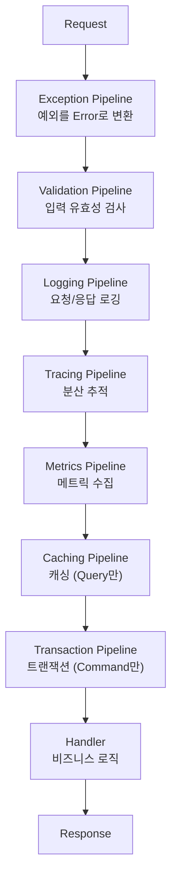

## Mediator Pipeline이란?

Mediator Pipeline은 요청(Request)이 핸들러(Handler)에 도달하기 전후로 **교차 관심사**를 처리하는 일련의 미들웨어입니다.



## Pipeline이 응답에 대해 알아야 하는 것

각 Pipeline은 서로 다른 수준의 응답 정보가 필요합니다:

| Pipeline | 필요한 능력 | 설명 |
|----------|------------|------|
| Validation | **생성** | 검증 실패 시 실패 응답을 직접 생성 |
| Exception | **생성** | 예외 발생 시 실패 응답을 직접 생성 |
| Logging | **읽기** + 생성 | 성공/실패 판단, 에러 정보 읽기 |
| Tracing | **읽기** + 생성 | 성공/실패 상태를 추적 태그에 기록 |
| Metrics | **읽기** + 생성 | 성공/실패 카운트 수집 |
| Transaction | **읽기** + 생성 | 성공 시 커밋, 실패 시 롤백 |
| Caching | **읽기** + 생성 | 성공 응답만 캐싱 |

## 두 가지 핵심 능력

Pipeline이 응답에 대해 필요한 능력은 크게 두 가지입니다:

### 1. 읽기 (Read)

응답의 성공/실패 상태를 확인하고, 실패 시 에러 정보에 접근합니다.

```csharp
// 성공/실패 확인
if (response.IsSucc)
    LogSuccess();
else
    LogError();

// 에러 정보 접근
if (response is IFinResponseWithError fail)
    RecordError(fail.Error);
```

### 2. 생성 (Create)

검증 실패나 예외 발생 시 실패 응답을 새로 만듭니다.

```csharp
// 실패 응답 생성
return TResponse.CreateFail(Error.New("Validation failed"));
```

## 제약 조건과 능력의 매핑

이 두 가지 능력은 서로 다른 인터페이스에 매핑됩니다:

| 능력 | 인터페이스 | 핵심 멤버 |
|------|-----------|----------|
| 읽기 | `IFinResponse` | `IsSucc`, `IsFail` |
| 에러 접근 | `IFinResponseWithError` | `Error` 속성 |
| 생성 | `IFinResponseFactory<TSelf>` | `static abstract CreateFail(Error)` |

Pipeline은 필요한 능력에 따라 **최소한의 제약 조건**만 사용합니다:

```csharp
// Create-Only: Validation, Exception
where TResponse : IFinResponseFactory<TResponse>

// Read + Create: Logging, Tracing, Metrics, Transaction, Caching
where TResponse : IFinResponse, IFinResponseFactory<TResponse>
```

## 이 튜토리얼에서 다루는 흐름

```
Part 1: 변성 기초           이 아키텍처의 기반이 되는 C# 제네릭 변성 이해
         │
Part 2: 문제 정의           Fin<T>가 왜 Pipeline 제약으로 사용 불가한지 분석
         │
Part 3: 계층 설계           IFinResponse 인터페이스 계층을 하나씩 설계
         │
Part 4: 제약 적용           각 Pipeline에 최소 제약 조건 적용
         │
Part 5: 실전 통합           Command/Query Usecase에서 전체 Pipeline 통합
```

