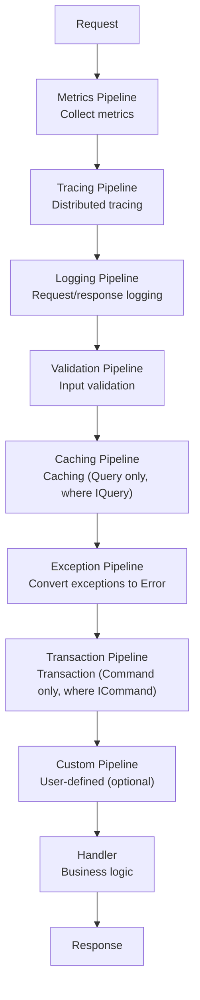

Are you repeatedly writing cross-cutting concerns like logging, validation, and transactions for every Usecase? Mediator Pipelines eliminate this repetition, but new problems arise the moment you need to handle the response type.

## What Is a Mediator Pipeline?

A Mediator Pipeline is a series of middleware that processes **cross-cutting concerns** before and after a request reaches the handler.



## What Pipelines Need to Know About Responses

The following summarizes what level of information each Pipeline requires about the response:

| Pipeline | Required Capability | Description |
|----------|------------|------|
| Metrics | **Read** + Create | Collect success/failure counts |
| Tracing | **Read** + Create | Record success/failure status in trace tags |
| Logging | **Read** + Create | Determine success/failure, read error information |
| Validation | **Create** | Directly create failure response on validation failure |
| Caching | **Read** + Create | Cache only successful responses |
| Exception | **Create** | Directly create failure response on exception |
| Transaction | **Read** + Create | Commit on success, rollback on failure |
| Custom | **(User-defined)** | User-defined Pipeline slot (optional) |

## Two Core Capabilities

The capabilities that Pipelines need from responses fall into two main categories:

### 1. Read

Check the success/failure status of the response and access error information on failure.

```csharp
// Check success/failure
if (response.IsSucc)
    LogSuccess();
else
    LogError();

// Access error information
if (response is IFinResponseWithError fail)
    RecordError(fail.Error);
```

### 2. Create

Create a new failure response when validation fails or an exception occurs.

```csharp
// Create failure response
return TResponse.CreateFail(Error.New("Validation failed"));
```

## Mapping Constraints to Capabilities

These two capabilities map to different interfaces:

| Capability | Interface | Key Member |
|------|-----------|----------|
| Read | `IFinResponse` | `IsSucc`, `IsFail` |
| Error access | `IFinResponseWithError` | `Error` property |
| Create | `IFinResponseFactory<TSelf>` | `static abstract CreateFail(Error)` |

Pipelines use only the **minimum constraints** based on their needed capabilities:

```csharp
// Create-Only: Validation, Exception
where TResponse : IFinResponseFactory<TResponse>

// Read + Create: Logging, Tracing, Metrics, Transaction, Caching
where TResponse : IFinResponse, IFinResponseFactory<TResponse>

// Custom: User-defined (constraints vary by Pipeline)
```

## FAQ

### Q1: Why do different Pipelines need different constraints?
**A**: Each Pipeline requires different capabilities from the response. The Validation Pipeline only needs to **create** failure responses, while the Logging Pipeline needs to **read** the success/failure status of responses. Not imposing unnecessary constraints is the core of the Interface Segregation Principle (ISP).

### Q2: What is the practical difference between Create-Only and Read+Create constraints?
**A**: The Create-Only constraint (`IFinResponseFactory<TResponse>`) only enables calling `TResponse.CreateFail(error)`, and does not provide access to `IsSucc`/`IsFail` on existing responses. The Read+Create constraint adds `IFinResponse` to enable both reading response status and creating failure responses.

### Q3: Why do both the Transaction Pipeline and Caching Pipeline use Read+Create constraints?
**A**: Both Pipelines need to **read** the success/failure status of responses. Transaction decides to commit on success or rollback on failure, and Caching only caches successful responses. Additionally, both need the Create capability to generate failure responses when exceptions occur.

Now let's examine the order in which we'll learn to implement this architecture.

## The Flow Covered in This Tutorial

```
Part 1: Variance Fundamentals    Understanding C# generic variance that underlies this architecture
         │
Part 2: Problem Definition       Analyzing why Fin<T> cannot be used as a Pipeline constraint
         │
Part 3: Hierarchy Design         Designing the IFinResponse interface hierarchy step by step
         │
Part 4: Applying Constraints     Applying minimal constraints to each Pipeline
         │
Part 5: Practical Integration    Integrating the complete Pipeline in Command/Query Usecases
```

---

The following section covers the first concept of C# generic variance that underpins the Pipeline architecture: covariance (`out`).

→ [Section 1.1: Covariance (out)](../Part1-Generic-Variance-Foundations/01-Covariance/)
