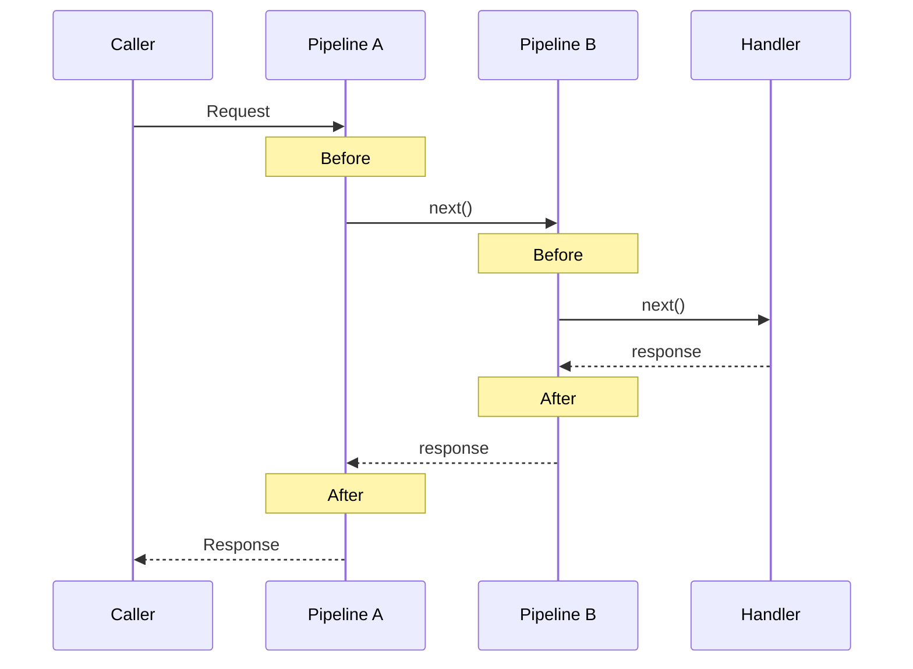

## Overview

How does a Mediator Pipeline work, and what constraints does the response type require? A Pipeline is middleware that processes **cross-cutting concerns** before and after a request reaches the handler. This section covers the structure of the Pipeline's core component, `IPipelineBehavior<TRequest, TResponse>`, and how generic constraints determine a Pipeline's scope of application and accessible members.

## Learning Objectives

After completing this section, you will be able to:

1. Explain the structure of `IPipelineBehavior<TRequest, TResponse>`
2. Understand the role of `MessageHandlerDelegate` in the Pipeline chain
3. Explain how `where` constraints determine a Pipeline's scope and accessible members
4. Understand why response type members cannot be accessed without TResponse constraints

## Key Concepts

### 1. IPipelineBehavior<TRequest, TResponse>

Mediator's Pipeline Behavior implements the following interface:

```csharp
public interface IPipelineBehavior<TRequest, TResponse>
    where TRequest : IMessage
{
    ValueTask<TResponse> Handle(
        TRequest request,
        MessageHandlerDelegate<TRequest, TResponse> next,
        CancellationToken cancellationToken);
}
```

The key elements of this interface:
- **TRequest**: The request message type (`IMessage` constraint)
- **TResponse**: The response type (no constraint by default)
- **Handle**: The method where the Pipeline intercepts the request

### 2. MessageHandlerDelegate<TRequest, TResponse>

The `next` delegate calls the **next step** in the Pipeline chain:

```csharp
public delegate ValueTask<TResponse> MessageHandlerDelegate<TRequest, TResponse>(
    TRequest request,
    CancellationToken cancellationToken);
```

Pipelines can add logic before and after calling `next`:

```csharp
public async ValueTask<TResponse> Handle(
    TRequest request,
    MessageHandlerDelegate<TRequest, TResponse> next,
    CancellationToken cancellationToken)
{
    // Before: logic before calling next (Validation, Logging start, etc.)
    var response = await next(request, cancellationToken);
    // After: logic after calling next (Logging end, Metrics collection, etc.)
    return response;
}
```

### 3. Generic Constraints Determine Pipeline Scope

A Pipeline's `where` constraints determine **which requests/responses the Pipeline applies to**.

#### No Constraints (applies to all requests)

```csharp
public class LoggingPipeline<TRequest, TResponse>
    : IPipelineBehavior<TRequest, TResponse>
    where TRequest : IMessage    // Only IMessage needed (Mediator default constraint)
```

#### Adding TResponse Constraints (specific responses only)

The key thing to note is that when a `where TResponse : IResult` constraint is added, members of the response type can be safely accessed at compile time within the Pipeline.

```csharp
public class ValidationPipeline<TRequest, TResponse>
    : IPipelineBehavior<TRequest, TResponse>
    where TRequest : IMessage
    where TResponse : IResult    // Only processes responses implementing IResult
```

Adding an `IResult` constraint to TResponse allows **direct access** to members like `response.IsSuccess` inside the Pipeline. This is the core of **type-safe Pipelines**.

### 4. Pipeline Chain Structure

When multiple Pipelines are registered, they are connected in a **chain**:



Each Pipeline calls `next()` to forward the request to the next Pipeline (or the final Handler).

## FAQ

### Q1: Why does `IPipelineBehavior`'s `TRequest` have an `IMessage` constraint?
**A**: `IMessage` is a **marker interface** used by the Mediator framework to identify request messages. This constraint is required for Mediator to recognize the type as a request and connect it to the Pipeline chain.

### Q2: Without constraints on `TResponse`, how does the Pipeline handle the response?
**A**: Without constraints, `TResponse` is treated like `object`, and members like `IsSucc` or `IsFail` cannot be accessed. In this case, reflection or `is` casting must be used for runtime type checking. This is exactly why appropriate constraints on `TResponse` are necessary.

### Q3: What happens if `next()` is not called in the Pipeline chain?
**A**: If `next()` is not called, the request is not forwarded to the next Pipeline or Handler. This is called **short-circuiting**. A typical example is the Validation Pipeline returning a failure response directly without calling `next()` when validation fails.

## Project Structure

```
01-Mediator-Pipeline-Structure/
├── MediatorPipelineStructure/
│   ├── MediatorPipelineStructure.csproj
│   ├── SimplePipeline.cs
│   └── Program.cs
├── MediatorPipelineStructure.Tests.Unit/
│   ├── MediatorPipelineStructure.Tests.Unit.csproj
│   ├── xunit.runner.json
│   └── PipelineStructureTests.cs
└── README.md
```

## How to Run

```bash
# Run the program
dotnet run --project MediatorPipelineStructure

# Run tests
dotnet test --project MediatorPipelineStructure.Tests.Unit
```

---

When using LanguageExt's `Fin<T>` directly as a response type, reflection is needed in 3 places due to the sealed struct constraint.

→ [Section 2.2: Limitations of Using Fin\<T\> Directly](../02-Fin-Direct-Limitation/)
