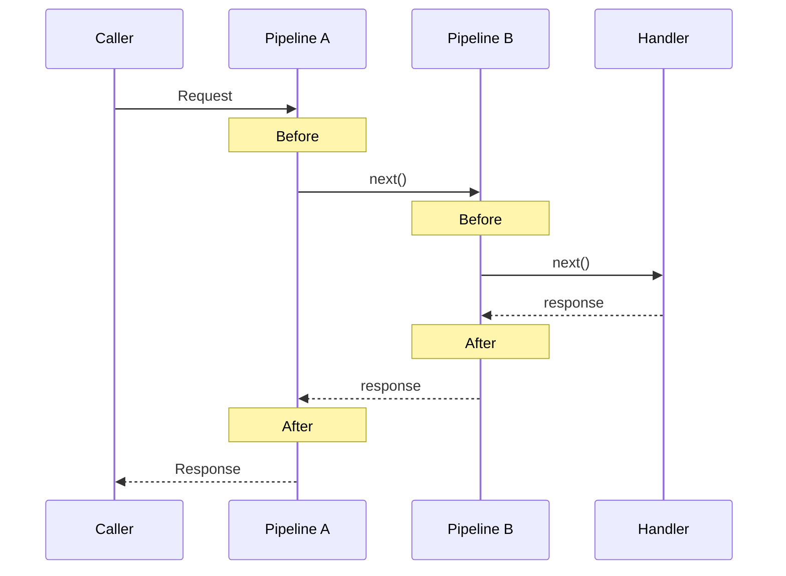

## 개요

Mediator Pipeline은 어떤 구조로 동작하며, 응답 타입에 어떤 제약이 필요할까요? Pipeline은 요청(Request)이 핸들러(Handler)에 도달하기 전후로 **교차 관심사를** 처리하는 미들웨어입니다. 이 장에서는 Pipeline의 핵심 구성 요소인 `IPipelineBehavior<TRequest, TResponse>`의 구조와 제네릭 제약이 Pipeline의 적용 범위를 어떻게 결정하는지 학습합니다.

## 학습 목표

이 장을 완료하면 다음을 할 수 있습니다:

1. `IPipelineBehavior<TRequest, TResponse>`의 구조를 설명할 수 있습니다
2. `MessageHandlerDelegate`가 Pipeline 체인에서 하는 역할을 이해할 수 있습니다
3. `where` 제약이 Pipeline의 적용 범위와 접근 가능한 멤버를 어떻게 결정하는지 설명할 수 있습니다
4. TResponse 제약이 없으면 응답 타입의 멤버에 접근할 수 없는 이유를 이해할 수 있습니다

## 핵심 개념

### 1. IPipelineBehavior<TRequest, TResponse>

Mediator의 Pipeline Behavior는 다음 인터페이스를 구현합니다:

```csharp
public interface IPipelineBehavior<TRequest, TResponse>
    where TRequest : IMessage
{
    ValueTask<TResponse> Handle(
        TRequest request,
        MessageHandlerDelegate<TRequest, TResponse> next,
        CancellationToken cancellationToken);
}
```

이 인터페이스의 핵심 요소:
- **TRequest**: 요청 메시지 타입 (`IMessage` 제약)
- **TResponse**: 응답 타입 (기본적으로 제약 없음)
- **Handle**: Pipeline이 요청을 가로채는 메서드

### 2. MessageHandlerDelegate<TRequest, TResponse>

`next` 델리게이트는 Pipeline 체인에서 **다음 단계**를 호출합니다:

```csharp
public delegate ValueTask<TResponse> MessageHandlerDelegate<TRequest, TResponse>(
    TRequest request,
    CancellationToken cancellationToken);
```

Pipeline은 `next`를 호출하기 전후로 로직을 추가할 수 있습니다:

```csharp
public async ValueTask<TResponse> Handle(
    TRequest request,
    MessageHandlerDelegate<TRequest, TResponse> next,
    CancellationToken cancellationToken)
{
    // Before: next 호출 전 로직 (Validation, Logging 시작 등)
    var response = await next(request, cancellationToken);
    // After: next 호출 후 로직 (Logging 종료, Metrics 수집 등)
    return response;
}
```

### 3. 제네릭 제약이 Pipeline 적용 범위를 결정

Pipeline의 `where` 제약은 **어떤 요청/응답에 이 Pipeline이 적용되는지**를 결정합니다.

#### 제약 없음 (모든 요청에 적용)

```csharp
public class LoggingPipeline<TRequest, TResponse>
    : IPipelineBehavior<TRequest, TResponse>
    where TRequest : IMessage    // IMessage만 필요 (Mediator 기본 제약)
```

#### TResponse에 제약 추가 (특정 응답만)

주목할 점은 `where TResponse : IResult` 제약이 추가되면, Pipeline 내부에서 응답 타입의 멤버에 컴파일 타임에 안전하게 접근할 수 있다는 것입니다.

```csharp
public class ValidationPipeline<TRequest, TResponse>
    : IPipelineBehavior<TRequest, TResponse>
    where TRequest : IMessage
    where TResponse : IResult    // IResult를 구현하는 응답만 처리
```

TResponse에 `IResult` 제약을 추가하면, Pipeline 내부에서 `response.IsSuccess` 같은 멤버에 **직접 접근**할 수 있습니다. 이것이 바로 **타입 안전한 Pipeline**의 핵심입니다.

### 4. Pipeline 체인 구조

여러 Pipeline이 등록되면 **체인**으로 연결됩니다:



각 Pipeline은 `next()`를 호출하여 다음 Pipeline(또는 최종 Handler)에 요청을 전달합니다.

## FAQ

### Q1: `IPipelineBehavior`의 `TRequest`에 `IMessage` 제약이 있는 이유는 무엇인가요?
**A**: `IMessage`는 Mediator 프레임워크가 요청 메시지를 식별하기 위한 **마커 인터페이스**입니다. 이 제약이 있어야 Mediator가 해당 타입을 요청으로 인식하고 Pipeline 체인에 연결할 수 있습니다.

### Q2: `TResponse`에 제약이 없으면 Pipeline 내부에서 응답을 어떻게 처리하나요?
**A**: 제약이 없으면 `TResponse`는 `object`처럼 취급되어 `IsSucc`나 `IsFail` 같은 멤버에 접근할 수 없습니다. 이 경우 리플렉션을 사용하거나, `is` 캐스팅으로 런타임에 타입을 확인해야 합니다. 이것이 바로 `TResponse`에 적절한 제약이 필요한 이유입니다.

### Q3: Pipeline 체인에서 `next()`를 호출하지 않으면 어떻게 되나요?
**A**: `next()`를 호출하지 않으면 다음 Pipeline이나 Handler에 요청이 전달되지 않습니다. 이를 **단축 평가(Short-Circuit)라고** 합니다. Validation Pipeline이 검증 실패 시 `next()`를 호출하지 않고 실패 응답을 직접 반환하는 것이 대표적인 예입니다.

## 프로젝트 구조

```
01-Mediator-Pipeline-Structure/
├── MediatorPipelineStructure/
│   ├── MediatorPipelineStructure.csproj
│   ├── SimplePipeline.cs
│   └── Program.cs
├── MediatorPipelineStructure.Tests.Unit/
│   ├── MediatorPipelineStructure.Tests.Unit.csproj
│   ├── xunit.runner.json
│   └── PipelineStructureTests.cs
└── README.md
```

## 실행 방법

```bash
# 프로그램 실행
dotnet run --project MediatorPipelineStructure

# 테스트 실행
dotnet test --project MediatorPipelineStructure.Tests.Unit
```

---

LanguageExt의 `Fin<T>`를 응답 타입으로 직접 사용하면, sealed struct라는 제약 때문에 리플렉션이 3곳에서 필요해집니다.

→ [2.2장: Fin\<T\> 직접 사용의 한계](../02-Fin-Direct-Limitation/)

