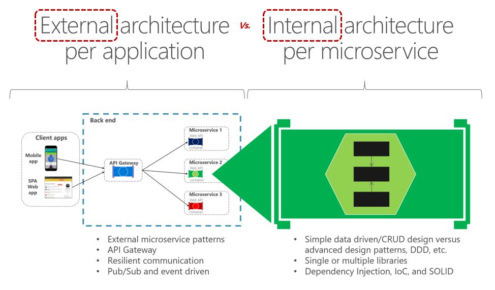
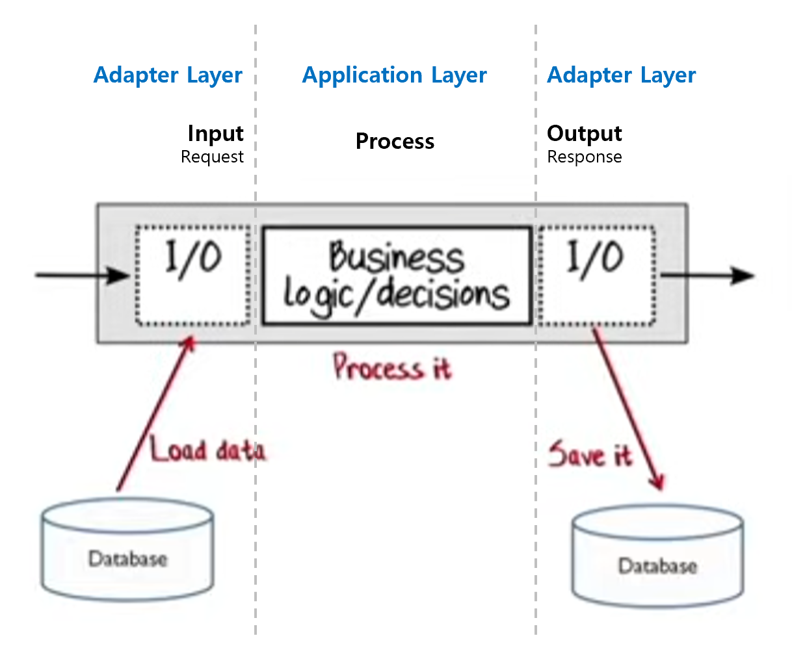
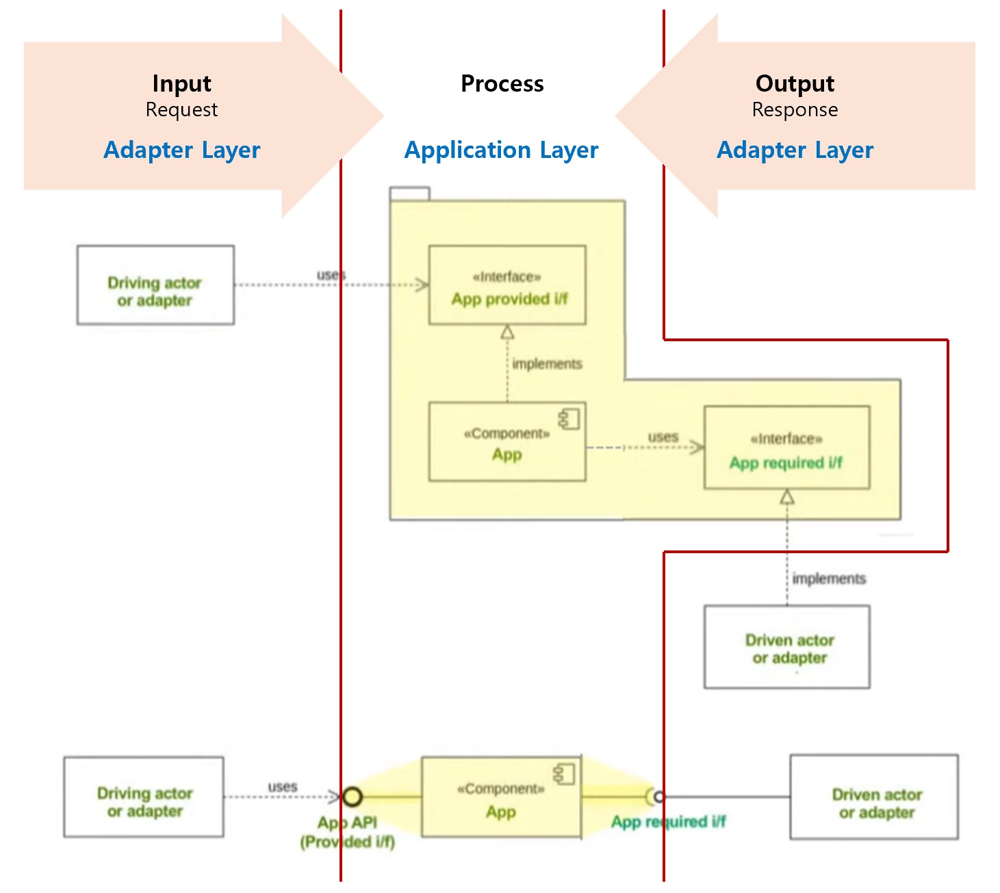
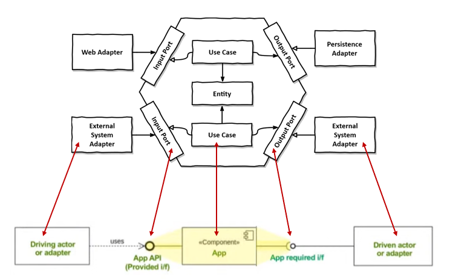
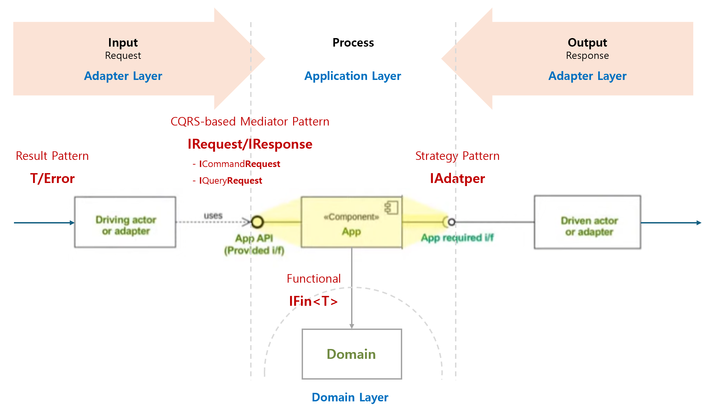
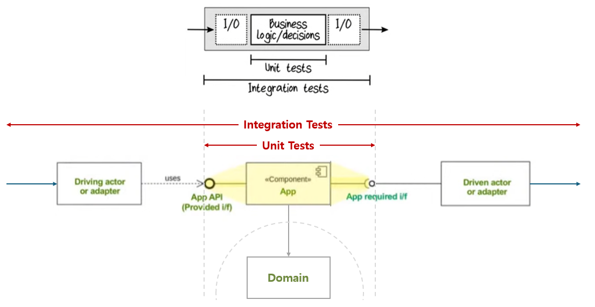
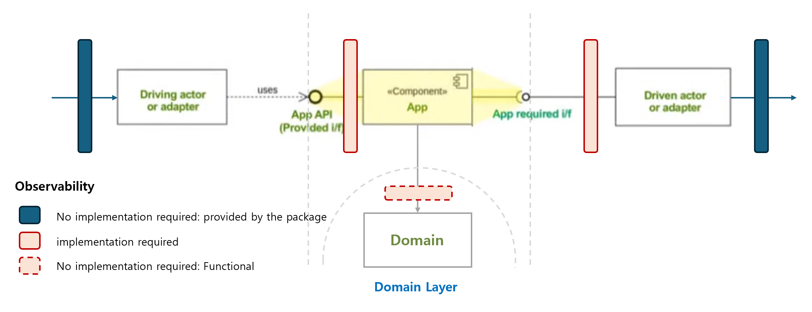

# 아키텍처

## 목차
- [소프트웨어 아키텍처 정의](#소프트웨어-아키텍처-정의)
- [애플리케이션 아키텍처](#애플리케이션-아키텍처)
- [Internal 아키텍처 관심사](#internal-아키텍처-관심사)
- [Internal 아키텍처 레이어 의존성](#internal-아키텍처-레이어-의존성)
- [Internal 아키텍처](#internal-아키텍처)
- [External 아키텍처](#external-아키텍처)
- [FAQ](#faq)

 

## 소프트웨어 아키텍처 정의

- 출처: [소프트웨어 아키텍처의 중요성](https://www.youtube.com/watch?v=4E1BHTvhB7Y)

 

## 애플리케이션 아키텍처
### 애플리케이션 아키텍처 변천사

### 애플리케이션 External(Outer) / Internal(Inner) 아키텍처

- 출처: [Design a microservice-oriented application](https://learn.microsoft.com/en-us/dotnet/architecture/microservices/multi-container-microservice-net-applications/microservice-application-design)

### 아키텍처 설계 원칙
- 관심사의 분리(Separation of concerns) 원칙
  - 출처: [아키텍처 원칙](https://learn.microsoft.com/ko-kr/dotnet/architecture/modern-web-apps-azure/architectural-principles)

  구분 | 관심사 단위 | 물리적 실체
  --- | --- | ---
  External 아키텍처 | 서비스 | 컨테이너
  Internal 아키텍처 | 레이어 | -
  객체 지향 | 객체 | 클래스

 

## Internal 아키텍처 관심사

Internal 아키텍처는 **관심사의 분리 원칙**에 따라 **기술 관심사**와 **비즈니스 관심사**로 구분합니다. 이렇게 구분된 관심사는 레이어로 정의하여 관리합니다.

### 레이어 분류
관심사 구분 | 레이어 이름 | 레이어 역할
--- | --- | ---
기술 관심사 | Adapter 레이어 | 기술 흐름과 단위 (입력/출력 처리)
비즈니스 관심사 | Application 레이어 | 비즈니스 흐름 (Use Case)
비즈니스 관심사 | Domain 레이어 | 비즈니스 단위 (Entity)

- 비즈니스 관심사만 단위와 흐름을 명시적으로 레이어를 구분합니다.
- **기술 관심사(Adapter 레이어)가 비즈니스 관심사에 의존**하도록 의존성 방향이 **밖에서 안쪽**으로 향합니다.
- 이를 통해 **비즈니스 관심사(Application/Domain 레이어)는 기술에 의존하지 않고** 개발 및 테스트할 수 있습니다.

 

## Internal 아키텍처 레이어 의존성
### 의존성 시각화(클래스 다이어그램)

- 출처: [Hexagonal Architecture (Alistair Cockburn)](https://www.youtube.com/watch?v=k0ykTxw7s0Y)

### 의존성 통합
> **App** = `Driving` 인터페이스 **정의 및 구현** + `Driven` 인터페이스 **정의 및 사용**

### 의존성 방향

- **Driving Adapter(입력)**: `App provided i/f` 인터페이스를 **사용(uses)** 합니다.
- **Application**: `App provided i/f` 인터페이스를 **구현(implements)** 하고, `App required i/f` 인터페이스를 **사용(uses)** 합니다.
- **Driven Adapter(출력)**: `App required i/f` 인터페이스를 **구현(implements)** 합니다.

> 의존성 역전(DIP)을 통해 Adapter 레이어가 Application 레이어에 정의된 인터페이스에 의존하게 되어, 의존성 방향이 **밖에서 안쪽**으로 향합니다.

### 의존성 비교
- 클린 아키텍처  
  
- 헥사고날 아키텍처  
  

- 클린 아키텍처와 헥사고날 아키텍처와 동일한 의존성 방향임을 확인할 수 있습니다.

 

## Internal 아키텍처

### 레이어별 역할과 패턴

| 구분 | 레이어 | 패턴 | 설명 |
| --- | --- | --- | --- |
| 입력(Request) | Adapter | Result 패턴 | `T(성공)/Error(실패)` 형태로 결과 반환 |
| 출력(Response) | Adapter | Strategy 패턴, 함수형 | `IAdapter` 인터페이스를 통한 외부 시스템 연동 |
| 비즈니스 연산 | Application | Mediator 패턴(CQRS) | `IRequest/IResponse` 인터페이스 (`ICommandRequest`, `IQueryRequest`) |
| 비즈니스 단위 | Domain | 함수형 | 비즈니스 핵심 로직과 엔티티 |

### 테스트 자동화

- **단위 테스트(Unit Tests)**: 비즈니스 관심사만으 테스트합니다.
- **통합 테스트(Integration Tests)**: 기술 관심사까지 포함하여 테스트합니다.

### 관찰 가능성

 

## External 아키텍처
- _TODO_

 

## FAQ

### Q1. 왜 기술 관심사와 비즈니스 관심사를 분리해야 하나요?
기술(프레임워크, DB, 외부 API 등)은 시간이 지남에 따라 변경될 수 있습니다. 비즈니스 로직이 특정 기술에 강하게 결합되어 있으면, 기술 변경 시 비즈니스 로직까지 수정해야 합니다. 관심사를 분리하면 기술 변경이 비즈니스 로직에 영향을 주지 않아 유지보수성이 높아집니다.

또한 **독립적 개발**이 가능해집니다. 기술 관심사(Adapter) 구현이 완료되지 않은 상황에서도 비즈니스 관심사(Application/Domain)는 독립적으로 개발하고 테스트할 수 있습니다. 예를 들어, DB 연동이 준비되지 않아도 In-Memory 구현체 또는 단위 테스트로 대체하여 비즈니스 로직 개발을 진행할 수 있습니다.

### Q2. Driving Adapter와 Driven Adapter의 차이점은 무엇인가요?
| 구분 | Driving Adapter (입력) | Driven Adapter (출력) |
| --- | --- | --- |
| 역할 | 애플리케이션을 호출하는 주체 | 애플리케이션이 호출하는 대상 |
| 예시 | REST Controller, CLI, Message Consumer | Repository, External API Client, Message Publisher |
| 인터페이스 | `App provided i/f`를 사용(uses) | `App required i/f`를 구현(implements) |

### Q3. 왜 의존성 방향이 밖에서 안쪽으로 향해야 하나요?
의존성 방향이 안쪽(비즈니스)에서 밖쪽(기술)으로 향하면, 비즈니스 로직이 기술에 의존하게 됩니다. 이 경우 기술 변경 시 비즈니스 로직도 함께 변경해야 합니다. 반대로 밖에서 안쪽으로 향하면, 기술이 비즈니스에 의존하므로 기술만 교체하면 됩니다.

### Q4. Application 레이어와 Domain 레이어를 왜 분리하나요?
- **Application 레이어**: 비즈니스 **흐름**(Use Case)을 담당합니다. "어떤 순서로 무엇을 할지"를 정의합니다.
- **Domain 레이어**: 비즈니스 **단위**(Entity)를 담당합니다. "무엇이 어떤 규칙을 가지는지"를 정의합니다.

흐름과 단위를 분리하면 Use Case 변경이 Entity에 영향을 주지 않고, Entity의 규칙 변경이 Use Case 흐름에 최소한의 영향만 줍니다.

### Q5. 이 아키텍처는 클린 아키텍처, 헥사고날 아키텍처와 어떤 관계인가요?
모두 **동일한 의존성 방향**(밖에서 안쪽)을 가집니다. 용어와 표현 방식은 다르지만 핵심 원칙은 같습니다:

| 본 문서 | 클린 아키텍처 | 헥사고날 아키텍처 |
| --- | --- | --- |
| Adapter 레이어 | Frameworks & Drivers | Port & Adapter |
| Application 레이어 | Use Cases | Application |
| Domain 레이어 | Entities | Domain |

### Q6. 단위 테스트에서 Adapter를 제외하는 이유는 무엇인가요?
Adapter는 외부 기술(DB, HTTP, 파일 시스템 등)과 연동되어 있어 테스트 환경 구성이 복잡하고 실행 속도가 느립니다. 비즈니스 로직(Application/Domain)만 테스트하면 빠르고 안정적인 단위 테스트가 가능합니다. Adapter는 통합 테스트에서 검증합니다.