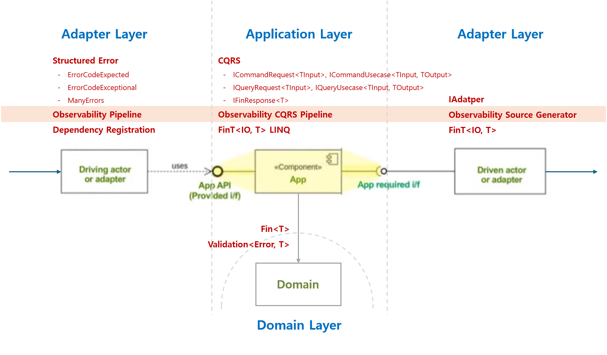

# Functorium

배움은 설렘이다. 배움은 겸손이다. 배움은 이타심이다.

[](https://github.com/hhko/Functorium/actions/workflows/build.yml) [](https://github.com/hhko/Functorium/actions/workflows/publish.yml)

> A functional domain is functor + dominium, seasoned with fun, designed to bridge **the age of deterministic rules** and **the age of probabilistic intuition**.
>
> - Domin-Driven Design: **객체 단위로** 비즈니스 관심사를 **캡슐화한다.**
> - Functional 아키텍처: **레이어 단위로** 비즈니스 관심사를 **순수화한다.**
> - Microservices 아키텍처: **서비스 단위로** 비즈니스 관심사를 **자율화한다.**
>
> 그래서 우리는 유스케이스 단위를 최상위 설계 단위로 삼는다!



It enables expressing domain logic as pure functions and pushing side effects to architectural boundaries, allowing you to write **testable and predictable business logic**. The framework provides a functional type system based on LanguageExt 5.x and integrated observability through OpenTelemetry.

### Core Principles

| Principle | Description | Functorium Support |
|-----------|-------------|-------------------|
| **Domain First** | Domain model is the center of architecture | Value Object hierarchy, immutable domain types |
| **Pure Core** | Business logic expressed as pure functions | `Fin<T>` return type, exception-free error handling |
| **Impure Shell** | Side effects handled at boundary layers | Adapter Pipeline, ActivityContext propagation |
| **Explicit Effects** | All effects explicitly typed | `FinResponse<T>`, `FinT<IO, T>` monad |

## Book
- [Architecture](./Docs/ArchitectureIs/README.md)
- [Automating Release Notes with Claude Code and .NET 10](./Books/Automating-ReleaseNotes-with-ClaudeCode-and-.NET10/README.md)
- [Automating Observability Code with SourceGenerator](./Books/Automating-ObservabilityCode-with-SourceGenerator/README.md)
- [Implementing Functional ValueObject](./Books/Implementing-Functional-ValueObject/README.md)

## Observability

> All observability fields use `snake_case + dot` notation for consistency with OpenTelemetry semantic conventions.


### Service Attributes

Functorium uses [OpenTelemetry Service Attributes](https://opentelemetry.io/docs/specs/semconv/registry/attributes/service/) for service identification.

| Attribute | Description | Example |
|-----------|-------------|---------|
| `service.namespace` | A namespace for `service.name`. Helps distinguish service groups (e.g., by team or environment). | `mycompany.production` |
| `service.name` | Logical name of the service. Must be identical across all horizontally scaled instances. | `orderservice` |
| `service.version` | The version string of the service API or implementation. | `2.0.0` |
| `service.instance.id` | Unique ID of the service instance. Must be globally unique per `service.namespace,service.name` pair. Uses `HOSTNAME` environment variable if available, otherwise falls back to `Environment.MachineName`. | `my-pod-abc123` (Kubernetes), `DESKTOP-ABC123` (Windows) |

> **Recommended**: Use lowercase values for `service.name` and `service.namespace` (e.g., `mycompany.production`, `orderservice`).
> This ensures consistency with OpenTelemetry conventions and avoids case-sensitivity issues in downstream systems (dashboards, queries, alerts).

### Field/Tag Consistency

**Application Layer:** (Unit Tests: [Logging](./Tests/Functorium.Tests.Unit/AdaptersTests/Observabilities/Pipelines/UsecaseLoggingPipelineStructureTests.cs), [Metrics](./Tests/Functorium.Tests.Unit/AdaptersTests/Observabilities/Pipelines/UsecaseMetricsPipelineStructureTests.cs), [Tracing](./Tests/Functorium.Tests.Unit/AdaptersTests/Observabilities/Pipelines/UsecaseTracingPipelineStructureTests.cs))

| Field/Tag | Logging | Metrics | Tracing | Description |
|-----------|---------|---------|---------|-------------|
| `request.layer` | ✅ | ✅ | ✅ | Architecture layer (`"application"`) |
| `request.category` | ✅ | ✅ | ✅ | Request category (`"usecase"`) |
| `request.category.type` | ✅ | ✅ | ✅ | CQRS type (`"command"`, `"query"`) |
| `request.handler` | ✅ | ✅ | ✅ | Handler class name |
| `request.handler.method` | ✅ | ✅ | ✅ | Handler method name (`"Handle"`) |
| `response.status` | ✅ | ✅ | ✅ | Response status (`"success"`, `"failure"`) |
| `response.elapsed` | ✅ | -* | ✅ | Processing time in seconds |
| `error.type` | ✅ | ✅ | ✅ | Error classification (`"expected"`, `"exceptional"`, `"aggregate"`) |
| `error.code` | ✅ | ✅ | ✅ | Domain-specific error code |
| `@error` | ✅ | - | - | Structured error object (detailed) |

**Adapter Layer:** (Unit Tests: [Logging](./Tests/Functorium.Tests.Unit/AdaptersTests/SourceGenerators/ObservablePortLoggingStructureTests.cs), [Metrics](./Tests/Functorium.Tests.Unit/AdaptersTests/SourceGenerators/ObservablePortMetricsStructureTests.cs), [Tracing](./Tests/Functorium.Tests.Unit/AdaptersTests/SourceGenerators/ObservablePortTracingStructureTests.cs))

| Field/Tag | Logging | Metrics | Tracing | Description |
|-----------|---------|---------|---------|-------------|
| `request.layer` | ✅ | ✅ | ✅ | Architecture layer (`"adapter"`) |
| `request.category` | ✅ | ✅ | ✅ | Adapter category (e.g., `"repository"`) |
| `request.handler` | ✅ | ✅ | ✅ | Handler class name |
| `request.handler.method` | ✅ | ✅ | ✅ | Handler method name |
| `response.status` | ✅ | ✅ | ✅ | Response status (`"success"`, `"failure"`) |
| `response.elapsed` | ✅ | -* | ✅ | Processing time in seconds |
| `error.type` | ✅ | ✅ | ✅ | Error classification (`"expected"`, `"exceptional"`, `"aggregate"`) |
| `error.code` | ✅ | ✅ | ✅ | Domain-specific error code |
| `@error` | ✅ | - | - | Structured error object (detailed) |

> **\* Why `response.elapsed` is not a Metrics tag:**
> - Metrics uses a dedicated `duration` **Histogram instrument** to capture processing time, which is the OpenTelemetry-recommended approach for latency measurement.
> - Using elapsed time as a tag would cause **high cardinality explosion** (each unique duration value creates a new time series), degrading metrics storage and query performance.
> - Histogram provides **statistical aggregations** (percentiles, averages, counts) that are more useful for monitoring than individual elapsed values.

### Logging

**Field Structure:**

| Field Name | Application Layer | Adapter Layer | Description |
|------------|-------------------|---------------|-------------|
| **Static Fields** | | | |
| `request.layer` | `"application"` | `"adapter"` | Request layer identifier |
| `request.category` | `"usecase"` | Adapter category name | Request category identifier |
| `request.category.type` | `"command"` / `"query"` | - | CQRS type |
| `request.handler` | Handler name | Handler name | Handler class name |
| `request.handler.method` | `"Handle"` | Method name | Handler method name |
| `response.status` | `"success"` / `"failure"` | `"success"` / `"failure"` | Response status |
| `response.elapsed` | Processing time (s) | Processing time (s) | Elapsed time in seconds |
| `error.type` | `"expected"` / `"exceptional"` / `"aggregate"` | `"expected"` / `"exceptional"` / `"aggregate"` | Error classification |
| `error.code` | Error code | Error code | Domain-specific error code |
| `@error` | Error object (structured) | Error object (structured) | Error data (detailed) |
| **Dynamic Fields** | | | |
| `@request.message` | Full Command/Query object | - | Request message |
| `@response.message` | Full response object | - | Response message |
| `request.params.{name}` | - | Individual method parameter | Request params |
| `request.params.{name}.count` | - | Collection size (when parameter is collection) | Request params count |
| `response.result` | - | Method return value | Response result |
| `response.result.count` | - | Collection size (when return is collection) | Response result count |

**Log Level by Event:**

| Event | Log Level | Application Layer | Adapter Layer | Description |
|-------|-----------|-------------------|---------------|-------------|
| Request | Information | 1001 `application.request` | 2001 `adapter.request` | Request received |
| Request (Debug) | Debug | - | 2001 `adapter.request` | Request with parameter values |
| Response Success | Information | 1002 `application.response.success` | 2002 `adapter.response.success` | Successful response |
| Response Success (Debug) | Debug | - | 2002 `adapter.response.success` | Response with result value |
| Response Warning | Warning | 1003 `application.response.warning` | 2003 `adapter.response.warning` | Expected error (business logic) |
| Response Error | Error | 1004 `application.response.error` | 2004 `adapter.response.error` | Exceptional error (system failure) |

**Message Templates (Application Layer):**

```
# Request
{request.layer} {request.category}.{request.category.type} {request.handler}.{request.handler.method} {@request.message} requesting

# Response - Success
{request.layer} {request.category}.{request.category.type} {request.handler}.{request.handler.method} {@response.message} responded {response.status} in {response.elapsed:0.0000} s

# Response - Warning/Error
{request.layer} {request.category}.{request.category.type} {request.handler}.{request.handler.method} responded {response.status} in {response.elapsed:0.0000} s with {error.type}:{error.code} {@error}
```

**Message Templates (Adapter Layer):**

```
# Request (Information)
{request.layer} {request.category} {request.handler}.{request.handler.method} requesting

# Request (Debug) - with parameters
{request.layer} {request.category} {request.handler}.{request.handler.method} {request.params.items} {request.params.items.count} requesting

# Response (Information)
{request.layer} {request.category} {request.handler}.{request.handler.method} responded {response.status} in {response.elapsed:0.0000} s

# Response (Debug) - with result
{request.layer} {request.category} {request.handler}.{request.handler.method} {response.result} responded {response.status} in {response.elapsed:0.0000} s

# Response Warning/Error
{request.layer} {request.category} {request.handler}.{request.handler.method} responded failure in {response.elapsed:0.0000} s with {error.type}:{error.code} {@error}
```

**Error Field Values (`error.type` vs `@error.ErrorType`):**

> `error.type` and `@error.ErrorType` use different value formats for different purposes.

| Error Type | `error.type` (Filtering) | `@error.ErrorType` (Detail) |
|------------|--------------------------|----------------------------|
| Expected Error | `"expected"` | `"ErrorCodeExpected"` |
| Exceptional Error | `"exceptional"` | `"ErrorCodeExceptional"` |
| Aggregate Error | `"aggregate"` | `"ManyErrors"` |
| LanguageExt Expected | `"expected"` | `"Expected"` |
| LanguageExt Exceptional | `"exceptional"` | `"Exceptional"` |

- **`error.type`**: Standardized values for log filtering/querying (consistent with Metrics/Tracing)
- **`@error.ErrorType`**: Actual class name for detailed error type identification

**Implementation:**

| Layer | Method | Tests | Note |
|-------|--------|-------|------|
| Application | Direct `ILogger.LogXxx()` calls | [UsecaseLoggingPipelineStructureTests](./Tests/Functorium.Tests.Unit/AdaptersTests/Observabilities/Pipelines/UsecaseLoggingPipelineStructureTests.cs) | 7+ parameters exceed `LoggerMessage.Define` limit of 6 |
| Adapter | `LoggerMessage.Define` delegates | [ObservablePortLoggingStructureTests](./Tests/Functorium.Tests.Unit/AdaptersTests/SourceGenerators/ObservablePortLoggingStructureTests.cs) | Zero allocation, high performance |

### Metrics

**Meter Name:**

| Layer | Meter Name Pattern | Example (`ServiceNamespace = "mycompany.production"`) |
|-------|-------------------|-------------------------------------------------------|
| Application | `{service.namespace}.application` | `mycompany.production.application` |
| Adapter | `{service.namespace}.adapter.{category}` | `mycompany.production.adapter.repository` |

**Instrument Structure:**

| Instrument | Application Layer | Adapter Layer | Type | Unit | Description |
|------------|-------------------|---------------|------|------|-------------|
| requests | `application.usecase.{cqrs}.requests` | `adapter.{category}.requests` | Counter | `{request}` | Total request count |
| responses | `application.usecase.{cqrs}.responses` | `adapter.{category}.responses` | Counter | `{response}` | Response count |
| duration | `application.usecase.{cqrs}.duration` | `adapter.{category}.duration` | Histogram | `s` | Processing time (seconds) |

**Tag Structure (Application Layer):**

| Tag Key | requestCounter | durationHistogram | responseCounter (success) | responseCounter (failure) |
|---------|----------------|-------------------|---------------------------|---------------------------|
| `request.layer` | `"application"` | `"application"` | `"application"` | `"application"` |
| `request.category` | `"usecase"` | `"usecase"` | `"usecase"` | `"usecase"` |
| `request.category.type` | `"command"` / `"query"` | `"command"` / `"query"` | `"command"` / `"query"` | `"command"` / `"query"` |
| `request.handler` | handler name | handler name | handler name | handler name |
| `request.handler.method` | `"Handle"` | `"Handle"` | `"Handle"` | `"Handle"` |
| `response.status` | - | - | `"success"` | `"failure"` |
| `error.type` | - | - | - | `"expected"` / `"exceptional"` / `"aggregate"` |
| `error.code` | - | - | - | Primary error code |
| **Total Tags** | **5** | **5** | **6** | **8** |

**Tag Structure (Adapter Layer):**

| Tag Key | requestCounter | durationHistogram | responseCounter (success) | responseCounter (failure) |
|---------|----------------|-------------------|---------------------------|---------------------------|
| `request.layer` | `"adapter"` | `"adapter"` | `"adapter"` | `"adapter"` |
| `request.category` | category name | category name | category name | category name |
| `request.handler` | handler name | handler name | handler name | handler name |
| `request.handler.method` | method name | method name | method name | method name |
| `response.status` | - | - | `"success"` | `"failure"` |
| `error.type` | - | - | - | `"expected"` / `"exceptional"` / `"aggregate"` |
| `error.code` | - | - | - | Error code |
| **Total Tags** | **4** | **4** | **5** | **7** |

**Error Type Tag Values:**

| Error Case | error.type | error.code | Description |
|------------|------------|------------|-------------|
| `IHasErrorCode` + `IsExpected` | `"expected"` | Error code | Expected business logic error with error code |
| `IHasErrorCode` + `IsExceptional` | `"exceptional"` | Error code | Exceptional system error with error code |
| `ManyErrors` | `"aggregate"` | Primary error code | Multiple errors aggregated (Exceptional takes priority) |
| `Expected` (LanguageExt) | `"expected"` | Type name | LanguageExt base expected error without error code |
| `Exceptional` (LanguageExt) | `"exceptional"` | Type name | LanguageExt base exceptional error without error code |

**Implementation:**

| Layer | Method | Tests | Note |
|-------|--------|-------|------|
| Application | `IPipelineBehavior` + `IMeterFactory` | [UsecaseMetricsPipelineStructureTests](./Tests/Functorium.Tests.Unit/AdaptersTests/Observabilities/Pipelines/UsecaseMetricsPipelineStructureTests.cs) | Mediator pipeline |
| Adapter | Source Generator | [ObservablePortMetricsStructureTests](./Tests/Functorium.Tests.Unit/AdaptersTests/SourceGenerators/ObservablePortMetricsStructureTests.cs) | Auto-generated metrics instruments |

### Tracing

**Span Structure:**

| Property | Application Layer | Adapter Layer |
|----------|-------------------|---------------|
| Span Name | `{layer} {category}.{cqrs} {handler}.{method}` | `{layer} {category} {handler}.{method}` |
| Example | `application usecase.command CreateOrderCommandHandler.Handle` | `adapter Repository OrderRepository.GetById` |
| Kind | `Internal` | `Internal` |

**Tag Structure:**

| Tag Key | Application Layer | Adapter Layer | Description |
|---------|-------------------|---------------|-------------|
| **Request Tags** | | | |
| `request.layer` | `"application"` | `"adapter"` | Layer identifier |
| `request.category` | `"usecase"` | Category name | Category identifier |
| `request.category.type` | `"command"` / `"query"` | - | CQRS type |
| `request.handler` | Handler name | Handler name | Handler class name |
| `request.handler.method` | `"Handle"` | Method name | Method name |
| **Response Tags** | | | |
| `response.status` | `"success"` / `"failure"` | `"success"` / `"failure"` | Response status |
| `response.elapsed` | Processing time (s) | Processing time (s) | Elapsed time in seconds |
| **Error Tags** | | | |
| `error.type` | `"expected"` / `"exceptional"` / `"aggregate"` | `"expected"` / `"exceptional"` / `"aggregate"` | Error classification |
| `error.code` | Error code | Error code | Error code |
| **ActivityStatus** | `Ok` / `Error` | `Ok` / `Error` | OpenTelemetry status |

**Error Type Tag Values:**

| Error Case | error.type | error.code | Description |
|------------|------------|------------|-------------|
| `IHasErrorCode` + `IsExpected` | `"expected"` | Error code | Expected business logic error with error code |
| `IHasErrorCode` + `IsExceptional` | `"exceptional"` | Error code | Exceptional system error with error code |
| `ManyErrors` | `"aggregate"` | Primary error code | Multiple errors aggregated (Exceptional takes priority) |
| `Expected` (LanguageExt) | `"expected"` | Type name | LanguageExt base expected error without error code |
| `Exceptional` (LanguageExt) | `"exceptional"` | Type name | LanguageExt base exceptional error without error code |

**Implementation:**

| Layer | Method | Tests | Note |
|-------|--------|-------|------|
| Application | `IPipelineBehavior` + `ActivitySource.StartActivity()` | [UsecaseTracingPipelineStructureTests](./Tests/Functorium.Tests.Unit/AdaptersTests/Observabilities/Pipelines/UsecaseTracingPipelineStructureTests.cs) | Mediator pipeline |
| Adapter | Source Generator | [ObservablePortTracingStructureTests](./Tests/Functorium.Tests.Unit/AdaptersTests/SourceGenerators/ObservablePortTracingStructureTests.cs) | Auto-generated Activity spans |
