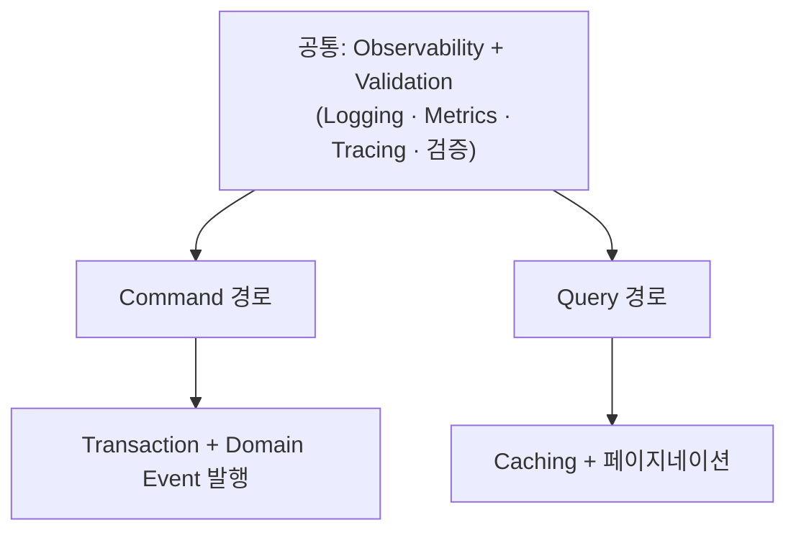
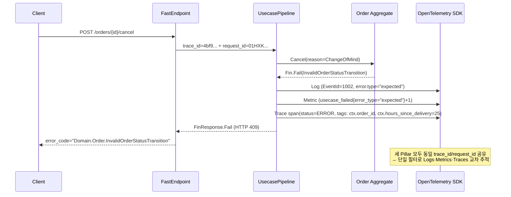

# Functorium

[](https://github.com/hhko/Functorium/actions/workflows/build.yml) [](https://github.com/hhko/Functorium/actions/workflows/publish.yml)

**[English](./README.md)** | **한국어**

> **Functorium**은 **`functor + dominium`** 에 **`fun`** 을 더한 이름입니다.
> **dominium**은 라틴어로 "지배, 소유"를 뜻합니다 — Domain은 단순한 범위가 아니라, **우리가 책임지고 지배하는 문제 공간**입니다.
>
> Functorium은 AI 에이전트가 도메인 설계를 직접 가이드하고 코드를 생성하는 **AI Native .NET 프레임워크**입니다. 산출물은 함수형 아키텍처 + DDD + Observability가 내재된 프로덕션 코드로 곧바로 컴파일됩니다.

**6개 전문 AI 에이전트가** 요구사항 분석부터 테스트까지 7단계 워크플로를 안내합니다. 각 단계에서 설계 문서와 컴파일 가능한 C# 코드가 동시에 생성되므로, 수백 가지 아키텍처 결정을 수작업으로 내릴 필요가 없습니다.

> **이 문서는 누구를 위한 것인가**
>
> 도메인 규칙만 던져주면 되는 기획자나 주니어 개발자를 위한 것이 **아닙니다.** AI 산출물의 무결성을 직접 검토·통제하고, 시스템의 경계와 아키텍처를 설정해야 하는 **애플리케이션 아키텍트**를 위한 심층 가이드입니다.
>
> AI는 파이프라인을 자동 합성합니다. 하지만 **무엇을 합성해야 하는가**를 정의하고, **합성된 결과를 신뢰할 수 있는가**를 판정하는 일은 사람의 책임으로 남습니다. 이 문서가 모나드·CQRS·Observable Port의 깊은 동작 원리까지 끝까지 설명하는 이유가 여기에 있습니다.

## 풀고자 하는 문제

1. **도메인 로직에 예외와 암묵적 사이드 이펙트가 섞여 있다** — 비즈니스 규칙의 성공과 실패가 예외로 처리되어, 흐름을 예측하기 어렵고 합성이 불가능합니다.
2. **개발 언어와 운영 언어가 분리되어 있다** — 기능 명세와 운영 요구가 서로 다른 체계로 관리되면서, 공통 언어가 정립되지 못하고 해석 차이가 누적됩니다.
3. **Observability가 사후 보완으로 추가된다** — 로그, 메트릭, 추적 정보가 구현 완료 후 별도로 부착되면서, 장애 발생 시 원인 분석에 필요한 맥락이 누락됩니다.

이는 단순히 프로세스의 문제가 아니라, **설계 철학과 구조의 문제**입니다.

Mediator, LanguageExt, FluentValidation, OpenTelemetry는 각각 훌륭합니다. 하지만 이들을 일관된 DDD 아키텍처로 통합하려면 에러 전파, 파이프라인 순서, 관측성 경계, 타입 제약에 관한 수백 가지 결정이 필요합니다. Functorium은 이 모든 결정을 한 곳에서 한 번에 내립니다 — 그리고 **AI 에이전트가 그 결정을 프로젝트에 자동으로 적용합니다.**

| 가치 | 제공 기능 |
|------|----------|
| **도메인 안전성** | Value Object 계층 (6 타입 + Union), Entity/AggregateRoot, Specification Pattern, 구조화된 에러 코드 |
| **함수형 합성** | `Fin<T>`/`FinT<IO,T>` Discriminated Union, LINQ 합성, Bind/Apply 검증, CQRS 경로별 최적화 |
| **IO 고급 기능** | Timeout, Retry(지수 백오프), Fork(병렬 실행), Bracket(리소스 생명주기 관리) |
| **자동화** | 6개 Source Generator, Usecase Pipeline (Observability + Validation 내장), 아키텍처 규칙 테스트 |
| **관측성** | 3-Pillar 자동 계측, ctx.* 비즈니스 컨텍스트 전파, 에러 자동 분류 (expected/exceptional/aggregate) |

### 30초 만에 보는 변화 — 텍스트에서 코드로

**사람이 작성하는 것** — 비즈니스 규칙 3줄:

> - 이메일은 비어 있을 수 없다
> - 이메일은 320자를 초과할 수 없다
> - 이메일은 올바른 형식이어야 한다

**AI가 생성하는 것** — 예외 없이 타입 안전한, 합성 가능한 함수형 검증 파이프라인:

```csharp
public sealed partial class Email : SimpleValueObject<string>
{
    public const int MaxLength = 320;

    private Email(string value) : base(value) { }

    public static Fin<Email> Create(string? value) =>
        CreateFromValidation(Validate(value), v => new Email(v));

    // 각 검증 조건이 실패하면 조건에 대응하는 에러 코드가 자동 생성됩니다.
    //   NotNull    → "Domain.Email.Null"
    //   NotEmpty   → "Domain.Email.Empty"
    //   MaxLength  → "Domain.Email.TooLong"
    //   Matches    → "Domain.Email.InvalidFormat"
    // 복합 Value Object는 Apply 패턴으로 복수 필드를 병렬 검증하여
    // 실패한 모든 에러를 한꺼번에 수집합니다.
    public static Validation<Error, string> Validate(string? value) =>
        ValidationRules<Email>
            .NotNull(value)
            .ThenNotEmpty()
            .ThenNormalize(v => v.Trim().ToLowerInvariant())
            .ThenMaxLength(MaxLength)
            .ThenMatches(EmailRegex(), "Invalid email format");

    // ORM/Repository 복원용 — 이미 정규화된 데이터만 받는다
    public static Email CreateFromValidated(string value) => new(value);

    public static implicit operator string(Email email) => email.Value;
}
```

> **비즈니스 규칙만 텍스트로 정의하세요.** 복잡하지만 안전한 이 코드는 AI 에이전트가 생성합니다.

<details>
<summary><strong>전통적 C# 예외 처리와의 비교</strong> — 왜 예외 대신 Fin&lt;T&gt;인가?</summary>

**Before** — 전통적인 C# 유효성 검사. 예외는 제어 흐름에 심어진 지뢰입니다:

```csharp
public class Email
{
    public Email(string value)
    {
        if (string.IsNullOrWhiteSpace(value))
            throw new ArgumentException("Email cannot be empty");   // 런타임 폭탄
                                                                    // 다음 개발자가 try-catch를 빼먹으면 시스템이 죽는다
        Value = value;
    }
    public string Value { get; }
}
```

**After** — Functorium의 함수형 검증. 실패 가능성이 반환 타입에 명시되어, 처리하지 않으면 컴파일 자체가 불가능합니다:

```csharp
public sealed partial class Email : SimpleValueObject<string>
{
    public static Fin<Email> Create(string? value) =>               // Fin<T>: 성공 또는 구조화된 에러
        CreateFromValidation(                                       // 예외 없이 합성 가능한 파이프라인
            Validate(value),                                        // Validation<Error, T>: 유효성 검사
            v => new Email(v));
}
```

</details>

이처럼 AI는 예외 없는 안전한 코드 구조를 자동으로 합성합니다.

### 사람은 규칙을, AI는 구현을, Observability는 번역을

| 역할 | 담당 | 구체적 산출물 |
|------|------|-------------|
| **사람** | 비즈니스 규칙 + 유비쿼터스 언어를 텍스트로 정의 | PRD, 불변식 목록, 용어 사전 |
| **AI 에이전트** | 복잡한 제어 흐름, 모나드 합성 코드, 보일러플레이트 구축 | `Fin<T>` 파이프라인, CQRS 유스케이스, Source Generator 코드 |
| **Observability** | AI가 생성한 코드를 사람이 읽을 수 있는 진단 데이터로 번역 | 구조화된 로그, 대시보드, 에러 자동 분류 |

> **"AI가 작성한 모나드 코드를 새벽 2시에 디버깅할 수 있을까?"**
>
> 프레임워크가 모든 Command/Query에 자동으로 내장하는 **에러 자동 분류 + 구조화된 컨텍스트 로그 + 대시보드가** AI 산출물의 내부 상태를 사람이 즉시 이해할 수 있는 진단 데이터로 번역합니다.

> **AI가 짠다고 해서, 사람이 이해하지 않아도 되는 것은 아닙니다.**
>
> 코드는 AI가 짜지만, 결과물의 무결성을 최종 검토하고 비즈니스 요건에 맞게 조율하는 일은 결국 **인간 아키텍트의 몫입니다.** 그래서 이 문서가 이어서 설명하는 모나드·CQRS·Observable Port의 내부 원리는 **독자가 짊어져야 할 짐이 아니라, AI를 통제하기 위해 손에 쥐어야 하는 무기**입니다.

### 요구사항이 바뀌면? — 인간은 텍스트만, AI는 구현을 다시

> CS팀이 경쟁사 정책 대응을 위해 **"배송 완료 후 24시간 내 단순변심 취소 허용"을** 요청합니다. 기존 규칙은 `Pending/Confirmed` 상태에서만 취소 가능했습니다 ([ecommerce-ddd 샘플의 `Order.Cancel()`](./Docs.Site/src/content/docs/ko/samples/ecommerce-ddd/index.md)).

| 항목 | Before | After |
|------|--------|-------|
| 허용 상태 전이 | `Pending/Confirmed → Cancelled` | 위 규칙 + `Delivered → Cancelled` (단, `DeliveredAt + 24h > now` & `reason = ChangeOfMind`) |
| `Cancel` 메서드 시그니처 | `Cancel() : Fin<Unit>` | `Cancel(CancellationReason reason) : Fin<Unit>` |
| Domain Event | `CancelledEvent(OrderId, OrderLines)` | 위 + `CancellationReason Reason` 필드 |
| 신규 Union 타입 | — | `CancellationReason = ChangeOfMind \| CustomerIssue \| Fraud` |

**3단계 협업 흐름**:

1. **사람 (아키텍트)** — PRD `§Order.Cancellation`에 한 줄 추가:
   > "`Delivered` 상태도 배송 완료 후 24시간 내 단순변심 취소 허용"

2. **AI (`domain-develop` 스킬)** — 아래 5개 산출물을 자동 생성·갱신:
   - `OrderStatus.AllowedTransitions`에 `("Delivered", Seq("Cancelled"))` 추가
   - `CancellationReason` Union 타입 신규 생성 (3-variant sealed record)
   - `Order.Cancel()`에 시간 조건 Specification 주입
   - `CancelledEvent`에 `CancellationReason` 필드 확장
   - 경계값 단위 테스트 자동 추가 (`23h59m` / `24h00m` / `24h01m`)

3. **프레임워크 (3중 검증 게이트)** — 빌드 타임에 회귀 자동 차단:
   - 아키텍처 규칙 테스트: Union `sealed`·record 불변성·`Fin<T>` 반환 검증
   - 기존 계약 회귀 테스트: `Pending/Confirmed → Cancelled` 경로가 깨지지 않는지 재확인
   - 타입 시스템: `Cancel()` 호출부의 컴파일 타임 시그니처 강제

> **개발자는 `Order.Cancel()` 내부의 `Fin<Unit>` 파이프라인을 열지 않습니다.**
> 텍스트 요구사항만 수정하세요. 상태 전이 규칙·Union 추가·이벤트 확장·테스트 재생성은 AI가 담당하고, 아키텍처 무결성은 [25개 규칙 테스트가](#게이트-1-아키텍처-규칙-테스트--구조적-무결성) 보장합니다.

| 역할 | 담당 | 이 시나리오에서 |
|------|------|----------------|
| **개발자** | 아키텍트 — 비즈니스 규칙·경계 결정 | "배송 완료 24시간 내 취소" 정책을 텍스트로 정의 |
| **AI 에이전트** | 구현 담당 — 상태머신·Union·이벤트·테스트 재생성 | `OrderStatus` 확장, `CancellationReason` 생성, 테스트 자동 추가 |
| **프레임워크** | 안전망 — 구조적 회귀 차단 | 아키텍처·타입·기존 계약 자동 검증 |

## AI가 문제를 돌파하는 방법

### 문제에서 코드까지 — AI가 연결하는 구조

| 문제 | 돌파 방향 | AI 에이전트의 역할 | 프레임워크가 보장하는 것 |
|------|----------|-------------------|----------------------|
| 예외와 암묵적 사이드 이펙트 | 예외 없는 순수 도메인 | **domain-architect**가 비즈니스 불변식을 분류하고 타입으로 매핑 | `Fin<T>`, `FinT<IO,T>`로 결과와 사이드 이펙트를 타입 수준에서 명시하고, LINQ 합성으로 도메인 흐름을 구성 |
| 개발/운영 언어 분리 | 단일 도메인 언어로 통합 | **product-analyst**가 유비쿼터스 언어를 추출하고 코드/문서/메트릭에 일관 반영 | Bounded Context를 명확히 정의하여 도메인 개념이 코드, 문서, 운영 메트릭에 일관 반영. `ctx.*` 필드 자동 전파 |
| Observability 사후 보완 | 설계에 내재된 Observability | **observability-engineer**가 KPI→메트릭 매핑, 대시보드, 알림을 설계 | OpenTelemetry 기반 Logging, Metrics, Tracing이 유스케이스 파이프라인에 자동 적용. `[GenerateObservablePort]` |

### 7단계 워크플로

PRD 작성부터 테스트까지, 7개 스킬 + 6개 전문 에이전트가 안내합니다.

```
project-spec                    : PRD 작성, 유비쿼터스 언어, Aggregate 경계 도출
  → architecture-design         : 프로젝트 구조, 레이어 구성, 인프라 결정
  → domain-develop              : Value Object, Entity, Aggregate, Specification 구현
  → application-develop         : CQRS 유스케이스, Port 설계 및 구현
  → adapter-develop             : Repository, Query Adapter, Endpoint, DI 등록
  → observability-develop       : KPI→메트릭 매핑, 대시보드, 알림, ctx.* 전파
  → test-develop                : 단위/통합/아키텍처 규칙 테스트 작성
---
domain-review                   : 기존 코드 DDD 리뷰 및 개선 방향 제시 (독립 스킬)
```

각 단계는 **4단계 문서 패턴을** 따릅니다. 모든 설계 결정에는 추적 가능한 근거가 남습니다:

```
00-business-requirements        : 비즈니스 규칙 정의
  →  01-type-design-decisions   : 불변식 → 타입 매핑
  →  02-code-design             : C# 패턴 설계
  →  03-implementation-results  : 컴파일 가능한 코드 + 테스트
```

### 6개 전문 에이전트 — 릴레이 타임라인

각 에이전트는 이전 단계의 산출물을 입력으로 받아 자신의 전문성을 더한 뒤, 다음 에이전트에게 바통을 넘깁니다:

```
Human                   : 비즈니스 요구사항 텍스트
  ↓
product-analyst         : 유비쿼터스 언어 + Aggregate 경계
  ↓
domain-architect        : 불변식 분류 + 타입 매핑 (VO, Entity, Aggregate)
  ↓
application-architect   : CQRS 유스케이스 + Port 인터페이스
  ↓
adapter-engineer        : Repository, Endpoint, DI, Observable Port
  ↓
observability-engineer  : KPI→메트릭 매핑 + 대시보드 + 알림
  ↓
test-engineer           : 단위/통합/아키텍처 규칙 테스트
```

| 단계 | 입력 | 에이전트 | 출력 |
|------|------------|---------|------------|
| 1 | 자연어 요구사항 | **product-analyst** | 유비쿼터스 언어 사전, Aggregate 경계, P0/P1/P2 우선순위 |
| 2 | 용어 사전 + 불변식 목록 | **domain-architect** | 타입 매핑(SimpleValueObject, SmartEnum 등), Always-valid 패턴 |
| 3 | 타입 정의 + 도메인 모델 | **application-architect** | CQRS 유스케이스, Port 인터페이스, FinT LINQ 합성 |
| 4 | Port 인터페이스 | **adapter-engineer** | EF Core Repository, Dapper Query, FastEndpoints, DI, Observable Port |
| 5 | Adapter 구현 코드 | **observability-engineer** | KPI→메트릭 매핑, L1/L2 대시보드, 알림 규칙, ctx.* 전파 |
| 6 | 전체 코드베이스 | **test-engineer** | 단위/통합/아키텍처 규칙 테스트, 검증 리포트 |

### AI가 생성하는 산출물

- Value Objects (Always-valid, 구조화된 에러 코드)
- AggregateRoot (도메인 이벤트 포함)
- CQRS Command/Query 유스케이스
- EF Core Repository + Dapper Query Adapter
- FastEndpoints API 엔드포인트
- Observable Port (자동 3-Pillar 계측)
- 단위 테스트, 통합 테스트, 아키텍처 규칙 테스트
- 전 단계 설계 문서 (추적 가능한 설계 근거)

## AI가 생성하는 코드: 함수형 아키텍처 상세

위 섹션의 Email 구현을 기반으로, 프레임워크의 추가 패턴을 살펴봅니다. CQRS Command/Query 유스케이스 구현 예제는 [CQRS Repository 튜토리얼](./Docs.Site/src/content/docs/tutorials/cqrs-repository/index.md)에서 확인할 수 있습니다.

> **이 섹션부터는 통제용 자료입니다.**
>
> 도메인 모델 → CQRS → Observability 순으로, AI가 생성한 코드를 **통제·수정·확장**할 때 아키텍트가 손에 쥐어야 하는 내부 동작 원리를 다룹니다. 각 계층에서 AI 산출물을 **어떤 기준으로 신뢰**할지 판정하는 데 필요한 어휘를 한 번에 채웁니다.
>
> 단순 사용자라면 [시작하기](#시작하기)로 건너뛰어 패키지 설치만으로 첫 코드를 돌려볼 수 있습니다. 본 섹션은 시스템에 책임을 지는 사람을 위한 자료입니다.

<details>
<summary><strong>도메인 모델 상세</strong> — Value Object, Entity, AggregateRoot, DomainError, Domain Event</summary>

`domain-develop` 스킬의 **domain-architect** 에이전트는 비즈니스 불변식을 분류하고, Functorium 타입 시스템으로 매핑합니다. 모든 핵심 비즈니스 로직은 도메인 모델 안에 위치하며, 엔티티와 값 객체, 애그리게이트, 도메인 서비스는 명확한 책임을 가집니다.

**Value Object** — 값 기반 동등성과 불변성을 보장합니다:

```csharp
public abstract class AbstractValueObject : IValueObject, IEquatable<AbstractValueObject>
{
    protected abstract IEnumerable<object> GetEqualityComponents();

    // 값 기반 동등성, 캐시된 해시코드, ORM 프록시 처리
}
```

**Entity / AggregateRoot** — Ulid 기반 ID와 도메인 이벤트 관리를 제공합니다:

```csharp
public interface IEntityId<T> : IEquatable<T>, IComparable<T>
    where T : struct, IEntityId<T>
{
    Ulid Value { get; }
    static abstract T New();
    static abstract T Create(Ulid id);
    static abstract T Create(string id);
}

public abstract class AggregateRoot<TId> : Entity<TId>, IDomainEventDrain
    where TId : struct, IEntityId<TId>
{
    protected void AddDomainEvent(IDomainEvent domainEvent);
    public void ClearDomainEvents();
}
```

**DomainError** — 구조화된 에러 코드로 복구 가능성을 확보합니다:

```csharp
// 에러 코드 자동 생성: "Domain.Email.Empty"
DomainError.For<Email>(new Empty(), value, "Email cannot be empty");

// 에러 코드 자동 생성: "Domain.Password.TooShort"
DomainError.For<Password>(new TooShort(MinLength: 8), value, "Password too short");
```

**Domain Event** — Mediator 기반 Pub/Sub과 이벤트 추적을 통합합니다:

```csharp
public interface IDomainEvent : INotification
{
    DateTimeOffset OccurredAt { get; }
    Ulid EventId { get; }
    string? CorrelationId { get; }
    string? CausationId { get; }
}
```

</details>

<details>
<summary><strong>CQRS와 함수형 합성 상세</strong> — Repository, Query Port, Command/Query 인터페이스</summary>

`application-develop` 스킬은 도메인 모델을 CQRS 유스케이스로 조립합니다. 핵심 도메인 로직은 순수 함수로 구성됩니다. 입력이 동일하면 항상 동일한 출력을 반환하는 구조를 유지함으로써, 로직은 예측 가능하고 테스트하기 쉬운 형태가 됩니다. 사이드 이펙트(데이터베이스, 외부 API, 메시징, 파일 I/O)는 도메인 로직 바깥에서 처리됩니다. `IO` 모나드는 Timeout, Retry(지수 백오프), Fork(병렬 실행), Bracket(리소스 생명주기 관리) 등 고급 기능을 기본 제공하여, 외부 서비스 호출의 장애 내성을 타입 안전하게 구성할 수 있습니다.

**`Fin<T>`, `FinT<IO, T>`** — 예외 대신 명시적 결과 타입으로 오류를 처리합니다. Command 경로의 Repository는 `FinT<IO, T>`를 반환하여 사이드 이펙트를 명시적으로 표현합니다:

```csharp
// Command: IRepository — Aggregate Root 단위 CRUD, EF Core로 변경 추적과 트랜잭션 관리
public interface IRepository<TAggregate, TId> : IObservablePort
    where TAggregate : AggregateRoot<TId>
    where TId : struct, IEntityId<TId>
{
    // Write: 단건
    FinT<IO, TAggregate> Create(TAggregate aggregate);
    FinT<IO, TAggregate> Update(TAggregate aggregate);
    FinT<IO, int>        Delete(TId id);                  // ⚠️ Hard delete (도메인 이벤트 없음)

    // Write: 벌크 — 영향 받은 행 수
    FinT<IO, int> CreateRange(IReadOnlyList<TAggregate> aggregates);
    FinT<IO, int> UpdateRange(IReadOnlyList<TAggregate> aggregates);
    FinT<IO, int> DeleteRange(IReadOnlyList<TId> ids);    // ⚠️ Hard delete

    // Read
    FinT<IO, TAggregate>      GetById(TId id);
    FinT<IO, Seq<TAggregate>> GetByIds(IReadOnlyList<TId> ids);

    // Specification (Evans selectSatisfying 패턴)
    FinT<IO, bool>               Exists(Specification<TAggregate> spec);
    FinT<IO, int>                Count(Specification<TAggregate> spec);
    FinT<IO, Seq<TAggregate>>    FindAllSatisfying(Specification<TAggregate> spec);
    FinT<IO, Option<TAggregate>> FindFirstSatisfying(Specification<TAggregate> spec);
    FinT<IO, int>                DeleteBy(Specification<TAggregate> spec);  // ⚠️ Hard delete
}
```

**CQRS** — 쓰기와 읽기를 구조적으로 분리하여 각 경로에 최적화된 데이터 접근 전략을 적용합니다. Command는 `IRepository` + EF Core로 Aggregate 일관성과 트랜잭션을 보장하고, Query는 `IQueryPort` + Dapper로 Aggregate 재구성 없이 DTO를 직접 프로젝션합니다. 두 경로 모두 `FinResponse<T>`로 결과를 통합합니다:

```csharp
// Command
public interface ICommandRequest<TSuccess> : ICommand<FinResponse<TSuccess>> { }
public interface ICommandUsecase<in TCommand, TSuccess>
    : ICommandHandler<TCommand, FinResponse<TSuccess>>
    where TCommand : ICommandRequest<TSuccess> { }

// Query
public interface IQueryRequest<TSuccess> : IQuery<FinResponse<TSuccess>> { }
public interface IQueryUsecase<in TQuery, TSuccess>
    : IQueryHandler<TQuery, FinResponse<TSuccess>>
    where TQuery : IQueryRequest<TSuccess> { }
```

```csharp
// Query: IQueryPort — Aggregate 재구성 없이 DTO 직접 프로젝션, Dapper로 경량 SQL 매핑
public interface IQueryPort<TEntity, TDto> : IQueryPort
{
    // 페이지네이션 + 스트리밍
    FinT<IO, PagedResult<TDto>> Search(
        Specification<TEntity> spec, PageRequest page, SortExpression sort);

    FinT<IO, CursorPagedResult<TDto>> SearchByCursor(
        Specification<TEntity> spec, CursorPageRequest cursor, SortExpression sort);

    IAsyncEnumerable<TDto> Stream(
        Specification<TEntity> spec, SortExpression sort,
        CancellationToken cancellationToken = default);

    // Read-side 집계 헬퍼 (리포팅·대시보드)
    FinT<IO, bool> Exists(Specification<TEntity> spec);
    FinT<IO, int>  Count(Specification<TEntity> spec);
}
```

| | Command (IRepository) | Query (IQueryPort) |
|------|----------------------|-------------------|
| **목적** | Aggregate Root 생명주기 관리 | 읽기 전용 DTO 프로젝션 |
| **구현** | EF Core — 변경 추적, 트랜잭션, 도메인 이벤트 | Dapper — 순수 SQL, 경량 매핑 |
| **Specification** | `PropertyMap` → EF Core LINQ 변환 | `DapperSpecTranslator` → SQL WHERE 변환 |
| **페이지네이션** | — | Offset/Limit, Cursor (keyset), Streaming |

</details>

<details>
<summary><strong>내재된 Observability 상세</strong> — Pipeline, Observable Port, ctx.*, 에러 분류</summary>

`observability-develop` 스킬은 운영 안정성을 설계 단계부터 내재화합니다. 모든 Command와 Query는 Observability(Logging, Metrics, Tracing)와 유효성 검사가 내장된 파이프라인을 자동으로 통과합니다. 개발자가 로그 코드를 직접 작성할 필요가 없습니다.



Command는 트랜잭션 경계 안에서 도메인 이벤트를 발행하고, Query는 캐싱과 페이지네이션을 제공합니다. 파이프라인의 정확한 단계와 순서는 [Observability Specification](./Docs.Site/src/content/docs/spec/08-observability.md)에서 확인할 수 있습니다.

**IObservablePort** — 모든 외부 의존성이 관측 가능한 포트로 추상화됩니다:

```csharp
public interface IObservablePort
{
    string RequestCategory { get; }
}
```

**ctx.* 3-Pillar Enrichment** — Source Generator가 Request/Response/DomainEvent의 프로퍼티를 `ctx.{snake_case}` 필드로 자동 변환하여, Logging/Tracing/Metrics에 비즈니스 컨텍스트를 동시 전파합니다. `[CtxTarget(CtxPillar.All)]`로 Metrics 태그를 opt-in할 수 있습니다.

**`[GenerateObservablePort]`** — Source Generator가 Adapter에 대한 Observable wrapper를 자동 생성하여, OpenTelemetry 기반의 Tracing/Logging/Metrics를 투명하게 제공합니다:

```csharp
[GenerateObservablePort]  // → Observable{ClassName} 자동 생성 (예: ObservableOrderRepository)
public class OrderRepository : IRepository<Order, OrderId> { ... }
```

**에러 자동 분류** — 비즈니스 규칙 위반(`"재고 부족"`)은 `expected`, 시스템 장애(`NullReferenceException`)는 `exceptional`, 복합 검증 실패는 `aggregate`로 자동 분류됩니다. `error.type` 필드로 Seq/Grafana에서 비즈니스 오류와 시스템 장애를 분리 조회할 수 있습니다.

</details>

## 시작하기

### Claude 플러그인 설치

```bash
git clone https://github.com/hhko/Functorium.git
cd Functorium

# 두 플러그인 동시 로드
claude --plugin-dir ./.claude/plugins/functorium-develop --plugin-dir ./.claude/plugins/release-note
```

### AI로 시작하기 (권장)

> "이커머스 플랫폼의 PRD를 작성해줘"로 시작하면, AI 에이전트가 7단계 워크플로를 안내합니다.

### 패키지로 시작하기

```bash
# 핵심 도메인 모델링 — Value Object, Entity, AggregateRoot, Specification, 에러 체계
dotnet add package Functorium

# 인프라 어댑터 — OpenTelemetry, Serilog, EF Core, Dapper, Pipeline
dotnet add package Functorium.Adapters

# 코드 자동 생성 — [GenerateObservablePort], [GenerateEntityId], CtxEnricher
dotnet add package Functorium.SourceGenerators

# 테스트 유틸리티 — ArchUnitNET, xUnit 확장, 통합 테스트 픽스처
dotnet add package Functorium.Testing
```

**5분 빠른시작:** [Quickstart](./Docs.Site/src/content/docs/quickstart/index.mdx)에서 Value Object → AggregateRoot → Command Usecase를 5분 안에 만들어 보세요.

**첫 번째 튜토리얼:** [Functional ValueObject 튜토리얼](./Docs.Site/src/content/docs/tutorials/functional-valueobject/index.md)에서 Value Object를 깊이 학습하세요.

**전체 문서:** [https://hhko.github.io/Functorium](https://hhko.github.io/Functorium)

## 아키텍처 개요


시스템은 세 가지 계층으로 구성됩니다. 도메인은 외부에 의존하지 않으며, 의존성은 항상 안쪽을 향합니다.

- **Domain Layer** — 순수 비즈니스 로직. Entity, AggregateRoot, Value Object, Specification, DomainError, Domain Event, Repository 포트(IRepository), IObservablePort. 외부 의존성 없이 순수 함수 기반으로 비즈니스 규칙을 표현합니다.
- **Application Layer** — 유스케이스 조립. CQRS(ICommandRequest, IQueryRequest), FinResponse, IQueryPort(읽기 전용 DTO 프로젝션), FluentValidation 확장, FinT LINQ 합성, Domain Event 발행, IUnitOfWork. 도메인 로직과 인프라를 연결하고 사이드 이펙트의 경계를 관리합니다.
- **Adapter Layer** — 인프라 구현. OpenTelemetry 구성, Usecase Pipeline (Observability + Validation 내장, CtxEnricher 포함), Observable 도메인 이벤트 발행, 구조화된 로거, DapperQueryAdapterBase, AdapterError, 6개 Source Generator([GenerateObservablePort], [GenerateEntityId], [GenerateSetters], CtxEnricher, DomainEventCtxEnricher, [UnionType]). 도메인에 의존하지만, 도메인은 인프라에 의존하지 않습니다.

## Observability

Functorium은 OpenTelemetry 기반의 통합 관측성(Logging, Metrics, Tracing)을 제공합니다.


### 세 가지 관측 경로

| 관측 경로 | 대상 | 메커니즘 | 기록 내용 |
|----------|------|---------|----------|
| **Usecase Pipeline** | 모든 Command/Query | Mediator `IPipelineBehavior` | request/response 필드 + ctx.* + 에러 분류 |
| **Observable Port** | Repository, QueryAdapter, ExternalService | `[GenerateObservablePort]` Source Generator | 동일한 request/response 필드 체계 |
| **DomainEvent** | Publisher + Handler | `ObservableDomainEventPublisher` | 이벤트 타입/수량 + 부분 실패 추적 |

Application 레이어(EventId 1001–1004)와 Adapter 레이어(EventId 2001–2004)가 **동일한 `request.*` / `response.*` / `error.*` 네이밍을** 사용하므로, 하나의 대시보드 쿼리로 전체 요청 흐름을 추적할 수 있습니다.

### 새벽 2시, 실제로 화면에 무엇이 보이는가

앞서 [요구사항 변경 시나리오](#요구사항이-바뀌면--인간은-텍스트만-ai는-구현을-다시)에서 적용한 "Delivered 24시간 내 취소 허용" 정책이 운영 중 경계값에서 어떻게 실패하는지 시각화합니다.

> `POST /orders/{id}/cancel` (reason=`ChangeOfMind`). 주문은 **25시간 전**에 배송 완료됨 → 24시간 윈도우 초과. 예외는 던져지지 않고, `error.type = "expected"`로 분류된 구조화된 실패 응답이 반환됩니다.

**로그에 남는 것** (Seq·Grafana Loki 등에서 실제로 이렇게 기록됩니다):

```json
{
  "@timestamp": "2026-04-20T02:14:33.0421Z",
  "EventId": 1002,
  "request.category": "OrderManagement",
  "request.name": "CancelOrderCommand",
  "request_id": "01HXK8Z6Q3N9V7B4M2C1D5E8F0",
  "trace_id": "4bf92f3577b34da6a3ce929d0e0e4736",
  "ctx.order_id": "01HXK5M2P8X7...",
  "ctx.customer_id": "01HXK5M2P8Y1...",
  "ctx.order_status_from": "Delivered",
  "ctx.order_status_to": "Cancelled",
  "ctx.cancellation_reason": "ChangeOfMind",
  "ctx.hours_since_delivery": 25,
  "error.type": "expected",
  "error.code": "Domain.Order.InvalidOrderStatusTransition",
  "error.message": "Cancel window (24h) exceeded for ChangeOfMind",
  "elapsed_ms": 7,
  "status": "Failed"
}
```

**3-Pillar에 같은 `trace_id` / `request_id`로 전파되는 흐름**:



다이어그램의 3-Pillar(Logs·Metrics·Traces)는 Source Generator와 Usecase Pipeline이 **자동으로 내보내는** 데이터입니다 — 개발자가 로그·메트릭 코드를 단 한 줄도 직접 쓰지 않습니다.

**전통적 예외 모델 vs Functorium `Fin` 모델**:

| 전통 예외 모델 (OOP) | Functorium `Fin` 모델 |
|---|---|
| `throw new InvalidOperationException(...)` | `Fin.Fail<Unit>(DomainError.For<Order>(...))` |
| 실패 시 스택 트레이스만 남음 | Expected: 구조화된 에러 코드(시그널) / Exceptional: 스택 트레이스 보존 / Aggregate: 복합 실패 목록 |
| 프로세스 흐름 단절 위험 | 타입 안전한 실패 값 — 흐름 유지 |
| 로그 수동 재조립 필요 | `request_id`·`trace_id` 자동 전파 |
| 비즈니스 에러·시스템 장애 혼재 | `error.type ∈ {expected, exceptional, aggregate}` 자동 분류로 대시보드 필터 가능 |

> **"스택 트레이스가 없다 = 디버깅 불가능"은 오해입니다.**
>
> 1. **Exceptional(시스템 장애) 에러는 스택 트레이스를 그대로 보존합니다** — `NullReferenceException` 같은 케이스는 기존 디버깅 습관 그대로.
> 2. **Expected·Aggregate(비즈니스·검증 실패)는 `{Layer}.{Class}.{Reason}` 에러 코드가 스택 트레이스 역할을 대신합니다** — 예: `Domain.Email.Empty` 한 줄로 *"Domain 레이어의 `Email` 클래스에서 빈 값 규칙 위반"이* 즉시 식별됩니다. 해당 Value Object의 `Validate` 메서드로 바로 점프할 수 있습니다.
> 3. **비즈니스 관심사(Usecase)와 기술 관심사(Port/Adapter)가 각각 독립 기록됩니다** — 동일 `request_id`로 `CancelOrderCommand`(Usecase) 실패와 하류 `IOrderRepository`(Port) 호출이 대시보드에서 나란히 조회됩니다(`EventId 1001–1004` ↔ `2001–2004`).
> 4. **모든 관측 데이터는 Source Generator가 형식에 맞춰 누락 없이 생성**합니다 — 로그 한 줄을 빠뜨려 맥락이 끊기는 일이 없습니다.
>
> 결과적으로 "스택 트레이스 뒤지기" 대신 **에러 코드 → 해당 클래스·규칙 → Usecase·Port 이중 관측 패널**의 체계적 원인 규명 흐름으로 전환됩니다.

상세 사양과 가이드는 문서 사이트에서 확인할 수 있습니다:
- [Observability Specification](./Docs.Site/src/content/docs/spec/08-observability.md) — Field/Tag 구조, ctx.* 3-Pillar Enrichment, Meter/Instrument 사양
- [Logging Guide](./Docs.Site/src/content/docs/guides/observability/19-observability-logging.md) — 구조화된 로깅 상세 가이드
- [Metrics Guide](./Docs.Site/src/content/docs/guides/observability/20-observability-metrics.md) — 메트릭 수집 및 분석 가이드
- [Tracing Guide](./Docs.Site/src/content/docs/guides/observability/21-observability-tracing.md) — 분산 추적 상세 가이드

## 품질 전략 — 생성의 절반은 검증이다

AI가 생성한 코드를 프로덕션에 배포할 수 있는 이유 — **3중 검증 게이트가** 아키텍처 위반, 비즈니스 규칙 오류, 관측성 누락을 빌드 시점에 차단합니다.

### 게이트 1: 아키텍처 규칙 테스트 — 구조적 무결성

도메인 레이어가 인프라에 의존하면? 빌드가 실패합니다:

```csharp
[Fact]
public void DomainLayer_ShouldNotDependOn_ApplicationLayer()
{
    Types()
        .That().ResideInNamespace(DomainNamespace)
        .Should().NotDependOnAnyTypesThat()
        .ResideInNamespace(ApplicationNamespace)
        .Check(Architecture);
}
```

Functorium.Testing은 2개 TestSuite 베이스 클래스를 제공합니다 — 상속만 하면 **Domain·Application 레이어에 걸친 25개 아키텍처 규칙이** 자동 적용됩니다:

| TestSuite | 검증 대상 |
|-----------|----------|
| `DomainArchitectureTestSuite` | Aggregate Root + 자식 Entity + Value Object + Domain Event 불변식 — sealed class, private 생성자, `Fin<T>` / `Validation<Error, T>` 반환, `[GenerateEntityId]` 적용, 네임스페이스 배치 등 |
| `ApplicationArchitectureTestSuite` | Command/Query Usecase + Port + DTO 구조 — `ICommandUsecase` / `IQueryUsecase` 형태, `FinResponse<T>` 반환 계약, sealed record DTO, 레이어 의존성 방향 |

### 게이트 2: 도메인 모델 단위 테스트 — 비즈니스 규칙 검증

**test-engineer** 에이전트가 Value Object의 모든 경계 조건 테스트를 자동 생성합니다:

```csharp
[Theory]
[InlineData("")]
[InlineData(null)]
public void Create_ShouldFail_WhenValueIsEmptyOrNull(string? value)
{
    var actual = Email.Create(value);
    actual.IsFail.ShouldBeTrue();
}

[Fact]
public void Create_ShouldFail_WhenValueExceedsMaxLength()
{
    var value = new string('a', Email.MaxLength + 1);
    var actual = Email.Create(value);
    actual.IsFail.ShouldBeTrue();
}
```

### 게이트 3: 빌드 실패 시나리오 — 위반은 즉시 차단

AI가 생성한 코드가 규칙을 위반하면, 빌드 파이프라인이 즉시 차단합니다:

```
FAILED  ValueObject_ShouldBe_PublicSealedWithPrivateConstructors
  ArchitectureRuleViolation:
    Class 'Email' violates ValueObject Visibility Rule
    — Expected: public sealed with all private constructors
    — Actual: constructor 'Email(string)' is public

  1 architecture rule violation(s) detected.
```

> **생성은 시스템의 절반이고, 무자비한 검증이 나머지 절반입니다.**
> 아키텍처 규칙 테스트는 AI가 생성한 코드뿐 아니라, 사람이 작성한 코드도 동일하게 검증합니다.

## 문서

**전체 문서 사이트:** [https://hhko.github.io/Functorium](https://hhko.github.io/Functorium)

### 튜토리얼

| 튜토리얼 | 주제 | 실습 |
|----------|------|------|
| [Implementing Functional ValueObject](./Docs.Site/src/content/docs/tutorials/functional-valueobject/index.md) | Value Object, 검증, 불변성 | 29개 |
| [Implementing Specification Pattern](./Docs.Site/src/content/docs/tutorials/specification-pattern/index.md) | Specification, Expression Tree | 18개 |
| [Implementing CQRS Repository And Query Patterns](./Docs.Site/src/content/docs/tutorials/cqrs-repository/index.md) | CQRS, Repository, Query 어댑터 | 22개 |
| [Designing TypeSafe Usecase Pipeline Constraints](./Docs.Site/src/content/docs/tutorials/usecase-pipeline/index.md) | 제네릭 변성, IFinResponse, Pipeline 제약 | 20개 |
| [Enforcing Architecture Rules with Testing](./Docs.Site/src/content/docs/tutorials/architecture-rules/index.md) | 아키텍처 규칙, ClassValidator | 16개 |
| [Automating ObservabilityCode with SourceGenerator](./Docs.Site/src/content/docs/tutorials/sourcegen-observability/index.md) | Source Generator, Observable wrapper | — |
| [Automating ReleaseNotes with ClaudeCode and .NET 10](./Docs.Site/src/content/docs/tutorials/release-notes-claude/index.md) | AI 자동화, 릴리스 노트 | — |

### 예제

| 예제 | 범위 | Aggregates | 핵심 패턴 |
|------|------|------------|-----------|
| [Designing with Types](./Docs.Site/src/content/docs/samples/designing-with-types/index.md) | Domain | 1 | VO, Union, Composite, Specification |
| [E-Commerce DDD](./Docs.Site/src/content/docs/samples/ecommerce-ddd/index.md) | Domain + Application | 5 | CQRS, EventHandler, DomainService, ApplyT |
| [AI Model Governance](./Docs.Site/src/content/docs/samples/ai-model-governance/index.md) | Domain + Application + Adapter | 4 | EF Core/Dapper/InMemory, FastEndpoints, IO.Retry/Timeout/Fork/Bracket |

### 패키지 구성

| 패키지 | 설명 |
|--------|------|
| `Functorium` | 핵심 도메인 모델링 — Value Object, Entity, AggregateRoot, Specification, 에러 체계 |
| `Functorium.Adapters` | 인프라 어댑터 — OpenTelemetry, Serilog, EF Core, Dapper, Pipeline |
| `Functorium.SourceGenerators` | 코드 자동 생성 — `[GenerateObservablePort]`, `[GenerateEntityId]`, `CtxEnricherGenerator` |
| `Functorium.Testing` | 테스트 유틸리티 — ArchUnitNET, xUnit 확장, 통합 테스트 픽스처 |

## 기술 스택

| 분류 | 주요 라이브러리 |
|------|----------------|
| 함수형 | LanguageExt.Core, Ulid, Ardalis.SmartEnum |
| 검증 | FluentValidation |
| 중재자 | Mediator (source-generated), Scrutor |
| 영속성 | EF Core, Dapper |
| 관측성 | OpenTelemetry, Serilog |
| 테스트 | xUnit v3, ArchUnitNET, Verify.Xunit, Shouldly |
