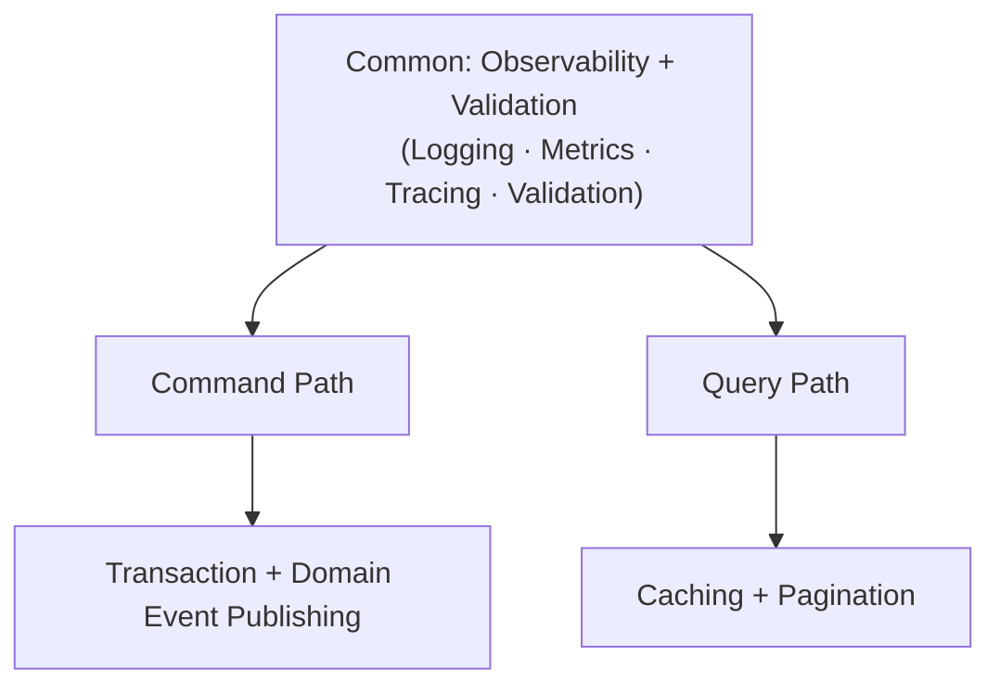
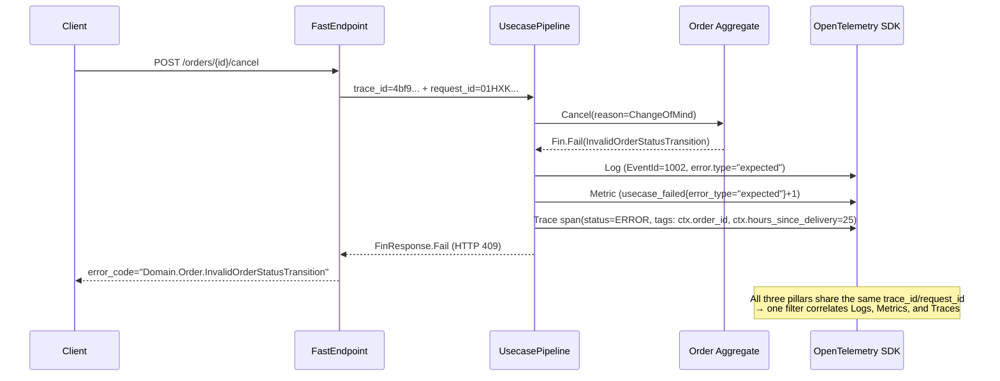

# Functorium

[](https://github.com/hhko/Functorium/actions/workflows/build.yml) [](https://github.com/hhko/Functorium/actions/workflows/publish.yml)

**English** | **[한국어](./README.ko.md)**

> **Functorium** is named from **`functor + dominium`** with a touch of **`fun`**.
> **dominium** is Latin for "dominion, ownership" — Domain is not just a scope, but **the problem space we own and govern**.
>
> Functorium is an **AI Native .NET framework** where AI agents directly guide domain design and generate code.
> The result compiles into production code with functional architecture + DDD + Observability built in.

**6 specialist AI agents** guide a 7-step workflow from requirements analysis to testing. At each step, design documents and compilable C# code are generated simultaneously. No need to manually make hundreds of architecture decisions.

Functorium is designed for .NET teams practicing enterprise DDD, teams seeking to bridge the language gap between development and operations, and architects systematically adopting functional DDD architecture.

## Problems to Solve

1. **Domain logic is mixed with exceptions and implicit side effects** — Business rule success and failure are handled via exceptions, making flow unpredictable and composition impossible.
2. **Development language and operations language are separated** — Feature specifications and operational requirements are managed in different systems, preventing a common language from being established and accumulating interpretation gaps.
3. **Observability is added as an afterthought** — Logs, metrics, and traces are attached separately after implementation is complete, causing critical context to be lost during incident analysis.

These are not simply process problems — they are **problems of design philosophy and structure**.

Mediator, LanguageExt, FluentValidation, and OpenTelemetry are each excellent. But integrating them into a coherent DDD architecture requires hundreds of decisions about error propagation, pipeline ordering, observability boundaries, and type constraints. Functorium makes these decisions once, consistently — and **AI agents automatically apply these decisions to your project.**

| Value | Features |
|-------|----------|
| **Domain Safety** | Value Object hierarchy (6 types + Union), Entity/AggregateRoot, Specification Pattern, structured error codes |
| **Functional Composition** | `Fin<T>`/`FinT<IO,T>` Discriminated Union, LINQ composition, Bind/Apply validation, CQRS path-optimized |
| **Advanced IO** | Timeout, Retry (exponential backoff), Fork (parallel execution), Bracket (resource lifecycle management) |
| **Automation** | 6 Source Generators, Usecase Pipeline (Observability + Validation built-in), architecture rule tests |
| **Observability** | 3-Pillar automatic instrumentation, ctx.* business context propagation, automatic error classification (expected/exceptional/aggregate) |

### See the Change in 30 Seconds — From Text to Code

**What you write** — 3 lines of business rules:

> - Email cannot be empty
> - Email cannot exceed 320 characters
> - Email must be in a valid format

**What AI generates** — A type-safe, composable functional validation pipeline without exceptions:

```csharp
public sealed partial class Email : SimpleValueObject<string>
{
    public const int MaxLength = 320;

    private Email(string value) : base(value) { }

    public static Fin<Email> Create(string? value) =>
        CreateFromValidation(Validate(value), v => new Email(v));

    // Each validation condition failure auto-generates a corresponding error code:
    //   NotNull    → "Domain.Email.Null"
    //   NotEmpty   → "Domain.Email.Empty"
    //   MaxLength  → "Domain.Email.TooLong"
    //   Matches    → "Domain.Email.InvalidFormat"
    // Composite Value Objects use the Apply pattern to validate multiple fields
    // in parallel, collecting all errors at once.
    public static Validation<Error, string> Validate(string? value) =>
        ValidationRules<Email>
            .NotNull(value)
            .ThenNotEmpty()
            .ThenNormalize(v => v.Trim().ToLowerInvariant())
            .ThenMaxLength(MaxLength)
            .ThenMatches(EmailRegex(), "Invalid email format");

    // For ORM/Repository restoration — accepts only already-normalized data
    public static Email CreateFromValidated(string value) => new(value);

    public static implicit operator string(Email email) => email.Value;
}
```

> **Just define business rules in text.** This complex but safe code is generated by AI agents.

<details>
<summary><strong>Comparison with traditional C# exception handling</strong> — Why Fin&lt;T&gt; instead of exceptions?</summary>

**Before** — Traditional C# validation. Exceptions are landmines buried in control flow:

```csharp
public class Email
{
    public Email(string value)
    {
        if (string.IsNullOrWhiteSpace(value))
            throw new ArgumentException("Email cannot be empty");   // Runtime bomb
                                                                    // if the next developer forgets try-catch, the system dies
        Value = value;
    }
    public string Value { get; }
}
```

**After** — Functorium's functional validation. Failure possibility is explicit in the return type — if you don't handle it, it won't compile:

```csharp
public sealed partial class Email : SimpleValueObject<string>
{
    public static Fin<Email> Create(string? value) =>               // Fin<T>: success or structured error
        CreateFromValidation(                                       // Composable pipeline without exceptions
            Validate(value),                                        // Validation<Error, T>: validation rules
            v => new Email(v));
}
```

</details>

This is how AI generates exception-free, safe code structures automatically.

### Humans Define Rules, AI Builds Implementation, Observability Translates Back

| Role | Responsibility | Concrete Artifacts |
|------|---------------|-------------------|
| **Human** | Define business rules + ubiquitous language in text | PRD, invariant list, glossary |
| **AI Agent** | Build complex control flow, monad composition code, boilerplate | `Fin<T>` pipelines, CQRS usecases, Source Generator code |
| **Observability** | Translate AI-generated code into human-readable diagnostics | Structured logs, dashboards, automatic error classification |

> **"Can I debug AI-written monad code at 2 AM?"**
>
> The framework's **automatic error classification + structured context logs + dashboards** — built into every Command/Query — translate code state into human language.

### When Requirements Change — Humans Update Text, AI Rebuilds the Implementation

> The CS team urgently requests **"Allow change-of-mind cancellation within 24h after delivery"** to match a competitor's policy. The current rule permits cancellation only in `Pending/Confirmed` states ([`Order.Cancel()` in the ecommerce-ddd sample](./Docs.Site/src/content/docs/samples/ecommerce-ddd/index.md)).

| Aspect | Before | After |
|--------|--------|-------|
| Allowed state transitions | `Pending/Confirmed → Cancelled` | The above + `Delivered → Cancelled` (only when `DeliveredAt + 24h > now` & `reason = ChangeOfMind`) |
| `Cancel` method signature | `Cancel() : Fin<Unit>` | `Cancel(CancellationReason reason) : Fin<Unit>` |
| Domain Event | `CancelledEvent(OrderId, OrderLines)` | The above + `CancellationReason Reason` field |
| New Union type | — | `CancellationReason = ChangeOfMind \| CustomerIssue \| Fraud` |

**The 3-step collaboration flow**:

1. **Human (architect)** — adds one line to PRD `§Order.Cancellation`:
   > "Also allow `Delivered` orders to be cancelled for change-of-mind within 24h of delivery"

2. **AI (`domain-develop` skill)** — auto-generates/updates five artifacts:
   - Add `("Delivered", Seq("Cancelled"))` to `OrderStatus.AllowedTransitions`
   - Create a new `CancellationReason` Union (3-variant sealed records)
   - Inject the time-window Specification into `Order.Cancel()`
   - Extend `CancelledEvent` with a `CancellationReason` field
   - Auto-add boundary-value unit tests (`23h59m` / `24h00m` / `24h01m`)

3. **Framework (triple verification gates)** — blocks regressions at build time:
   - Architecture rule tests: verify `sealed`, record immutability, `Fin<T>` return types on the Union
   - Contract regression tests: confirm the `Pending/Confirmed → Cancelled` path still holds
   - Type system: enforce the new `Cancel()` signature at every call site at compile time

> **Developers never open the `Fin<Unit>` pipeline inside `Order.Cancel()`.**
> Just edit the text requirement. AI rebuilds state-transition rules, Unions, events, and tests; architectural integrity is guaranteed by [25 rule tests](#gate-1-architecture-rule-tests--structural-integrity).

| Role | Responsibility | In this scenario |
|------|---------------|------------------|
| **Developer** | Architect — defines business rules and boundaries | Specify the "24h post-delivery cancellation" policy in text |
| **AI Agent** | Implementer — regenerates state machines, Unions, events, tests | Extend `OrderStatus`, create `CancellationReason`, add tests automatically |
| **Framework** | Safety net — blocks structural regression | Validates architecture, types, and existing contracts automatically |

## How AI Breaks Through the Problems

### From Problem to Code — Structure Connected by AI

| Problem | Breakthrough Direction | AI Agent's Role | What the Framework Guarantees |
|---------|----------------------|----------------|-------------------------------|
| Exceptions and implicit side effects | Exception-free pure domain | **domain-architect** classifies business invariants and maps them to types | `Fin<T>`, `FinT<IO,T>` make results and side effects explicit at the type level; LINQ composition structures domain flow |
| Development/operations language separation | Unified domain language | **product-analyst** extracts Ubiquitous Language and consistently reflects it across code/docs/metrics | Bounded Context clearly defined so domain concepts are consistently reflected in code, docs, and operational metrics. `ctx.*` field auto-propagation |
| Observability as afterthought | Observability by design | **observability-engineer** designs KPI→metric mapping, dashboards, and alerts | OpenTelemetry-based Logging, Metrics, Tracing automatically applied to usecase pipelines. `[GenerateObservablePort]` |

### 7-Step Workflow

From PRD writing to testing, 7 skills + 6 specialist agents guide the way.

```
project-spec                    : PRD writing, Ubiquitous Language, Aggregate boundary extraction
  → architecture-design         : Project structure, layer composition, infrastructure decisions
  → domain-develop              : Value Object, Entity, Aggregate, Specification implementation
  → application-develop         : CQRS usecase, Port design and implementation
  → adapter-develop             : Repository, Query Adapter, Endpoint, DI registration
  → observability-develop       : KPI→metric mapping, dashboards, alerts, ctx.* propagation
  → test-develop                : Unit/integration/architecture rule test writing
---
domain-review                   : DDD review of existing code and improvement guidance (standalone skill)
```

Each step follows a **4-stage document pattern**. Every design decision has traceable rationale:

```
00-business-requirements        : Business rule definition
  →  01-type-design-decisions   : Invariant → type mapping
  →  02-code-design             : C# pattern design
  →  03-implementation-results  : Compilable code + tests
```

### 6 Specialist Agents — Relay Timeline

Each agent takes the output of the previous stage, adds its own expertise, and passes the baton to the next:

```
Human                   : Business requirements text
  ↓
product-analyst         : Ubiquitous Language + Aggregate boundaries
  ↓
domain-architect        : Invariant classification + type mapping (VO, Entity, Aggregate)
  ↓
application-architect   : CQRS usecases + Port interfaces
  ↓
adapter-engineer        : Repository, Endpoint, DI, Observable Port
  ↓
observability-engineer  : KPI→metric mapping + dashboards + alerts
  ↓
test-engineer           : Unit/integration/architecture rule tests
```

| Step | Input | Agent | Output |
|------|-------|-------|--------|
| 1 | Natural language requirements | **product-analyst** | Ubiquitous Language glossary, Aggregate boundaries, P0/P1/P2 priorities |
| 2 | Glossary + invariant list | **domain-architect** | Type mapping (SimpleValueObject, SmartEnum, etc.), Always-valid patterns |
| 3 | Type definitions + domain model | **application-architect** | CQRS usecases, Port interfaces, FinT LINQ composition |
| 4 | Port interfaces | **adapter-engineer** | EF Core Repository, Dapper Query, FastEndpoints, DI, Observable Port |
| 5 | Adapter implementation code | **observability-engineer** | KPI→metric mapping, L1/L2 dashboards, alert rules, ctx.* propagation |
| 6 | Full codebase | **test-engineer** | Unit/integration/architecture rule tests, verification report |

### AI-Generated Artifacts

- Value Objects (Always-valid, structured error codes)
- AggregateRoot (with domain events)
- CQRS Command/Query usecases
- EF Core Repository + Dapper Query Adapter
- FastEndpoints API endpoints
- Observable Port (automatic 3-Pillar instrumentation)
- Unit tests, integration tests, architecture rule tests
- Design documents for all stages (traceable design rationale)

## AI-Generated Code: Functional Architecture in Detail

Building on the Email implementation above, let's explore additional framework patterns. For CQRS Command/Query usecase implementation examples, see the [CQRS Repository Tutorial](./Docs.Site/src/content/docs/tutorials/cqrs-repository/index.md).

<details>
<summary><strong>Domain Model in Detail</strong> — Value Object, Entity, AggregateRoot, DomainError, Domain Event</summary>

The **domain-architect** agent of the `domain-develop` skill classifies business invariants and maps them to the Functorium type system. All core business logic resides within the domain model, and entities, value objects, aggregates, and domain services have clear responsibilities.

**Value Object** — Ensures value-based equality and immutability:

```csharp
public abstract class AbstractValueObject : IValueObject, IEquatable<AbstractValueObject>
{
    protected abstract IEnumerable<object> GetEqualityComponents();

    // Value-based equality, cached hash code, ORM proxy handling
}
```

**Entity / AggregateRoot** — Provides Ulid-based IDs and domain event management:

```csharp
public interface IEntityId<T> : IEquatable<T>, IComparable<T>
    where T : struct, IEntityId<T>
{
    Ulid Value { get; }
    static abstract T New();
    static abstract T Create(Ulid id);
    static abstract T Create(string id);
}

public abstract class AggregateRoot<TId> : Entity<TId>, IDomainEventDrain
    where TId : struct, IEntityId<TId>
{
    protected void AddDomainEvent(IDomainEvent domainEvent);
    public void ClearDomainEvents();
}
```

**DomainError** — Ensures recoverability through structured error codes:

```csharp
// Auto-generated error code: "Domain.Email.Empty"
DomainError.For<Email>(new Empty(), value, "Email cannot be empty");

// Auto-generated error code: "Domain.Password.TooShort"
DomainError.For<Password>(new TooShort(MinLength: 8), value, "Password too short");
```

**Domain Event** — Integrates Mediator-based Pub/Sub with event tracking:

```csharp
public interface IDomainEvent : INotification
{
    DateTimeOffset OccurredAt { get; }
    Ulid EventId { get; }
    string? CorrelationId { get; }
    string? CausationId { get; }
}
```

</details>

<details>
<summary><strong>CQRS and Functional Composition in Detail</strong> — Repository, Query Port, Command/Query Interfaces</summary>

The `application-develop` skill assembles domain models into CQRS usecases. Core domain logic is composed of pure functions. By maintaining a structure where identical inputs always produce identical outputs, the logic becomes predictable and easy to test. Side effects (database, external APIs, messaging, file I/O) are handled outside the domain logic. The `IO` monad provides built-in advanced features such as Timeout, Retry (exponential backoff), Fork (parallel execution), and Bracket (resource lifecycle management), enabling type-safe fault tolerance configuration for external service calls.

**`Fin<T>`, `FinT<IO, T>`** — Handles errors with explicit result types instead of exceptions. The Command path Repository returns `FinT<IO, T>` to explicitly express side effects:

```csharp
// Command: IRepository — Per-Aggregate Root CRUD, change tracking and transaction management via EF Core
public interface IRepository<TAggregate, TId> : IObservablePort
    where TAggregate : AggregateRoot<TId>
    where TId : struct, IEntityId<TId>
{
    // Write: Single
    FinT<IO, TAggregate> Create(TAggregate aggregate);
    FinT<IO, TAggregate> Update(TAggregate aggregate);
    FinT<IO, int>        Delete(TId id);                  // ⚠️ Hard delete (no domain events)

    // Write: Batch — affected-row count
    FinT<IO, int> CreateRange(IReadOnlyList<TAggregate> aggregates);
    FinT<IO, int> UpdateRange(IReadOnlyList<TAggregate> aggregates);
    FinT<IO, int> DeleteRange(IReadOnlyList<TId> ids);    // ⚠️ Hard delete

    // Read
    FinT<IO, TAggregate>      GetById(TId id);
    FinT<IO, Seq<TAggregate>> GetByIds(IReadOnlyList<TId> ids);

    // Specification (Evans selectSatisfying pattern)
    FinT<IO, bool>               Exists(Specification<TAggregate> spec);
    FinT<IO, int>                Count(Specification<TAggregate> spec);
    FinT<IO, Seq<TAggregate>>    FindAllSatisfying(Specification<TAggregate> spec);
    FinT<IO, Option<TAggregate>> FindFirstSatisfying(Specification<TAggregate> spec);
    FinT<IO, int>                DeleteBy(Specification<TAggregate> spec);  // ⚠️ Hard delete
}
```

**CQRS** — Structurally separates write and read paths, applying optimized data access strategies for each. Command uses `IRepository` + EF Core for Aggregate consistency and transactions, while Query uses `IQueryPort` + Dapper for direct DTO projection without Aggregate reconstruction. Both paths unify results through `FinResponse<T>`:

```csharp
// Command
public interface ICommandRequest<TSuccess> : ICommand<FinResponse<TSuccess>> { }
public interface ICommandUsecase<in TCommand, TSuccess>
    : ICommandHandler<TCommand, FinResponse<TSuccess>>
    where TCommand : ICommandRequest<TSuccess> { }

// Query
public interface IQueryRequest<TSuccess> : IQuery<FinResponse<TSuccess>> { }
public interface IQueryUsecase<in TQuery, TSuccess>
    : IQueryHandler<TQuery, FinResponse<TSuccess>>
    where TQuery : IQueryRequest<TSuccess> { }
```

```csharp
// Query: IQueryPort — Direct DTO projection without Aggregate reconstruction, lightweight SQL mapping via Dapper
public interface IQueryPort<TEntity, TDto> : IQueryPort
{
    // Pagination + streaming
    FinT<IO, PagedResult<TDto>> Search(
        Specification<TEntity> spec, PageRequest page, SortExpression sort);

    FinT<IO, CursorPagedResult<TDto>> SearchByCursor(
        Specification<TEntity> spec, CursorPageRequest cursor, SortExpression sort);

    IAsyncEnumerable<TDto> Stream(
        Specification<TEntity> spec, SortExpression sort,
        CancellationToken cancellationToken = default);

    // Read-side aggregate helpers (reporting, dashboard)
    FinT<IO, bool> Exists(Specification<TEntity> spec);
    FinT<IO, int>  Count(Specification<TEntity> spec);
}
```

| | Command (IRepository) | Query (IQueryPort) |
|------|----------------------|-------------------|
| **Purpose** | Aggregate Root lifecycle management | Read-only DTO projection |
| **Implementation** | EF Core — change tracking, transactions, domain events | Dapper — pure SQL, lightweight mapping |
| **Specification** | `PropertyMap` → EF Core LINQ translation | `DapperSpecTranslator` → SQL WHERE translation |
| **Pagination** | — | Offset/Limit, Cursor (keyset), Streaming |

</details>

<details>
<summary><strong>Observability by Design in Detail</strong> — Pipeline, Observable Port, ctx.*, Error Classification</summary>

The `observability-develop` skill embeds operational stability from the design phase. All Commands and Queries automatically pass through a pipeline with built-in Observability (Logging, Metrics, Tracing) and validation. Developers do not need to write log code manually.



Command publishes domain events within transaction boundaries, and Query provides caching and pagination. For the exact pipeline stages and order, see the [Observability Specification](./Docs.Site/src/content/docs/spec/08-observability.md).

**IObservablePort** — All external dependencies are abstracted as observable ports:

```csharp
public interface IObservablePort
{
    string RequestCategory { get; }
}
```

**ctx.* 3-Pillar Enrichment** — The Source Generator automatically transforms Request/Response/DomainEvent properties into `ctx.{snake_case}` fields, propagating business context simultaneously to Logging, Tracing, and Metrics. Metrics tags can be opted in with `[CtxTarget(CtxPillar.All)]`.

**`[GenerateObservablePort]`** — The Source Generator automatically creates Observable wrappers for Adapters, transparently providing OpenTelemetry-based Tracing, Logging, and Metrics:

```csharp
[GenerateObservablePort]  // → Observable{ClassName} auto-generated (e.g., ObservableOrderRepository)
public class OrderRepository : IRepository<Order, OrderId> { ... }
```

**Automatic Error Classification** — Business rule violations (e.g., "insufficient stock") are classified as `expected`, system failures (`NullReferenceException`) as `exceptional`, and compound validation failures as `aggregate`. The `error.type` field allows separate querying of business errors and system failures in Seq/Grafana.

</details>

## Getting Started

### Installation

```bash
git clone https://github.com/hhko/Functorium.git
cd Functorium

# Load both plugins simultaneously
claude --plugin-dir ./.claude/plugins/functorium-develop --plugin-dir ./.claude/plugins/release-note
```

### Getting Started with AI (Recommended)

> Start with "Write a PRD for an e-commerce platform" and the AI agents will guide you through the 7-step workflow.

### Getting Started with Packages

```bash
# Core domain modeling — Value Object, Entity, AggregateRoot, Specification, error system
dotnet add package Functorium

# Infrastructure adapters — OpenTelemetry, Serilog, EF Core, Dapper, Pipeline
dotnet add package Functorium.Adapters

# Code generation — [GenerateObservablePort], [GenerateEntityId], CtxEnricher
dotnet add package Functorium.SourceGenerators

# Test utilities — ArchUnitNET, xUnit extensions, integration test fixtures
dotnet add package Functorium.Testing
```

**5-Minute Quickstart:** Build a Value Object → AggregateRoot → Command Usecase in 5 minutes at [Quickstart](./Docs.Site/src/content/docs/quickstart/index.mdx).

**First Tutorial:** Dive deep into Value Objects at the [Functional ValueObject Tutorial](./Docs.Site/src/content/docs/tutorials/functional-valueobject/index.md).

**Full Documentation:** [https://hhko.github.io/Functorium](https://hhko.github.io/Functorium)

## Architecture Overview


The system is composed of three layers. The domain depends on nothing external, and dependencies always flow inward.

- **Domain Layer** — Pure business logic. Entity, AggregateRoot, Value Object, Specification, DomainError, Domain Event, Repository port (IRepository), IObservablePort. Expresses business rules through pure functions without external dependencies.
- **Application Layer** — Usecase orchestration. CQRS (ICommandRequest, IQueryRequest), FinResponse, IQueryPort (read-only DTO projection), FluentValidation extensions, FinT LINQ composition, Domain Event publishing, IUnitOfWork. Connects domain logic with infrastructure and manages side effect boundaries.
- **Adapter Layer** — Infrastructure implementation. OpenTelemetry configuration, Usecase Pipeline (Observability + Validation built-in, including CtxEnricher), Observable domain event publishing, structured loggers, DapperQueryAdapterBase, AdapterError, 6 Source Generators ([GenerateObservablePort], [GenerateEntityId], [GenerateSetters], CtxEnricher, DomainEventCtxEnricher, [UnionType]). Depends on domain, but domain does not depend on infrastructure.

## Observability

Functorium provides unified observability (Logging, Metrics, Tracing) based on OpenTelemetry.


### Three Observation Paths

| Observation Path | Target | Mechanism | Recorded Content |
|-----------------|--------|-----------|-----------------|
| **Usecase Pipeline** | All Command/Query | Mediator `IPipelineBehavior` | request/response fields + ctx.* + error classification |
| **Observable Port** | Repository, QueryAdapter, ExternalService | `[GenerateObservablePort]` Source Generator | Same request/response field scheme |
| **DomainEvent** | Publisher + Handler | `ObservableDomainEventPublisher` | Event type/count + partial failure tracking |

The Application layer (EventId 1001–1004) and Adapter layer (EventId 2001–2004) use **identical `request.*` / `response.*` / `error.*` naming**, enabling end-to-end request flow tracking with a single dashboard query.

### At 2 AM, What Actually Appears on Your Screen

Here we visualize how the "24h post-delivery cancellation" policy from the [requirements-change scenario](#when-requirements-change--humans-update-text-ai-rebuilds-the-implementation) fails at its boundary in production.

> `POST /orders/{id}/cancel` (reason=`ChangeOfMind`). The order was delivered **25 hours ago** — past the 24h window. No exception is thrown; instead, a structured failure response classified as `error.type = "expected"` is returned.

**What actually lands in the log** (this is literally what Seq or Grafana Loki displays):

```json
{
  "@timestamp": "2026-04-20T02:14:33.0421Z",
  "EventId": 1002,
  "request.category": "OrderManagement",
  "request.name": "CancelOrderCommand",
  "request_id": "01HXK8Z6Q3N9V7B4M2C1D5E8F0",
  "trace_id": "4bf92f3577b34da6a3ce929d0e0e4736",
  "ctx.order_id": "01HXK5M2P8X7...",
  "ctx.customer_id": "01HXK5M2P8Y1...",
  "ctx.order_status_from": "Delivered",
  "ctx.order_status_to": "Cancelled",
  "ctx.cancellation_reason": "ChangeOfMind",
  "ctx.hours_since_delivery": 25,
  "error.type": "expected",
  "error.code": "Domain.Order.InvalidOrderStatusTransition",
  "error.message": "Cancel window (24h) exceeded for ChangeOfMind",
  "elapsed_ms": 7,
  "status": "Failed"
}
```

**How the same `trace_id` / `request_id` propagate across the three pillars**:



The three pillars (Logs, Metrics, Traces) shown above are emitted **automatically** by Source Generators and the Usecase Pipeline — developers write no logging or metric code by hand.

**Traditional exception model vs. Functorium `Fin` model**:

| Traditional exception model (OOP) | Functorium `Fin` model |
|---|---|
| `throw new InvalidOperationException(...)` | `Fin.Fail<Unit>(DomainError.For<Order>(...))` |
| Only a stack trace on failure | Expected: structured error code (signal) / Exceptional: stack trace preserved / Aggregate: list of compound failures |
| Risk of broken process flow | Type-safe failure value — flow is preserved |
| Manual log re-assembly required | `request_id` / `trace_id` auto-propagated |
| Business errors and system failures mixed | `error.type ∈ {expected, exceptional, aggregate}` — dashboard-filterable |

> **"No stack trace = undebuggable" is a misconception.**
>
> 1. **Exceptional errors (system failures) retain their stack traces in full** — a `NullReferenceException` debugs exactly the way you already know.
> 2. **Expected and Aggregate errors (business / validation failures) use `{Layer}.{Class}.{Reason}` error codes in place of stack traces** — e.g., `Domain.Email.Empty` tells you instantly: *"Empty-value rule violated in the `Email` class of the Domain layer."* You can jump straight to that Value Object's `Validate` method.
> 3. **Business concerns (Usecase) and technical concerns (Port/Adapter) are observed independently** — a single `request_id` correlates a failed `CancelOrderCommand` (Usecase) with its downstream `IOrderRepository` (Port) calls side-by-side on your dashboard (`EventId 1001–1004` ↔ `2001–2004`).
> 4. **Every observability record is emitted in a consistent schema by Source Generators with zero gaps** — no context loss from a missed log line.
>
> The workflow shifts from "scanning stack traces" to **error code → exact class & rule → dual-panel Usecase·Port view** — systematic root-cause analysis by construction.

For detailed specifications and guides, see the documentation site:
- [Observability Specification](./Docs.Site/src/content/docs/spec/08-observability.md) — Field/Tag structure, ctx.* 3-Pillar Enrichment, Meter/Instrument specification
- [Logging Guide](./Docs.Site/src/content/docs/guides/observability/19-observability-logging.md) — Structured logging detailed guide
- [Metrics Guide](./Docs.Site/src/content/docs/guides/observability/20-observability-metrics.md) — Metrics collection and analysis guide
- [Tracing Guide](./Docs.Site/src/content/docs/guides/observability/21-observability-tracing.md) — Distributed tracing detailed guide

## Quality Strategy — Half of Generation is Verification

Why AI-generated code can be deployed to production — **a triple verification gate** blocks architecture violations, business rule errors, and observability gaps at build time.

### Gate 1: Architecture Rule Tests — Structural Integrity

If the domain layer depends on infrastructure? The build fails:

```csharp
[Fact]
public void DomainLayer_ShouldNotDependOn_ApplicationLayer()
{
    Types()
        .That().ResideInNamespace(DomainNamespace)
        .Should().NotDependOnAnyTypesThat()
        .ResideInNamespace(ApplicationNamespace)
        .Check(Architecture);
}
```

Functorium.Testing provides 2 TestSuite base classes — just inherit and **25 architecture rules** are automatically applied across the Domain and Application layers:

| TestSuite | Verification Target |
|-----------|----------|
| `DomainArchitectureTestSuite` | Aggregate Root + child Entity + Value Object + Domain Event invariants — sealed class, private constructors, `Fin<T>` / `Validation<Error, T>` return types, `[GenerateEntityId]` presence, namespace placement, etc. |
| `ApplicationArchitectureTestSuite` | Command/Query Usecase + Port + DTO structure — `ICommandUsecase` / `IQueryUsecase` shape, `FinResponse<T>` return contract, sealed record DTOs, layer dependency direction |

### Gate 2: Domain Model Unit Tests — Business Rule Verification

The **test-engineer** agent automatically generates boundary condition tests for all Value Objects:

```csharp
[Theory]
[InlineData("")]
[InlineData(null)]
public void Create_ShouldFail_WhenValueIsEmptyOrNull(string? value)
{
    var actual = Email.Create(value);
    actual.IsFail.ShouldBeTrue();
}

[Fact]
public void Create_ShouldFail_WhenValueExceedsMaxLength()
{
    var value = new string('a', Email.MaxLength + 1);
    var actual = Email.Create(value);
    actual.IsFail.ShouldBeTrue();
}
```

### Gate 3: Build Failure Scenarios — Violations are Blocked Immediately

When AI-generated code violates rules, the build pipeline blocks immediately:

```
FAILED  ValueObject_ShouldBe_PublicSealedWithPrivateConstructors
  ArchitectureRuleViolation:
    Class 'Email' violates ValueObject Visibility Rule
    — Expected: public sealed with all private constructors
    — Actual: constructor 'Email(string)' is public

  1 architecture rule violation(s) detected.
```

> **Generation is half the system; ruthless verification is the other half.**
> Architecture rule tests verify AI-generated code and human-written code equally.

## Documentation

**Full Documentation Site:** [https://hhko.github.io/Functorium](https://hhko.github.io/Functorium)

### Tutorials

| Tutorial | Topic | Exercises |
|----------|-------|-----------|
| [Implementing Functional ValueObject](./Docs.Site/src/content/docs/tutorials/functional-valueobject/index.md) | Value Object, Validation, Immutability | 29 |
| [Implementing Specification Pattern](./Docs.Site/src/content/docs/tutorials/specification-pattern/index.md) | Specification, Expression Tree | 18 |
| [Implementing CQRS Repository And Query Patterns](./Docs.Site/src/content/docs/tutorials/cqrs-repository/index.md) | CQRS, Repository, Query Adapter | 22 |
| [Designing TypeSafe Usecase Pipeline Constraints](./Docs.Site/src/content/docs/tutorials/usecase-pipeline/index.md) | Generic Variance, IFinResponse, Pipeline Constraints | 20 |
| [Enforcing Architecture Rules with Testing](./Docs.Site/src/content/docs/tutorials/architecture-rules/index.md) | Architecture Rules, ClassValidator | 16 |
| [Automating ObservabilityCode with SourceGenerator](./Docs.Site/src/content/docs/tutorials/sourcegen-observability/index.md) | Source Generator, Observable Wrapper | — |
| [Automating ReleaseNotes with ClaudeCode and .NET 10](./Docs.Site/src/content/docs/tutorials/release-notes-claude/index.md) | AI Automation, Release Notes | — |

### Samples

| Sample | Scope | Aggregates | Key Patterns |
|--------|-------|------------|--------------|
| [Designing with Types](./Docs.Site/src/content/docs/samples/designing-with-types/index.md) | Domain | 1 | VO, Union, Composite, Specification |
| [E-Commerce DDD](./Docs.Site/src/content/docs/samples/ecommerce-ddd/index.md) | Domain + Application | 5 | CQRS, EventHandler, DomainService, ApplyT |
| [AI Model Governance](./Docs.Site/src/content/docs/samples/ai-model-governance/index.md) | Domain + Application + Adapter | 4 | EF Core/Dapper/InMemory, FastEndpoints, IO.Retry/Timeout/Fork/Bracket |

### Packages

| Package | Description |
|---------|-------------|
| `Functorium` | Core domain modeling — Value Object, Entity, AggregateRoot, Specification, error system |
| `Functorium.Adapters` | Infrastructure adapters — OpenTelemetry, Serilog, EF Core, Dapper, Pipeline |
| `Functorium.SourceGenerators` | Code generation — `[GenerateObservablePort]`, `[GenerateEntityId]`, `CtxEnricherGenerator` |
| `Functorium.Testing` | Test utilities — ArchUnitNET, xUnit extensions, integration test fixtures |

## Tech Stack

| Category | Key Libraries |
|----------|---------------|
| Functional | LanguageExt.Core, Ulid, Ardalis.SmartEnum |
| Validation | FluentValidation |
| Mediator | Mediator (source-generated), Scrutor |
| Persistence | EF Core, Dapper |
| Observability | OpenTelemetry, Serilog |
| Testing | xUnit v3, ArchUnitNET, Verify.Xunit, Shouldly |
