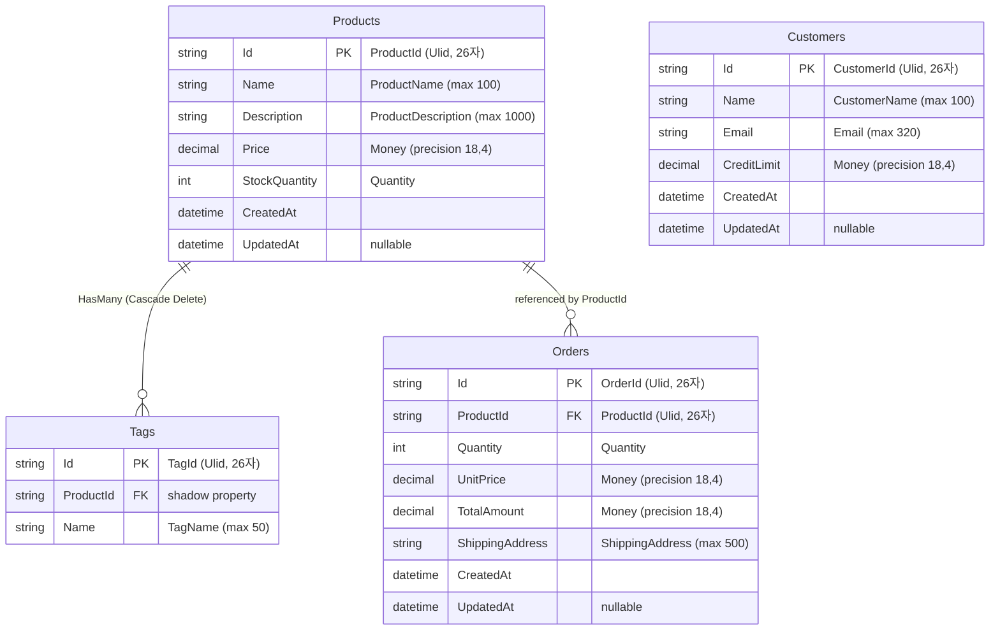

# SingleHost ER Diagram

> EF Core `LayeredArchDbContext` 기반 Entity-Relationship 다이어그램

## Entity 설명

| 테이블 | Aggregate | 설명 |
|--------|-----------|------|
| `Products` | `Product` (Aggregate Root) | 상품 정보. Tag 컬렉션 소유 |
| `Customers` | `Customer` (Aggregate Root) | 고객 정보 |
| `Orders` | `Order` (Aggregate Root) | 주문. ProductId로 상품 참조 (Navigation 없음) |
| `Tags` | `Tag` (Entity) | 태그. Product가 소유하는 하위 Entity |

## 공유 Value Object

| Value Object | 저장 타입 | 사용 위치 |
|-------------|----------|----------|
| `Money` | `decimal(18,4)` | Product.Price, Customer.CreditLimit, Order.UnitPrice, Order.TotalAmount |
| `Quantity` | `int` | Product.StockQuantity, Order.Quantity |

## 관계

- **Products → Tags**: 1:N 소유 관계. `ProductId` shadow FK, Cascade Delete
- **Products → Orders**: 1:N 참조 관계. `ProductId` FK, Navigation property 없음 (Cross-Aggregate 참조)
