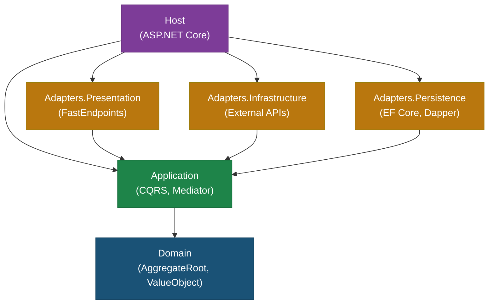

# SingleHost

Functorium 프레임워크의 **Layered Architecture 레퍼런스 구현**이자 **테스트 차량(test vehicle)**이다.
단일 ASP.NET Core 프로세스에 모든 레이어를 포함하는 전자상거래 샘플 애플리케이션으로, 프레임워크가 제공하는 아키텍처 패턴(AggregateRoot, ValueObject, Specification, Pipeline, CQRS 등)을 검증한다.

## 프로젝트 구조

```
01-SingleHost/
├── Src/
│   ├── LayeredArch/                            # Host (ASP.NET Core 진입점)
│   ├── LayeredArch.Adapters.Presentation/      # Presentation Adapter (FastEndpoints)
│   ├── LayeredArch.Adapters.Infrastructure/    # Infrastructure Adapter (외부 API)
│   ├── LayeredArch.Adapters.Persistence/       # Persistence Adapter (EF Core, Dapper)
│   ├── LayeredArch.Application/                # Application (CQRS Usecase)
│   └── LayeredArch.Domain/                     # Domain (AggregateRoot, ValueObject)
└── Tests/
    ├── LayeredArch.Tests.Unit/                 # 단위 테스트
    └── LayeredArch.Tests.Integration/          # 통합 테스트
```

## 아키텍처

의존성은 항상 안쪽(Domain)을 향한다. Adapter 레이어는 Application이 정의한 Port(인터페이스)를 구현한다.



| 레이어 | 프로젝트 | 역할 |
|--------|----------|------|
| **Domain** | `LayeredArch.Domain` | AggregateRoot, Entity, ValueObject, Specification, DomainEvent, Domain Port |
| **Application** | `LayeredArch.Application` | Command/Query Handler(CQRS), Application Port, FluentValidation |
| **Adapters** | `LayeredArch.Adapters.Persistence` | Repository 구현(EF Core, Dapper, InMemory), UnitOfWork |
| | `LayeredArch.Adapters.Infrastructure` | 외부 API 호출(ExternalPricingApiService) |
| | `LayeredArch.Adapters.Presentation` | HTTP Endpoint(FastEndpoints), Request/Response DTO |
| **Host** | `LayeredArch` | DI 구성, 미들웨어, 로깅(Serilog), 관측(OpenTelemetry) |

## 도메인 모델

### Aggregate Root

| Aggregate Root | 주요 ValueObject | Specification |
|----------------|------------------|---------------|
| `Customer` | `Email`, `CustomerName` | `CustomerEmailSpec` |
| `Product` | `ProductName`, `ProductDescription` | `ProductNameUniqueSpec`, `ProductPriceRangeSpec` |
| `Inventory` | — | `InventoryLowStockSpec` |
| `Order` | `ShippingAddress` | — |

### SharedModels

| 타입 | 클래스 | 설명 |
|------|--------|------|
| Entity | `Tag` | 여러 Aggregate에서 공유하는 태그 |
| ValueObject | `Money` | 금액(`ComparableSimpleValueObject<decimal>`) |
| | `Quantity` | 수량(`ComparableSimpleValueObject<int>`) |
| | `TagName` | 태그 이름(`SimpleValueObject<string>`) |
| DomainEvent | `TagEvents` | 태그 관련 도메인 이벤트 |

### Domain Service

- `OrderCreditCheckService` — 주문 신용 검사 도메인 서비스

## 핵심 패턴

| 패턴 | Functorium 타입 | 적용 예시 |
|------|-----------------|-----------|
| AggregateRoot / Entity | `AggregateRoot<TId>`, `Entity<TId>` | `Customer`, `Product`, `Inventory`, `Order`, `Tag` |
| ValueObject | `SimpleValueObject<T>`, `ComparableSimpleValueObject<T>` | `Email`, `Money`, `Quantity`, `ProductName` |
| Specification | `Specification<T>` | `CustomerEmailSpec`, `ProductPriceRangeSpec`, `InventoryLowStockSpec` |
| Command (CQRS) | `ICommand<T>` / `ICommandHandler<T>` | `CreateProductCommand`, `CreateOrderCommand`, `DeductStockCommand` |
| Query (CQRS) | `IQuery<T>` / `IQueryHandler<T>` | `GetProductByIdQuery`, `SearchProductsQuery`, `SearchInventoryQuery` |
| Port / Adapter + Pipeline | Port 인터페이스 + Adapter Pipeline | `IProductRepository` → `EfCoreProductRepository`, `InMemoryProductRepository` |
| DomainEvent | `IDomainEvent` | `TagEvents` |

## 기술 스택

| 영역 | 기술 |
|------|------|
| Runtime | .NET 10 / C# 14 |
| Web Framework | ASP.NET Core (Minimal API) |
| Endpoint | FastEndpoints |
| ORM | EF Core (Sqlite), Dapper |
| Mediator | Mediator (Source Generator) |
| Validation | FluentValidation |
| Functional | LanguageExt |
| Observability | OpenTelemetry, Serilog |
| Framework | Functorium, Functorium.SourceGenerators |

## 테스트

### 단위 테스트 (`LayeredArch.Tests.Unit`)

| 범주 | 대상 |
|------|------|
| Domain | AggregateRoot, ValueObject, Specification, DomainService 동작 검증 |
| Application | Command/Query Handler 동작 검증 |
| Persistence | Mapper(Entity ↔ DB Model) 변환 검증 |
| Architecture | 레이어 의존성, Port/Adapter, Entity, ValueObject, Specification, Usecase, DTO 구조 규칙 검증 |

- **프레임워크**: xUnit v3, Shouldly, NSubstitute, ArchUnitNET

### 통합 테스트 (`LayeredArch.Tests.Integration`)

| 범주 | 대상 |
|------|------|
| Endpoints | Customer, Product, Inventory, Order CRUD 엔드포인트 검증 |
| ErrorScenarios | Adapter/Handler 예외 시나리오 검증 |

- **프레임워크**: xUnit v3, Shouldly, `Microsoft.AspNetCore.Mvc.Testing`

## 빌드 및 실행

```bash
# 빌드
dotnet build Functorium.slnx

# 테스트
dotnet test --solution Functorium.slnx
```

### 영속성 모드 전환

`appsettings.json`의 `Persistence:Provider` 설정으로 영속성 모드를 전환한다.

| Provider | 저장소 | 설명 |
|----------|--------|------|
| `InMemory` | ConcurrentDictionary | 기본값. 외부 의존성 없이 실행 |
| `Sqlite` | SQLite 파일 | EF Core + Dapper 기반 영속성 |
