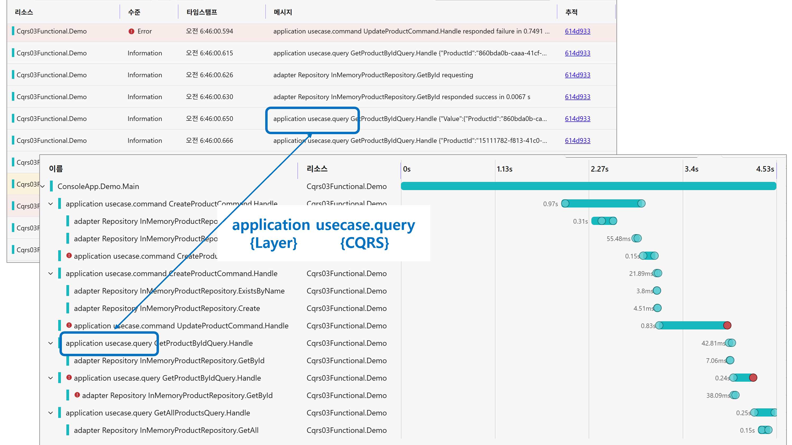

> 이 문서는 Functorium 프레임워크의 관측성(Observability) 사양입니다.
> 각 Pillar별 상세 매뉴얼은 별도 문서를 참조하세요.

> 모든 관측성 필드는 OpenTelemetry 시맨틱 규칙과의 일관성을 위해 `snake_case + dot` 표기법을 사용합니다.



## 목차

- [요약](#요약)
- [공통 사양](#공통-사양)
- [Field/Tag 일관성](#fieldtag-일관성)
- [Logging](#logging)
- [Metrics](#metrics)
- [Tracing](#tracing)
- [OpenTelemetryOptions 설정](#opentelemetryoptions-설정)
- [새 Usecase에 Observability 추가하기 (Quick Start)](#새-usecase에-observability-추가하기-quick-start)
- [필드/태그 네이밍 규칙](#필드태그-네이밍-규칙)
- [트러블슈팅](#트러블슈팅)
- [FAQ](#faq)
- [참고 문서](#참고-문서)

---

## 요약

### 주요 명령

```csharp
// Observability 전체 활성화
services
    .RegisterOpenTelemetry(configuration, AssemblyReference.Assembly)
    .ConfigurePipelines(pipelines => pipelines.UseAll())  // Metrics, Tracing, Logging 포함
    .Build();
```

```json
// appsettings.json 기본 설정
{
  "OpenTelemetry": {
    "ServiceNamespace": "mycompany.production",
    "ServiceName": "orderservice",
    "CollectorEndpoint": "http://localhost:4317"
  }
}
```

### 주요 절차

1. `appsettings.json`에 `OpenTelemetry` 섹션 설정 (`ServiceNamespace`, `ServiceName`, `CollectorEndpoint` 필수)
2. `RegisterOpenTelemetry()`로 OpenTelemetry 서비스 등록
3. `ConfigurePipelines(p => p.UseAll())`로 Logging/Metrics/Tracing Pipeline 활성화
4. 새 Usecase나 Adapter 구현 시 관측성 코드 자동 생성 (추가 코드 불필요)

### 주요 개념

| 개념 | 설명 |
|------|------|
| 3-Pillar | Logging, Metrics, Tracing 세 가지 관측성 신호 |
| Field/Tag 일관성 | `request.*`, `response.*`, `error.*` 필드가 3-Pillar에서 동일하게 사용 |
| Error 분류 | `expected` (비즈니스 오류), `exceptional` (시스템 오류), `aggregate` (복합 오류) |
| Event ID | Application(1001-1004), Adapter(2001-2004) |
| Meter Name | `{service.namespace}.{layer}[.{category}]` 패턴 |
| Instrument | `requests` (Counter), `responses` (Counter), `duration` (Histogram) |
| Span Name | `{layer} {category}[.{cqrs}] {handler}.{method}` |
| Pipeline 순서 | Metrics → Tracing → Logging → Validation → Exception → Transaction → Custom → Handler |

---

## 공통 사양

### Service Attributes

Functorium은 서비스 식별을 위해 [OpenTelemetry Service Attributes](https://opentelemetry.io/docs/specs/semconv/registry/attributes/service/)를 사용합니다.

| Attribute | 설명 | 예시 |
|-----------|------|------|
| `service.namespace` | `service.name`의 네임스페이스. 서비스 그룹을 구분하는 데 도움이 됩니다(예: 팀별 또는 환경별). | `mycompany.production` |
| `service.name` | 서비스의 논리적 이름. 수평 확장된 모든 인스턴스에서 동일해야 합니다. | `orderservice` |
| `service.version` | 서비스 API 또는 구현의 버전 문자열. | `2.0.0` |
| `service.instance.id` | 서비스 인스턴스의 고유 ID. `service.namespace,service.name` 쌍당 전역적으로 고유해야 합니다. 가능한 경우 `HOSTNAME` 환경 변수를 사용하고, 그렇지 않으면 `Environment.MachineName`으로 대체됩니다. | `my-pod-abc123` (Kubernetes), `DESKTOP-ABC123` (Windows) |
| `deployment.environment` | 배포 환경을 식별하는 속성. | `production`, `staging` |

> **권장**: `service.name`과 `service.namespace`에는 소문자 값을 사용하세요(예: `mycompany.production`, `orderservice`).
> 이렇게 하면 OpenTelemetry 규칙과의 일관성을 보장하고 다운스트림 시스템(대시보드, 쿼리, 알림)에서 대소문자 구분 문제를 방지할 수 있습니다.

### Error 분류

#### Error Type Tag 값

| Error Case | error.type | error.code | 설명 |
|------------|------------|------------|------|
| `IHasErrorCode` + `IsExpected` | `"expected"` | 오류 코드 | 오류 코드가 있는 예상 비즈니스 로직 오류 |
| `IHasErrorCode` + `IsExceptional` | `"exceptional"` | 오류 코드 | 오류 코드가 있는 예외 시스템 오류 |
| `ManyErrors` | `"aggregate"` | Primary 오류 코드 | 여러 오류가 집계됨(Exceptional이 우선) |
| `Expected` (LanguageExt) | `"expected"` | 타입 이름 | 오류 코드가 없는 LanguageExt 기본 예상 오류 |
| `Exceptional` (LanguageExt) | `"exceptional"` | 타입 이름 | 오류 코드가 없는 LanguageExt 기본 예외 오류 |

#### Error Field 값 (Logging 전용)

> `error.type`과 `@error.ErrorType`은 서로 다른 목적을 위해 다른 값 형식을 사용합니다.

| Error Type | `error.type` (필터링용) | `@error.ErrorType` (상세용) |
|------------|------------------------|----------------------------|
| Expected Error | `"expected"` | `"ErrorCodeExpected"` |
| Exceptional Error | `"exceptional"` | `"ErrorCodeExceptional"` |
| Aggregate Error | `"aggregate"` | `"ManyErrors"` |
| LanguageExt Expected | `"expected"` | `"Expected"` |
| LanguageExt Exceptional | `"exceptional"` | `"Exceptional"` |

- **`error.type`**: 로그 필터링/쿼리를 위한 표준화된 값(Metrics/Tracing과 일관됨)
- **`@error.ErrorType`**: 상세한 오류 타입 식별을 위한 실제 클래스 이름

## Field/Tag 일관성

### Usecase (Application/Adapter)

**Application 레이어:** (단위 테스트: [Logging](../../Tests/Functorium.Tests.Unit/AdaptersTests/Observabilities/Pipelines/UsecaseLoggingPipelineStructureTests.cs), [Metrics](../../Tests/Functorium.Tests.Unit/AdaptersTests/Observabilities/Pipelines/UsecaseMetricsPipelineStructureTests.cs), [Tracing](../../Tests/Functorium.Tests.Unit/AdaptersTests/Observabilities/Pipelines/UsecaseTracingPipelineStructureTests.cs))

| Field/Tag | Logging | Metrics | Tracing | 설명 |
|-----------|---------|---------|---------|------|
| `request.layer` | ✅ | ✅ | ✅ | 아키텍처 레이어 (`"application"`) |
| `request.category` | ✅ | ✅ | ✅ | 요청 카테고리 (`"usecase"`) |
| `request.category.type` | ✅ | ✅ | ✅ | CQRS 타입 (`"command"`, `"query"`) |
| `request.handler` | ✅ | ✅ | ✅ | Handler 클래스 이름 |
| `request.handler.method` | ✅ | ✅ | ✅ | Handler 메서드 이름 (`"Handle"`) |
| `response.status` | ✅ | ✅ | ✅ | 응답 상태 (`"success"`, `"failure"`) |
| `response.elapsed` | ✅ | -* | ✅ | 처리 시간(초) |
| `error.type` | ✅ | ✅ | ✅ | 오류 분류 (`"expected"`, `"exceptional"`, `"aggregate"`) |
| `error.code` | ✅ | ✅ | ✅ | 도메인 특화 오류 코드 |
| `@error` | ✅ | - | - | 구조화된 오류 객체(상세) |

**Adapter 레이어:** (단위 테스트: [Logging](../../Tests/Functorium.Tests.Unit/AdaptersTests/SourceGenerators/ObservablePortLoggingStructureTests.cs), [Metrics](../../Tests/Functorium.Tests.Unit/AdaptersTests/SourceGenerators/ObservablePortMetricsStructureTests.cs), [Tracing](../../Tests/Functorium.Tests.Unit/AdaptersTests/SourceGenerators/ObservablePortTracingStructureTests.cs))

| Field/Tag | Logging | Metrics | Tracing | 설명 |
|-----------|---------|---------|---------|------|
| `request.layer` | ✅ | ✅ | ✅ | 아키텍처 레이어 (`"adapter"`) |
| `request.category` | ✅ | ✅ | ✅ | Adapter 카테고리 (예: `"repository"`) |
| `request.handler` | ✅ | ✅ | ✅ | Handler 클래스 이름 |
| `request.handler.method` | ✅ | ✅ | ✅ | Handler 메서드 이름 |
| `response.status` | ✅ | ✅ | ✅ | 응답 상태 (`"success"`, `"failure"`) |
| `response.elapsed` | ✅ | -* | ✅ | 처리 시간(초) |
| `error.type` | ✅ | ✅ | ✅ | 오류 분류 (`"expected"`, `"exceptional"`, `"aggregate"`) |
| `error.code` | ✅ | ✅ | ✅ | 도메인 특화 오류 코드 |
| `@error` | ✅ | - | - | 구조화된 오류 객체(상세) |

> **\* `response.elapsed`가 Metrics 태그가 아닌 이유:**
> - Metrics는 처리 시간을 캡처하기 위해 전용 `duration` **Histogram instrument**를 사용하며, 이는 지연 시간 측정에 대한 OpenTelemetry 권장 접근 방식입니다.
> - 경과 시간을 태그로 사용하면 **높은 카디널리티 폭발**을 유발합니다(각 고유한 duration 값이 새로운 시계열을 생성하여 메트릭 저장소 및 쿼리 성능이 저하됨).
> - Histogram은 개별 경과 값보다 모니터링에 더 유용한 **통계적 집계**(백분위수, 평균, 카운트)를 제공합니다.

### DomainEvent Publisher

(단위 테스트: [Logging](../../Tests/Functorium.Tests.Unit/AdaptersTests/Observabilities/Events/DomainEventPublisherLoggingStructureTests.cs), [Metrics](../../Tests/Functorium.Tests.Unit/AdaptersTests/Observabilities/Events/DomainEventPublisherMetricsStructureTests.cs), [Tracing](../../Tests/Functorium.Tests.Unit/AdaptersTests/Observabilities/Events/DomainEventPublisherTracingStructureTests.cs))

> DomainEvent Publisher는 Adapter 레이어로 분류되며, `request.layer`는 `"adapter"`, `request.category`는 `"event"`입니다.

| Field/Tag | Logging | Metrics | Tracing | 설명 |
|-----------|---------|---------|---------|------|
| `request.layer` | ✅ | ✅ | ✅ | 아키텍처 레이어 (`"adapter"`) |
| `request.category` | ✅ | ✅ | ✅ | 요청 카테고리 (`"event"`) |
| `request.handler` | ✅ | ✅ | ✅ | Event 타입명 또는 Aggregate 타입명 |
| `request.handler.method` | ✅ | ✅ | ✅ | 메서드 이름 (`"Publish"`, `"PublishTrackedEvents"`) |
| `request.event.count` | ✅ | - | ✅ | 배치 발행 시 이벤트 개수 (Aggregate 전용) |
| `response.status` | ✅ | ✅ | ✅ | 응답 상태 (`"success"`, `"failure"`) |
| `response.elapsed` | ✅ | -* | ✅ | 처리 시간(초) |
| `response.event.success_count` | ✅ | - | ✅ | 부분 실패 시 성공한 이벤트 수 (Partial Failure 전용) |
| `response.event.failure_count` | ✅ | - | ✅ | 부분 실패 시 실패한 이벤트 수 (Partial Failure 전용) |
| `error.type` | ✅ | ✅ | ✅ | 오류 분류 (`"expected"`, `"exceptional"`) |
| `error.code` | ✅ | ✅ | ✅ | 도메인 특화 오류 코드 |
| `@error` | ✅ | - | - | 구조화된 오류 객체(상세) |

### DomainEvent Handler

(단위 테스트: [Logging](../../Tests/Functorium.Tests.Unit/AdaptersTests/Observabilities/Events/DomainEventHandlerLoggingStructureTests.cs), [Metrics](../../Tests/Functorium.Tests.Unit/AdaptersTests/Observabilities/Events/DomainEventHandlerMetricsStructureTests.cs), [Tracing](../../Tests/Functorium.Tests.Unit/AdaptersTests/Observabilities/Events/DomainEventHandlerTracingStructureTests.cs))

> DomainEventHandler는 Application 레이어로 분류되며, `request.layer`는 `"application"`, `request.category`는 `"usecase"`, `request.category.type`은 `"event"`입니다.

| Field/Tag | Logging | Metrics | Tracing | 설명 |
|-----------|---------|---------|---------|------|
| `request.layer` | ✅ | ✅ | ✅ | 아키텍처 레이어 (`"application"`) |
| `request.category` | ✅ | ✅ | ✅ | 요청 카테고리 (`"usecase"`) |
| `request.category.type` | ✅ | ✅ | ✅ | CQRS 타입 (`"event"`) |
| `request.handler` | ✅ | ✅ | ✅ | Handler 클래스 이름 |
| `request.handler.method` | ✅ | ✅ | ✅ | 메서드 이름 (`"Handle"`) |
| `request.event.type` | ✅ | - | ✅ | 이벤트 타입명 |
| `request.event.id` | ✅ | - | ✅ | 이벤트 고유 ID |
| `@request.message` | ✅ | - | - | 이벤트 객체 (요청 시) |
| `response.status` | ✅ | ✅ | ✅ | 응답 상태 (`"success"`, `"failure"`) |
| `response.elapsed` | ✅ | -* | - | 처리 시간(초) |
| `error.type` | ✅ | ✅ | ✅ | 오류 분류 (`"expected"`, `"exceptional"`) |
| `error.code` | ✅ | ✅ | ✅ | 도메인 특화 오류 코드 |

> **Note:** DomainEventHandler의 `response.elapsed`는 Tracing Span 태그에 설정되지 않습니다 (Logging 전용). Span은 자체적으로 시작/종료 시간(duration)을 가지므로 별도의 elapsed 필드는 중복입니다.
> DomainEventHandler의 ErrorResponse는 Exception 객체가 직접 로깅됩니다 (`@error` 대신).

## Logging

### Usecase Logging

#### Field 구조

| Field Name | Application 레이어 | Adapter 레이어 | 설명 |
|------------|-------------------|---------------|------|
| **Static Fields** | | | |
| `request.layer` | `"application"` | `"adapter"` | 요청 레이어 식별자 |
| `request.category` | `"usecase"` | Adapter 카테고리 이름 | 요청 카테고리 식별자 |
| `request.category.type` | `"command"` / `"query"` | - | CQRS 타입 |
| `request.handler` | Handler 이름 | Handler 이름 | Handler 클래스 이름 |
| `request.handler.method` | `"Handle"` | 메서드 이름 | Handler 메서드 이름 |
| `response.status` | `"success"` / `"failure"` | `"success"` / `"failure"` | 응답 상태 |
| `response.elapsed` | 처리 시간(초) | 처리 시간(초) | 경과 시간(초) |
| `error.type` | `"expected"` / `"exceptional"` / `"aggregate"` | `"expected"` / `"exceptional"` / `"aggregate"` | 오류 분류 |
| `error.code` | 오류 코드 | 오류 코드 | 도메인 특화 오류 코드 |
| `@error` | 오류 객체(구조화) | 오류 객체(구조화) | 오류 데이터(상세) |
| **Dynamic Fields** | | | |
| `@request.message` | 전체 Command/Query 객체 | - | 요청 메시지 |
| `@response.message` | 전체 응답 객체 | - | 응답 메시지 |
| `request.params.{name}` | - | 개별 메서드 파라미터 | 요청 파라미터 |
| `request.params.{name}.count` | - | 컬렉션 크기(파라미터가 컬렉션인 경우) | 요청 파라미터 카운트 |
| `response.result` | - | 메서드 반환 값 | 응답 결과 |
| `response.result.count` | - | 컬렉션 크기(반환이 컬렉션인 경우) | 응답 결과 카운트 |

#### 이벤트별 로그 레벨

| Event | Log 수준 | Application 레이어 | Adapter 레이어 | 설명 |
|-------|-----------|-------------------|---------------|------|
| Request | Information | 1001 `application.request` | 2001 `adapter.request` | 요청 수신 |
| Request (Debug) | Debug | - | 2001 `adapter.request` | 파라미터 값이 포함된 요청 |
| Response Success | Information | 1002 `application.response.success` | 2002 `adapter.response.success` | 성공 응답 |
| Response Success (Debug) | Debug | - | 2002 `adapter.response.success` | 결과 값이 포함된 응답 |
| Response Warning | Warning | 1003 `application.response.warning` | 2003 `adapter.response.warning` | 예상 오류(비즈니스 로직) |
| Response Error | Error | 1004 `application.response.error` | 2004 `adapter.response.error` | 예외 오류(시스템 장애) |

#### Message Templates (Application)

```
# Request
{request.layer} {request.category}.{request.category.type} {request.handler}.{request.handler.method} requesting with {@request.message}

# Response - Success
{request.layer} {request.category}.{request.category.type} {request.handler}.{request.handler.method} responded {response.status} in {response.elapsed:0.0000} s with {@response.message}

# Response - Warning/Error
{request.layer} {request.category}.{request.category.type} {request.handler}.{request.handler.method} responded {response.status} in {response.elapsed:0.0000} s with {error.type}:{error.code} {@error}
```

#### Message Templates (Adapter)

```
# Request (Information)
{request.layer} {request.category} {request.handler}.{request.handler.method} requesting

# Request (Debug) - 파라미터 포함
{request.layer} {request.category} {request.handler}.{request.handler.method} requesting with {request.params.items} {request.params.items.count}

# Response (Information)
{request.layer} {request.category} {request.handler}.{request.handler.method} responded {response.status} in {response.elapsed:0.0000} s

# Response (Debug) - 결과 포함
{request.layer} {request.category} {request.handler}.{request.handler.method} responded {response.status} in {response.elapsed:0.0000} s with {response.result}

# Response Warning/Error
{request.layer} {request.category} {request.handler}.{request.handler.method} responded {response.status} in {response.elapsed:0.0000} s with {error.type}:{error.code} {@error}
```

#### 구현

| 레이어 | 방식 | 테스트 | 참고 |
|-------|------|--------|------|
| Application | 직접 `ILogger.LogXxx()` 호출 | [UsecaseLoggingPipelineStructureTests](../../Tests/Functorium.Tests.Unit/AdaptersTests/Observabilities/Pipelines/UsecaseLoggingPipelineStructureTests.cs) | 7개 이상의 파라미터가 `LoggerMessage.Define`의 6개 제한을 초과 |
| Adapter | `LoggerMessage.Define` 델리게이트 | [ObservablePortLoggingStructureTests](../../Tests/Functorium.Tests.Unit/AdaptersTests/SourceGenerators/ObservablePortLoggingStructureTests.cs) | 제로 할당, 고성능 |

### DomainEvent Logging

#### Field 비교

**Application Usecase vs DomainEvent Publisher vs DomainEventHandler 필드 비교:**

| Field | Application Usecase | DomainEvent Publisher | DomainEventHandler |
|-------|---------------------|----------------------|-------------------|
| `request.layer` | `"application"` | `"adapter"` | `"application"` |
| `request.category` | `"usecase"` | `"event"` | `"usecase"` |
| `request.category.type` | `"command"` / `"query"` | - | `"event"` |
| `request.handler` | Handler 클래스명 | Event/Aggregate 타입명 | Handler 클래스명 |
| `request.handler.method` | `"Handle"` | `"Publish"` / `"PublishTrackedEvents"` | `"Handle"` |
| `@request.message` | Command/Query 객체 | 이벤트 객체 | 이벤트 객체 |
| `@response.message` | 응답 객체 | - | - |
| `request.event.count` | - | O (Aggregate만) | - |
| `response.event.success_count` | - | O (Partial Failure만) | - |
| `response.event.failure_count` | - | O (Partial Failure만) | - |
| `response.status` | `"success"` / `"failure"` | `"success"` / `"failure"` | `"success"` / `"failure"` |
| `response.elapsed` | 처리 시간(초) | 처리 시간(초) | 처리 시간(초) |
| `error.type` | `"expected"` / `"exceptional"` / `"aggregate"` | `"expected"` / `"exceptional"` | `"expected"` / `"exceptional"` |
| `error.code` | 오류 코드 | 오류 코드 | 오류 코드 |
| `@error` | 오류 객체 | 오류 객체 | 오류 객체 (Exception) |

> Error 분류 상세는 [Error 분류](#error-분류) 섹션 참조.

#### Message Templates (Publisher)

```
# Request - 단일 이벤트
{request.layer} {request.category} {request.handler}.{request.handler.method} requesting with {@request.message}

# Request - Aggregate 다중 이벤트
{request.layer} {request.category} {request.handler}.{request.handler.method} requesting with {request.event.count} events

# Response - Success
{request.layer} {request.category} {request.handler}.{request.handler.method} responded {response.status} in {response.elapsed:0.0000} s

# Response - Success (Aggregate)
{request.layer} {request.category} {request.handler}.{request.handler.method} responded {response.status} in {response.elapsed:0.0000} s with {request.event.count} events

# Response - Warning/Error
{request.layer} {request.category} {request.handler}.{request.handler.method} responded {response.status} in {response.elapsed:0.0000} s with {error.type}:{error.code} {@error}

# Response - Warning/Error (Aggregate)
{request.layer} {request.category} {request.handler}.{request.handler.method} responded {response.status} in {response.elapsed:0.0000} s with {request.event.count} events with {error.type}:{error.code} {@error}

# Response - Partial Failure (Aggregate)
{request.layer} {request.category} {request.handler}.{request.handler.method} responded {response.status} in {response.elapsed:0.0000} s with {request.event.count} events partial failure: {response.event.success_count} succeeded, {response.event.failure_count} failed
```

#### Publisher Event IDs

> DomainEvent Publisher는 Adapter 레이어로 분류되므로, Adapter 레이어와 동일한 Event ID를 사용합니다.

| Event | ID | Name |
|-------|-----|------|
| Request | 2001 | `adapter.request` |
| Success | 2002 | `adapter.response.success` |
| Warning | 2003 | `adapter.response.warning` |
| Error | 2004 | `adapter.response.error` |

#### Message Templates (Handler)

> DomainEventHandler는 Publisher가 발행한 이벤트를 처리하는 Handler 관점의 로깅입니다. `request.layer`는 `"application"`, `request.category`는 `"usecase"`, `request.category.type`은 `"event"`입니다.

```
# Request
{request.layer} {request.category}.{request.category.type} {request.handler}.{request.handler.method} {request.event.type} {request.event.id} requesting with {@request.message}

# Response - Success
{request.layer} {request.category}.{request.category.type} {request.handler}.{request.handler.method} {request.event.type} {request.event.id} responded {response.status} in {response.elapsed:0.0000} s

# Response - Warning/Error
{request.layer} {request.category}.{request.category.type} {request.handler}.{request.handler.method} {request.event.type} {request.event.id} responded {response.status} in {response.elapsed:0.0000} s with {error.type}:{error.code} {@error}
```

#### Handler Event IDs

> DomainEventHandler는 Application 레이어의 usecase로 분류되므로, Application 레이어와 동일한 Event ID를 사용합니다.

| Event | ID | Name |
|-------|-----|------|
| Request | 1001 | `application.request` |
| Success | 1002 | `application.response.success` |
| Warning | 1003 | `application.response.warning` |
| Error | 1004 | `application.response.error` |

#### 구현

| 레이어 | 방식 | 테스트 | 참고 |
|-------|------|--------|------|
| DomainEvent Publisher | Decorator | [DomainEventPublisherLoggingStructureTests](../../Tests/Functorium.Tests.Unit/AdaptersTests/Observabilities/Events/DomainEventPublisherLoggingStructureTests.cs) | Adapter 레이어 패턴 |
| DomainEvent Handler | `INotificationPublisher` | [DomainEventHandlerLoggingStructureTests](../../Tests/Functorium.Tests.Unit/AdaptersTests/Observabilities/Events/DomainEventHandlerLoggingStructureTests.cs) | Application 레이어 패턴 |

## Metrics

### Meter Name

| 레이어 | Meter Name 패턴 | 예시 (`ServiceNamespace = "mycompany.production"`) |
|-------|-----------------|---------------------------------------------------|
| Application | `{service.namespace}.application` | `mycompany.production.application` |
| Adapter | `{service.namespace}.adapter.{category}` | `mycompany.production.adapter.repository` |
| DomainEvent Publisher | `{service.namespace}.adapter.event` | `mycompany.production.adapter.event` |
| DomainEvent Handler | `{service.namespace}.application` | `mycompany.production.application` |

### Instrument 구조

| Instrument | Application 레이어 | Adapter 레이어 | DomainEvent Publisher | DomainEvent Handler | Type | Unit |
|------------|-------------------|---------------|----------------------|--------------------|------|------|
| requests | `application.usecase.{type}.requests` | `adapter.{category}.requests` | `adapter.event.requests` | `application.usecase.event.requests` | Counter | `{request}` |
| responses | `application.usecase.{type}.responses` | `adapter.{category}.responses` | `adapter.event.responses` | `application.usecase.event.responses` | Counter | `{response}` |
| duration | `application.usecase.{type}.duration` | `adapter.{category}.duration` | `adapter.event.duration` | `application.usecase.event.duration` | Histogram | `s` |

### Usecase Metrics

#### Tag 구조 (Application)

| Tag Key | requestCounter | durationHistogram | responseCounter (success) | responseCounter (failure) |
|---------|----------------|-------------------|---------------------------|---------------------------|
| `request.layer` | `"application"` | `"application"` | `"application"` | `"application"` |
| `request.category` | `"usecase"` | `"usecase"` | `"usecase"` | `"usecase"` |
| `request.category.type` | `"command"` / `"query"` | `"command"` / `"query"` | `"command"` / `"query"` | `"command"` / `"query"` |
| `request.handler` | handler 이름 | handler 이름 | handler 이름 | handler 이름 |
| `request.handler.method` | `"Handle"` | `"Handle"` | `"Handle"` | `"Handle"` |
| `response.status` | - | - | `"success"` | `"failure"` |
| `error.type` | - | - | - | `"expected"` / `"exceptional"` / `"aggregate"` |
| `error.code` | - | - | - | Primary 오류 코드 |
| **Total Tags** | **5** | **5** | **6** | **8** |

#### Tag 구조 (Adapter)

| Tag Key | requestCounter | durationHistogram | responseCounter (success) | responseCounter (failure) |
|---------|----------------|-------------------|---------------------------|---------------------------|
| `request.layer` | `"adapter"` | `"adapter"` | `"adapter"` | `"adapter"` |
| `request.category` | 카테고리 이름 | 카테고리 이름 | 카테고리 이름 | 카테고리 이름 |
| `request.handler` | handler 이름 | handler 이름 | handler 이름 | handler 이름 |
| `request.handler.method` | 메서드 이름 | 메서드 이름 | 메서드 이름 | 메서드 이름 |
| `response.status` | - | - | `"success"` | `"failure"` |
| `error.type` | - | - | - | `"expected"` / `"exceptional"` / `"aggregate"` |
| `error.code` | - | - | - | 오류 코드 |
| **Total Tags** | **4** | **4** | **5** | **7** |

> Error 분류 상세는 [Error 분류](#error-분류) 섹션 참조.

### DomainEvent Metrics

#### Tag 구조 (Publisher)

| Tag Key | requestCounter | durationHistogram | responseCounter (success) | responseCounter (failure) |
|---------|----------------|-------------------|---------------------------|---------------------------|
| `request.layer` | `"adapter"` | `"adapter"` | `"adapter"` | `"adapter"` |
| `request.category` | `"event"` | `"event"` | `"event"` | `"event"` |
| `request.handler` | handler 이름 | handler 이름 | handler 이름 | handler 이름 |
| `request.handler.method` | 메서드 이름 | 메서드 이름 | 메서드 이름 | 메서드 이름 |
| `response.status` | - | `"success"` / `"failure"` | `"success"` | `"failure"` |
| `error.type` | - | - | - | `"expected"` / `"exceptional"` |
| `error.code` | - | - | - | 오류 코드 |
| **Total Tags** | **4** | **5** | **5** | **7** |

> **DomainEvent Metrics에서 제외되는 태그:**
> `request.event.count`, `response.event.success_count`, `response.event.failure_count`는 Metrics 태그로 사용하지 않습니다.
> 이 값들은 각각 고유한 수치를 가지므로 태그로 사용하면 **높은 카디널리티 폭발**을 유발합니다.
> 이는 `response.elapsed`를 Metrics 태그로 사용하지 않는 것과 동일한 원칙입니다.

#### Tag 구조 (Handler)

| Tag Key | requestCounter | durationHistogram | responseCounter (success) | responseCounter (failure) |
|---------|----------------|-------------------|---------------------------|---------------------------|
| `request.layer` | `"application"` | `"application"` | `"application"` | `"application"` |
| `request.category` | `"usecase"` | `"usecase"` | `"usecase"` | `"usecase"` |
| `request.category.type` | `"event"` | `"event"` | `"event"` | `"event"` |
| `request.handler` | handler 이름 | handler 이름 | handler 이름 | handler 이름 |
| `request.handler.method` | `"Handle"` | `"Handle"` | `"Handle"` | `"Handle"` |
| `response.status` | - | - | `"success"` | `"failure"` |
| `error.type` | - | - | - | `"expected"` / `"exceptional"` |
| `error.code` | - | - | - | 오류 코드 |
| **Total Tags** | **5** | **5** | **6** | **8** |

### 구현

| 레이어 | 방식 | 테스트 | 참고 |
|-------|------|--------|------|
| Application | `IPipelineBehavior` + `IMeterFactory` | [UsecaseMetricsPipelineStructureTests](../../Tests/Functorium.Tests.Unit/AdaptersTests/Observabilities/Pipelines/UsecaseMetricsPipelineStructureTests.cs) | Mediator pipeline |
| Adapter | Source Generator | [ObservablePortMetricsStructureTests](../../Tests/Functorium.Tests.Unit/AdaptersTests/SourceGenerators/ObservablePortMetricsStructureTests.cs) | 자동 생성된 metrics instruments |
| DomainEvent Publisher | Decorator + `IMeterFactory` | [DomainEventPublisherMetricsStructureTests](../../Tests/Functorium.Tests.Unit/AdaptersTests/Observabilities/Events/DomainEventPublisherMetricsStructureTests.cs) | Adapter 레이어 패턴 |
| DomainEvent Handler | `INotificationPublisher` + `IMeterFactory` | [DomainEventHandlerMetricsStructureTests](../../Tests/Functorium.Tests.Unit/AdaptersTests/Observabilities/Events/DomainEventHandlerMetricsStructureTests.cs) | Application 레이어 패턴 |

## Tracing

### Usecase Tracing

#### Span 구조

| Property | Application 레이어 | Adapter 레이어 |
|----------|-------------------|---------------|
| Span Name | `{layer} {category}.{type} {handler}.{method}` | `{layer} {category} {handler}.{method}` |
| Example | `application usecase.command CreateOrderCommandHandler.Handle` | `adapter repository OrderRepository.GetById` |
| Kind | `Internal` | `Internal` |

#### Tag 구조

| Tag Key | Application 레이어 | Adapter 레이어 | 설명 |
|---------|-------------------|---------------|------|
| **Request Tags** | | | |
| `request.layer` | `"application"` | `"adapter"` | 레이어 식별자 |
| `request.category` | `"usecase"` | 카테고리 이름 | 카테고리 식별자 |
| `request.category.type` | `"command"` / `"query"` | - | CQRS 타입 |
| `request.handler` | Handler 이름 | Handler 이름 | Handler 클래스 이름 |
| `request.handler.method` | `"Handle"` | 메서드 이름 | 메서드 이름 |
| **Response Tags** | | | |
| `response.status` | `"success"` / `"failure"` | `"success"` / `"failure"` | 응답 상태 |
| `response.elapsed` | 처리 시간(초) | 처리 시간(초) | 경과 시간(초) |
| **Error Tags** | | | |
| `error.type` | `"expected"` / `"exceptional"` / `"aggregate"` | `"expected"` / `"exceptional"` / `"aggregate"` | 오류 분류 |
| `error.code` | 오류 코드 | 오류 코드 | 오류 코드 |
| **ActivityStatus** | `Ok` / `Error` | `Ok` / `Error` | OpenTelemetry 상태 |

> Error 분류 상세는 [Error 분류](#error-분류) 섹션 참조.

### DomainEvent Tracing

#### Publisher Span 구조

| Property | Publish | PublishTrackedEvents |
|----------|---------|---------------------|
| Span Name | `adapter event {EventType}.Publish` | `adapter event PublishTrackedEvents.PublishTrackedEvents` |
| Kind | `Internal` | `Internal` |

#### Publisher Tag 구조 (Publish)

| Tag Key | Request | Success Response | Failure Response |
|---------|---------|-----------------|-----------------|
| `request.layer` | `"adapter"` | `"adapter"` | `"adapter"` |
| `request.category` | `"event"` | `"event"` | `"event"` |
| `request.handler` | event type name | event type name | event type name |
| `request.handler.method` | `"Publish"` | `"Publish"` | `"Publish"` |
| `response.elapsed` | - | 처리 시간(초) | 처리 시간(초) |
| `response.status` | - | `"success"` | `"failure"` |
| `error.type` | - | - | `"expected"` / `"exceptional"` |
| `error.code` | - | - | 오류 코드 |
| **Total Tags** | **4** | **6** | **8** |

#### Publisher Tag 구조 (PublishTrackedEvents)

| Tag Key | Request | Success | Partial Failure | Total Failure |
|---------|---------|---------|-----------------|---------------|
| `request.layer` | `"adapter"` | `"adapter"` | `"adapter"` | `"adapter"` |
| `request.category` | `"event"` | `"event"` | `"event"` | `"event"` |
| `request.handler` | `"PublishTrackedEvents"` | `"PublishTrackedEvents"` | `"PublishTrackedEvents"` | `"PublishTrackedEvents"` |
| `request.handler.method` | `"PublishTrackedEvents"` | `"PublishTrackedEvents"` | `"PublishTrackedEvents"` | `"PublishTrackedEvents"` |
| `request.aggregate.count` | aggregate count | aggregate count | aggregate count | aggregate count |
| `request.event.count` | event count | event count | event count | event count |
| `response.elapsed` | - | 처리 시간(초) | 처리 시간(초) | 처리 시간(초) |
| `response.status` | - | `"success"` | `"failure"` | `"failure"` |
| `response.event.success_count` | - | - | success count | - |
| `response.event.failure_count` | - | - | failure count | - |
| `error.type` | - | - | - | `"expected"` / `"exceptional"` |
| `error.code` | - | - | - | 오류 코드 |
| **Total Tags** | **6** | **8** | **10** | **10** |

#### Handler Span 구조

| Property | 설명 |
|----------|------|
| Span Name | `application usecase.event {HandlerName}.Handle` |
| Kind | `Internal` |

#### Handler Tag 구조

| Tag Key | Success | Failure |
|---------|---------|---------|
| `request.layer` | `"application"` | `"application"` |
| `request.category` | `"usecase"` | `"usecase"` |
| `request.category.type` | `"event"` | `"event"` |
| `request.handler` | handler name | handler name |
| `request.handler.method` | `"Handle"` | `"Handle"` |
| `request.event.type` | event type name | event type name |
| `request.event.id` | event id | event id |
| `response.status` | `"success"` | `"failure"` |
| `error.type` | - | `"expected"` / `"exceptional"` |
| `error.code` | - | 오류 코드 |
| **Total Tags** | **8** | **10** |

> **Note:** Handler의 `response.elapsed`는 Activity 태그에 설정되지 않습니다 (Logging 전용).

### 구현

| 레이어 | 방식 | 테스트 | 참고 |
|-------|------|--------|------|
| Application | `IPipelineBehavior` + `ActivitySource.StartActivity()` | [UsecaseTracingPipelineStructureTests](../../Tests/Functorium.Tests.Unit/AdaptersTests/Observabilities/Pipelines/UsecaseTracingPipelineStructureTests.cs) | Mediator pipeline |
| Adapter | Source Generator | [ObservablePortTracingStructureTests](../../Tests/Functorium.Tests.Unit/AdaptersTests/SourceGenerators/ObservablePortTracingStructureTests.cs) | 자동 생성된 Activity spans |
| DomainEvent Publisher | Decorator + `ActivitySource.StartActivity()` | [DomainEventPublisherTracingStructureTests](../../Tests/Functorium.Tests.Unit/AdaptersTests/Observabilities/Events/DomainEventPublisherTracingStructureTests.cs) | Adapter 레이어 패턴 |
| DomainEvent Handler | `INotificationPublisher` + `ActivitySource.StartActivity()` | [DomainEventHandlerTracingStructureTests](../../Tests/Functorium.Tests.Unit/AdaptersTests/Observabilities/Events/DomainEventHandlerTracingStructureTests.cs) | Application 레이어 패턴 |

## OpenTelemetryOptions 설정

### 속성 일람

**서비스 정보:**

| 속성 | 타입 | 기본값 | 설명 |
|------|------|--------|------|
| `ServiceNamespace` | `string` | `""` | 서비스 네임스페이스(그룹) **(필수)** |
| `ServiceName` | `string` | `""` | 서비스 이름 **(필수)** |
| `ServiceVersion` | `string` | 어셈블리 버전 | 자동 설정 (`Assembly.GetEntryAssembly()`) |
| `ServiceInstanceId` | `string` | 호스트명 | 자동 설정 (`HOSTNAME` 환경 변수 또는 `Environment.MachineName`) |

**통합 설정:**

| 속성 | 타입 | 기본값 | 설명 |
|------|------|--------|------|
| `CollectorEndpoint` | `string` | `""` | OTLP Collector 엔드포인트 |
| `CollectorProtocol` | `string` | `"Grpc"` | OTLP Protocol (`OtlpCollectorProtocol` SmartEnum) |

**개별 엔드포인트 (null=통합 사용, ""=비활성화):**

| 속성 | 타입 | 기본값 |
|------|------|--------|
| `TracingEndpoint` | `string?` | `null` |
| `MetricsEndpoint` | `string?` | `null` |
| `LoggingEndpoint` | `string?` | `null` |

**개별 Protocol:**

| 속성 | 타입 | 기본값 |
|------|------|--------|
| `TracingProtocol` | `string?` | `null` |
| `MetricsProtocol` | `string?` | `null` |
| `LoggingProtocol` | `string?` | `null` |

**추가 설정:**

| 속성 | 타입 | 기본값 | 설명 |
|------|------|--------|------|
| `SamplingRate` | `double` | `1.0` | 샘플링 비율 (0.0 ~ 1.0) |
| `EnablePrometheusExporter` | `bool` | `false` | Prometheus Exporter 활성화 |

### OtlpCollectorProtocol SmartEnum

```csharp
public sealed class OtlpCollectorProtocol : SmartEnum<OtlpCollectorProtocol>
{
    public static readonly OtlpCollectorProtocol Grpc = new(nameof(Grpc), 1);
    public static readonly OtlpCollectorProtocol HttpProtobuf = new(nameof(HttpProtobuf), 2);
}
```

### Validator 검증 규칙

`OpenTelemetryOptions.Validator`는 `AbstractValidator<OpenTelemetryOptions>`를 상속합니다.

| 속성 | 규칙 |
|------|------|
| `ServiceNamespace` | `NotEmpty` (필수) |
| `ServiceName` | `NotEmpty` (필수) |
| 엔드포인트 | `CollectorEndpoint` 또는 개별 엔드포인트 중 하나 이상 필수 |
| `SamplingRate` | `InclusiveBetween(0.0, 1.0)` |
| `CollectorProtocol` | `Grpc` 또는 `HttpProtobuf` (SmartEnum 검증) |
| 개별 Protocol | 설정된 경우에만 `Grpc` 또는 `HttpProtobuf` 검증 |

### appsettings.json 설정 예시

**기본 설정 (통합 엔드포인트):**

```json
{
  "OpenTelemetry": {
    "ServiceNamespace": "mycompany.production",
    "ServiceName": "orderservice",
    "CollectorEndpoint": "http://localhost:4317",
    "CollectorProtocol": "Grpc",
    "SamplingRate": 1.0,
    "EnablePrometheusExporter": false
  }
}
```

**개별 엔드포인트 설정:**

```json
{
  "OpenTelemetry": {
    "ServiceNamespace": "mycompany.production",
    "ServiceName": "orderservice",
    "CollectorEndpoint": "http://localhost:4317",
    "TracingEndpoint": "http://localhost:21890",
    "MetricsEndpoint": "http://localhost:21891",
    "LoggingEndpoint": "http://localhost:21892",
    "SamplingRate": 0.5,
    "EnablePrometheusExporter": true
  }
}
```

**특정 신호 비활성화 (빈 문자열):**

```json
{
  "OpenTelemetry": {
    "ServiceNamespace": "mycompany.production",
    "ServiceName": "orderservice",
    "CollectorEndpoint": "http://localhost:4317",
    "TracingEndpoint": ""
  }
}
```

### Pipeline 실행 순서

`ConfigurePipelines(p => p.UseAll())` 호출 시 다음 순서로 파이프라인이 등록됩니다:

```
Request → Metrics → Tracing → Logging → Validation → Exception → Transaction → Custom → Handler
```

> **참조**: `Src/Functorium.Adapters/Observabilities/Builders/Configurators/PipelineConfigurator.cs`

---

## 새 Usecase에 Observability 추가하기 (Quick Start)

Functorium Pipeline은 Usecase와 Adapter 양쪽에서 Logging, Metrics, Tracing 세 가지 신호를 **자동 생성**합니다. 개발자가 별도의 관측성 코드를 작성할 필요가 없습니다.

### 설정

```csharp
services
    .RegisterOpenTelemetry(configuration, AssemblyReference.Assembly)
    .ConfigurePipelines(pipelines => pipelines.UseAll())  // Metrics, Tracing, Logging 포함
    .Build();
```

### 단일 요청의 관측성 출력

`CreateProductCommand` 요청 시 Pipeline이 자동으로 생성하는 세 가지 신호:

**1. Logging** -- 구조화된 로그 (Seq, Console 등)
```
[INF] application usecase.command CreateProductCommand.Handle requesting with {@request.message}
[INF] application usecase.command CreateProductCommand.Handle responded success in 0.0234 s with {@response.message}
[INF] adapter repository EfCoreProductRepository.Create requesting
[INF] adapter repository EfCoreProductRepository.Create responded success in 0.0012 s
```

**2. Metrics** -- 카운터, 히스토그램 (Prometheus, OTLP 등)
- `application.usecase.command.requests` +1 (request.handler=CreateProductCommand)
- `application.usecase.command.responses` +1 (response.status=success)
- `application.usecase.command.duration` 0.0234s (히스토그램 버킷)
- Adapter도 동일 구조로 `adapter.repository.requests/responses/duration` 기록

**3. Tracing** -- 분산 추적 span (Jaeger, Zipkin 등)
```
[Span] application usecase.command CreateProductCommand.Handle (23.4ms)
  └── [Span] adapter repository EfCoreProductRepository.Create (1.2ms)
```

### 실패 시

비즈니스 오류(Expected)는 Warning 로그 + `error.type=expected` 태그, 시스템 오류(Exceptional)는 Error 로그 + `error.type=exceptional` 태그로 자동 분류됩니다.

### 핵심 원칙

- **Usecase**: `UseAll()` Pipeline이 Logging/Metrics/Tracing 자동 처리
- **Adapter**: `[GenerateObservablePort]` 소스 생성기가 Pipeline 클래스 자동 생성
- **추가 코드 불필요**: 새 Usecase나 Adapter를 구현하면 관측성이 자동으로 따라옵니다

> Observability로 해결할 수 없는 프로세스 크래시 분석은 [22-crash-diagnostics.md](./22-crash-diagnostics)을 참고하세요.

## 필드/태그 네이밍 규칙

### 개요

이 섹션은 Functorium 프로젝트의 Logging, Tracing, Metrics에서 사용하는 필드(Field)와 태그(Tag) 이름 규칙을 정의합니다.

**목적:**
- 일관된 필드 이름으로 관측성 데이터 검색 및 분석 용이
- OpenTelemetry 시맨틱 규칙과의 호환성 유지
- 팀 내 명명 규칙 표준화

**범위:**
- Logging 구조화 필드
- Metrics 태그
- Tracing Span 속성

### 기본 명명 규칙

#### 표기법: `snake_case + dot`

OpenTelemetry 시맨틱 규칙을 준수하여 `snake_case + dot` 표기법을 사용합니다.

```
# 올바른 예시
request.layer
request.category.type
request.handler.method
response.status
error.code

# 잘못된 예시
requestLayer          # camelCase 사용 금지
request-layer         # kebab-case 사용 금지
REQUEST_LAYER         # UPPER_SNAKE_CASE 사용 금지
```

#### 계층 구조: `{namespace}.{property}`

필드는 네임스페이스와 속성의 계층 구조로 구성합니다.

| 네임스페이스 | 설명 | 예시 |
|-------------|------|------|
| `request.*` | 요청 관련 정보 | `request.layer`, `request.handler` |
| `response.*` | 응답 관련 정보 | `response.status`, `response.elapsed` |
| `error.*` | 오류 관련 정보 | `error.type`, `error.code` |

### 필드 카테고리별 규칙

#### Request 필드 (`request.*`)

| 필드 | 설명 | 예시 값 |
|------|------|--------|
| `request.layer` | 아키텍처 레이어 | `"application"`, `"adapter"` |
| `request.category` | 요청 카테고리 | `"usecase"`, `"repository"`, `"event"` |
| `request.category.type` | CQRS 타입 | `"command"`, `"query"`, `"event"` |
| `request.handler` | Handler 클래스 이름 | `"CreateOrderCommandHandler"` |
| `request.handler.method` | Handler 메서드 이름 | `"Handle"`, `"GetById"` |
| `request.params.{name}` | 동적 파라미터 값 | 파라미터 값 |
| `request.params.{name}.count` | 컬렉션 파라미터 크기 | 정수 값 |
| `request.event.count` | 이벤트 개수 | 정수 값 |

#### Response 필드 (`response.*`)

| 필드 | 설명 | 예시 값 |
|------|------|--------|
| `response.status` | 응답 상태 | `"success"`, `"failure"` |
| `response.elapsed` | 처리 시간(초) | `0.0123` |
| `response.result` | 응답 결과 값 | 반환 값 |
| `response.result.count` | 컬렉션 결과 크기 | 정수 값 |
| `response.event.success_count` | 성공한 이벤트 수 | 정수 값 |
| `response.event.failure_count` | 실패한 이벤트 수 | 정수 값 |

#### Error 필드 (`error.*`)

| 필드 | 설명 | 예시 값 |
|------|------|--------|
| `error.type` | 오류 분류 | `"expected"`, `"exceptional"`, `"aggregate"` |
| `error.code` | 도메인 특화 오류 코드 | `"ORDER_NOT_FOUND"` |
| `@error` | 구조화된 오류 객체 | 오류 상세 정보 |

### `count` 필드 규칙

`count` 필드는 컬렉션 크기를 나타내며, 다음 규칙을 따릅니다.

#### 규칙 1: `count`가 단독으로 사용될 때 → `.count`

`count`가 다른 형용사나 명사 없이 단독으로 사용될 때는 `.count` 형식을 사용합니다.

```
# 올바른 예시
request.event.count              # 이벤트 개수
request.params.orders.count      # 컬렉션 파라미터 크기
response.result.count            # 컬렉션 결과 크기

# 잘못된 예시
request.event_count              # 단독 count는 .count 사용
```

#### 규칙 2: `count`가 다른 형용사/명사와 조합될 때 → `{prefix}_count`

`count` 앞에 형용사나 명사가 붙을 때는 `_count` 형식을 사용합니다.

```
# 올바른 예시
response.event.success_count     # 성공한 이벤트 수
response.event.failure_count     # 실패한 이벤트 수

# 잘못된 예시
response.event.success.count     # 조합 count는 _count 사용
```

#### 현재 필드 적용 예시

| 필드명 | 규칙 | 설명 |
|--------|------|------|
| `request.event.count` | 단독 `.count` | DomainEvent 배치 발행 시 이벤트 개수 |
| `request.params.{name}.count` | 단독 `.count` | 컬렉션 파라미터 크기 |
| `response.result.count` | 단독 `.count` | 컬렉션 결과 크기 |
| `response.event.success_count` | 조합 `_count` | 부분 실패 시 성공한 이벤트 수 |
| `response.event.failure_count` | 조합 `_count` | 부분 실패 시 실패한 이벤트 수 |

### 레이어별 필드 목록

#### Application 레이어 필드

| Field/Tag | Logging | Metrics | Tracing | 설명 |
|-----------|---------|---------|---------|------|
| `request.layer` | ✅ | ✅ | ✅ | `"application"` |
| `request.category` | ✅ | ✅ | ✅ | `"usecase"` |
| `request.category.type` | ✅ | ✅ | ✅ | `"command"`, `"query"`, `"event"` |
| `request.handler` | ✅ | ✅ | ✅ | Handler 클래스 이름 |
| `request.handler.method` | ✅ | ✅ | ✅ | `"Handle"` |
| `@request.message` | ✅ | - | - | Command/Query 객체 |
| `response.status` | ✅ | ✅ | ✅ | `"success"`, `"failure"` |
| `response.elapsed` | ✅ | - | ✅ | 처리 시간(초) |
| `@response.message` | ✅ | - | - | 응답 객체 |
| `error.type` | ✅ | ✅ | ✅ | `"expected"`, `"exceptional"`, `"aggregate"` |
| `error.code` | ✅ | ✅ | ✅ | 도메인 특화 오류 코드 |
| `@error` | ✅ | - | - | 구조화된 오류 객체 |

#### Adapter 레이어 필드

| Field/Tag | Logging | Metrics | Tracing | 설명 |
|-----------|---------|---------|---------|------|
| `request.layer` | ✅ | ✅ | ✅ | `"adapter"` |
| `request.category` | ✅ | ✅ | ✅ | Adapter 카테고리 (예: `"repository"`) |
| `request.handler` | ✅ | ✅ | ✅ | Handler 클래스 이름 |
| `request.handler.method` | ✅ | ✅ | ✅ | 메서드 이름 |
| `request.params.{name}` | ✅ | - | - | 개별 메서드 파라미터 |
| `request.params.{name}.count` | ✅ | - | - | 컬렉션 파라미터 크기 |
| `response.status` | ✅ | ✅ | ✅ | `"success"`, `"failure"` |
| `response.elapsed` | ✅ | - | ✅ | 처리 시간(초) |
| `response.result` | ✅ | - | - | 메서드 반환 값 |
| `response.result.count` | ✅ | - | - | 컬렉션 결과 크기 |
| `error.type` | ✅ | ✅ | ✅ | `"expected"`, `"exceptional"`, `"aggregate"` |
| `error.code` | ✅ | ✅ | ✅ | 도메인 특화 오류 코드 |
| `@error` | ✅ | - | - | 구조화된 오류 객체 |

#### DomainEvent 필드

| Field/Tag | Logging | Metrics | Tracing | 설명 |
|-----------|---------|---------|---------|------|
| `request.layer` | ✅ | ✅ | ✅ | `"adapter"` (Publisher), `"application"` (Handler) |
| `request.category` | ✅ | ✅ | ✅ | `"event"` (Publisher), `"usecase"` (Handler) |
| `request.category.type` | ✅ | ✅ | ✅ | `"event"` (Handler만) |
| `request.handler` | ✅ | ✅ | ✅ | Event/Aggregate 타입명 또는 Handler 클래스명 |
| `request.handler.method` | ✅ | ✅ | ✅ | `"Publish"`, `"PublishTrackedEvents"`, `"Handle"` |
| `request.event.type` | ✅ | - | ✅ | 이벤트 타입명 (Handler만) |
| `request.event.id` | ✅ | - | ✅ | 이벤트 고유 ID (Handler만) |
| `request.event.count` | ✅ | - | ✅ | 배치 발행 시 이벤트 개수 |
| `@request.message` | ✅ | - | - | 이벤트 객체 |
| `response.status` | ✅ | ✅ | ✅ | `"success"`, `"failure"` |
| `response.elapsed` | ✅ | - | ✅ | 처리 시간(초) |
| `response.event.success_count` | ✅ | - | ✅ | 부분 실패 시 성공한 이벤트 수 |
| `response.event.failure_count` | ✅ | - | ✅ | 부분 실패 시 실패한 이벤트 수 |
| `error.type` | ✅ | ✅ | ✅ | `"expected"`, `"exceptional"` |
| `error.code` | ✅ | ✅ | ✅ | 도메인 특화 오류 코드 |
| `@error` | ✅ | - | - | 구조화된 오류 객체 |

### 예시 및 안티패턴

#### 올바른 예시

```
# 정적 필드
request.layer = "adapter"
request.category = "repository"
request.handler = "OrderRepository"
request.handler.method = "GetById"
response.status = "success"
response.elapsed = 0.0234

# 동적 필드 (Adapter 레이어)
request.params.id = "12345"
request.params.items = [...]
request.params.items.count = 5
response.result = {...}
response.result.count = 10

# DomainEvent 필드
request.event.count = 3
response.event.success_count = 2
response.event.failure_count = 1
```

#### 안티패턴

```
# 잘못된 표기법
requestLayer                     # camelCase 사용
request-layer                    # kebab-case 사용

# 잘못된 count 사용
response.event.success.count     # 조합 count에 .count 사용
response.event.failure.count     # 조합 count에 .count 사용

# 올바른 count 사용
response.event.success_count     # 조합 count는 _count
response.event.failure_count     # 조합 count는 _count
```

### 관련 코드 위치

| 구성 요소 | 파일 경로 |
|----------|----------|
| 필드 이름 생성 헬퍼 | `Src/Functorium.SourceGenerators/Generators/ObservablePortGenerator/CollectionTypeHelper.cs` |
| Application Logging | `Src/Functorium.Adapters/Observabilities/Pipelines/UsecaseLoggingPipeline.cs` |
| Adapter Logging | Source Generator 생성 코드 |
| Application Metrics | `Src/Functorium.Adapters/Observabilities/Pipelines/UsecaseMetricsPipeline.cs` |
| Application Tracing | `Src/Functorium.Adapters/Observabilities/Pipelines/UsecaseTracingPipeline.cs` |
| DomainEvent Publisher | `Src/Functorium.Adapters/Observabilities/Events/ObservableDomainEventPublisher.cs` |

### 관련 테스트

| 테스트 | 파일 경로 |
|--------|----------|
| Application Logging 구조 | `Tests/Functorium.Tests.Unit/AdaptersTests/Observabilities/Pipelines/UsecaseLoggingPipelineStructureTests.cs` |
| Adapter Logging 구조 | `Tests/Functorium.Tests.Unit/AdaptersTests/SourceGenerators/ObservablePortLoggingStructureTests.cs` |
| Application Metrics 구조 | `Tests/Functorium.Tests.Unit/AdaptersTests/Observabilities/Pipelines/UsecaseMetricsPipelineStructureTests.cs` |
| Adapter Metrics 구조 | `Tests/Functorium.Tests.Unit/AdaptersTests/SourceGenerators/ObservablePortMetricsStructureTests.cs` |
| Application Tracing 구조 | `Tests/Functorium.Tests.Unit/AdaptersTests/Observabilities/Pipelines/UsecaseTracingPipelineStructureTests.cs` |
| Adapter Tracing 구조 | `Tests/Functorium.Tests.Unit/AdaptersTests/SourceGenerators/ObservablePortTracingStructureTests.cs` |
| DomainEvent Publisher Logging | `Tests/Functorium.Tests.Unit/AdaptersTests/Observabilities/Events/DomainEventPublisherLoggingStructureTests.cs` |
| DomainEvent Handler Logging | `Tests/Functorium.Tests.Unit/AdaptersTests/Observabilities/Events/DomainEventHandlerLoggingStructureTests.cs` |

## 트러블슈팅

### OpenTelemetryOptions 검증 실패로 서비스가 시작되지 않는 경우

**원인:** `ServiceNamespace`, `ServiceName`, `CollectorEndpoint` 중 하나 이상이 설정되지 않았습니다.

**해결:** `appsettings.json`에 필수 값을 설정합니다.

```json
{
  "OpenTelemetry": {
    "ServiceNamespace": "mycompany.production",
    "ServiceName": "orderservice",
    "CollectorEndpoint": "http://localhost:4317"
  }
}
```

### 특정 Pillar의 텔레메트리만 수집되지 않는 경우

**원인:** 개별 엔드포인트가 빈 문자열(`""`)로 설정되어 해당 신호가 비활성화되었습니다.

**해결:** 개별 엔드포인트 설정을 확인합니다. `null`은 통합 엔드포인트를 사용하고, `""`는 해당 신호를 비활성화합니다.

```json
{
  "OpenTelemetry": {
    "CollectorEndpoint": "http://localhost:4317",
    "TracingEndpoint": ""    // Tracing 비활성화됨
  }
}
```

### error.type과 @error.ErrorType 값이 혼동되는 경우

**원인:** 두 필드는 서로 다른 목적으로 다른 값 형식을 사용합니다.

**해결:** `error.type`은 필터링용 표준화된 값(`"expected"`, `"exceptional"`, `"aggregate"`)이고, `@error.ErrorType`은 상세 분석용 실제 클래스 이름(`"ErrorCodeExpected"`, `"ManyErrors"` 등)입니다. 쿼리에는 `error.type`을, 상세 진단에는 `@error.ErrorType`을 사용하세요.

### 필드 이름에 camelCase나 kebab-case를 사용한 경우

**원인:** OpenTelemetry 시맨틱 규칙의 `snake_case + dot` 표기법을 따르지 않았습니다.

**해결:** 모든 필드/태그는 `request.handler.method` 형식의 소문자 dot notation을 사용합니다. `requestHandler`(camelCase)나 `request-handler`(kebab-case)는 사용하지 않습니다.

### count 필드에서 `.count`와 `_count`를 혼용한 경우

**원인:** 단독 count와 형용사 조합 count의 규칙을 구분하지 않았습니다.

**해결:** 단독 사용 시 `.count`(`request.event.count`, `response.result.count`), 형용사/명사 조합 시 `_count`(`response.event.success_count`, `response.event.failure_count`)를 사용합니다.

## FAQ

### Q1. Usecase Pipeline과 Adapter Pipeline의 관측성 차이는?

Application Layer(Usecase)는 `IPipelineBehavior`로 구현되며 `request.category.type`(command/query)이 포함됩니다. Adapter Layer는 Source Generator가 코드를 자동 생성하며 `request.category.type`이 없는 대신 동적 파라미터(`request.params.*`)가 Debug 레벨에서 기록됩니다.

### Q2. DomainEvent의 Publisher와 Handler는 왜 다른 레이어로 분류되나요?

Publisher는 이벤트 발행이라는 인프라 관심사를 담당하므로 Adapter 레이어(`request.layer = "adapter"`, `request.category = "event"`)로 분류됩니다. Handler는 이벤트에 대한 비즈니스 로직을 처리하므로 Application 레이어(`request.layer = "application"`, `request.category = "usecase"`, `request.category.type = "event"`)로 분류됩니다.

### Q3. response.elapsed가 Metrics 태그에서 제외되는 이유는?

`response.elapsed`는 연속적인 값(0.0234초, 0.0235초 등)이므로 태그로 사용하면 카디널리티 폭발을 유발합니다. 대신 `duration` Histogram instrument가 처리 시간의 통계적 분포(백분위수, 평균)를 제공합니다.

### Q4. Pipeline 실행 순서가 중요한 이유는?

`Metrics → Tracing → Logging → Validation → Exception → Transaction → Custom → Handler` 순서로 실행됩니다. Metrics/Tracing/Logging이 가장 바깥에 있으므로 Validation이나 Exception에서 발생한 오류까지 모두 관측할 수 있습니다.

### Q5. 새 Adapter를 추가할 때 관측성 코드를 직접 작성해야 하나요?

아닙니다. Port 인터페이스에 `[GenerateObservablePort]` 속성을 적용하면 Source Generator가 Logging, Metrics, Tracing 코드를 자동으로 생성합니다. Usecase도 `UseAll()` Pipeline이 자동 처리합니다.

## 참고 문서

| 문서 | 설명 |
|------|------|
| [Logging 매뉴얼](./19-observability-logging) | 구조화된 로깅 상세 가이드 |
| [Metrics 매뉴얼](./20-observability-metrics) | 메트릭 수집 및 분석 가이드 |
| [Tracing 매뉴얼](./21-observability-tracing) | 분산 추적 상세 가이드 |
| [코드 명명 규칙](./18b-observability-naming) | Observability 코드 명명 규칙 |
| [Logger 메서드 명명 규칙](./18b-observability-naming) | Logger 메서드 네이밍 규칙 |
